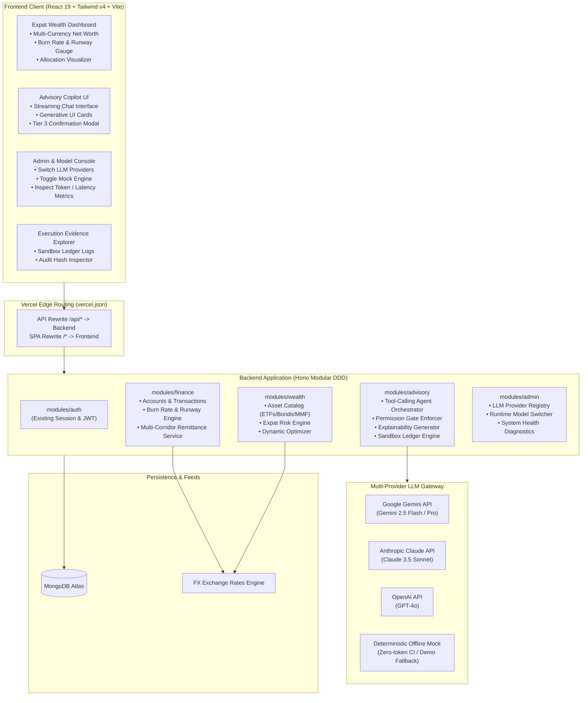
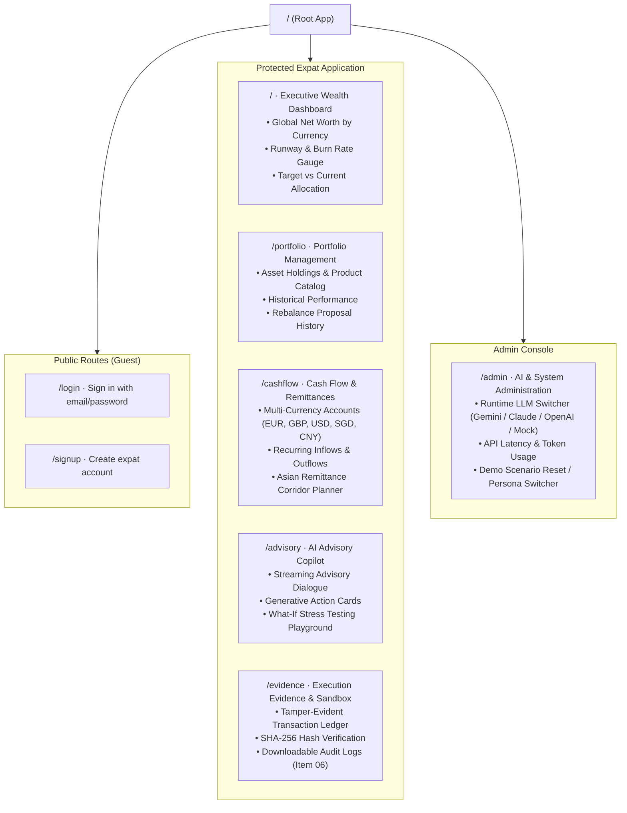

# FinTechathon 2026: Implementation Plan
**Project:** Dynamic Expat Wealth Agent (DEWA)  
**Competition Track:** International Track — "AI as a Financial Participant"  
**Core Topic:** Topic B (Wealth Advisory Agent)  
**Synergistic Extensions:** Topic A (Personal Finance Assistant) & Topic C (Cross-Border & Student Finance Assistant)  
**Primary Persona:** Elena — Cross-border remote professional in Europe with multi-corridor remittances to East Asia facing FX currency swings  

---

## 1. Executive Summary & Competition Alignment

### 1.1 Scoring Rubric Alignment
| Evaluation Pillar | Weight | DEWA System Realization |
|---|---|---|
| **Task Completion** | **40%** | Autonomous end-to-end advisory lifecycle: multi-currency cash flow ingestion (EUR, GBP, USD, SGD, CNY), burn-rate tracking, expat risk profiling, multi-asset matching, Black-Litterman/MVO allocation, and simulated sandbox trade execution. |
| **Security & Compliance** | **30%** | Strict 4-tier permission model (Tier 0 to Tier 3), deterministic financial calculation shield (decoupling quantitative math from LLM dialogue), cross-border regulatory boundary validation, and immutable sandbox audit logs. |
| **Innovation & Interaction** | **30%** | Dynamic burn-rate risk recalibration (Topic A $\to$ B), cross-border FX shock absorption & remittance timing optimization (Topic C $\to$ B), streaming copilot dialogue with generative UI action cards, and three-pillar explainability rationale. |
| **Bonus Exploration** | **0–5 pts** | Cryptographic hash verification of sandbox ledger events with an optional on-chain settlement anchor. |

### 1.2 Mandatory Submission Checklist Mapping
1. **01 Technical Documentation:** C1–C3 architecture, algorithm specifications (burn rate, runway, dynamic risk, allocation optimizer), and permission-tier security design.
2. **02 Presentation Deck:** 10-minute slide deck focused on the expat financial fragmentation problem, DEWA agent architecture, demo results, and compliance.
3. **03 Demo Video:** 5-minute screencast following a structured expat journey (Elena: European income, Asian family remittance commitments, EUR/GBP depreciation vs. Asian currencies triggering automated portfolio hedging and remittance rescheduling).
4. **04 Source Code:** Monorepo with passing unit/integration tests, zero type errors, clean Vercel deployment, and reproduction guides.
5. **05 Security Self-Assessment Report:** Comprehensive risk matrix, permission-tier implementation details, and LLM safety guardrails.
6. **06 Execution Evidence:** Exportable simulated-account/sandbox execution logs with before/after portfolio state diffs and SHA-256 audit digests.

---

## 2. Core Development Principles & Architectural Guardrails

### 2.1 Workspace Dependency Direction
Strict unidirectional hierarchy enforced across the monorepo:
$$\text{rules} \longleftarrow \text{contracts} \longleftarrow \text{backend} \quad\text{and}\quad \text{frontend}$$
* **`@wealth-advisor/rules` (Zero dependencies):** Pure domain rules, financial constants, currency codes, asset classes, permission tiers, error codes, and validation patterns.
* **`@wealth-advisor/contracts` (Depends only on `rules` and `zod`):** Request/response Zod schemas and TypeScript types.
* **`backend` (Depends on `rules`, `contracts`, `hono`, `mongodb`):** Domain logic, use cases, Mongo repositories, and Hono route handlers.
* **`frontend` (Depends on `rules`, `contracts`, `react`, `@tanstack/react-query`, `tailwindcss`):** SPA user interface and presentation components.

### 2.2 Erasable TypeScript & Runtime Cleanliness
* No TypeScript `enum`s, namespaces, decorators, or parameter properties. Closed sets are defined as `as const` string objects.
* Relative imports carry `.ts`/`.tsx` extensions for runtime compatibility with Node native module resolution.
* Only one default export exists across the backend: `backend/src/app.ts` (Vercel entrypoint). All other exports are strictly named.

### 2.3 The Deterministic Calculation Shield (Anti-Hallucination)
To ensure regulatory compliance and prevent LLM hallucinations:
* The LLM **never** calculates portfolio weights, returns, variances, or burn rates directly in text.
* The LLM calls typed internal calculation tools.
* The financial calculation engine executes deterministic TypeScript algorithms and returns structured JSON.
* The LLM interprets the result, provides conversational context, and delivers the three-pillar explainability report.

### 2.4 The 4-Tier Permission Architecture
Every agent capability and API endpoint is bound to an explicit permission tier:
* **Tier 0 (Read & Analytics):** Read-only data access (account balances, past transactions, asset catalog, portfolio status). Executed autonomously.
* **Tier 1 (Advisory Recommendation):** Analytical recommendations (risk profile update, target portfolio proposal, currency hedge suggestions). Executed autonomously; output is advisory only.
* **Tier 2 (Supervised Simulation):** What-if stress testing (e.g. simulating a -10% FX shock or a €15,000 remittance commitment spike). Executed on user request.
* **Tier 3 (Execution Gate):** Sandbox ledger mutations (portfolio rebalancing order, scheduled liquidity ring-fencing). **Mandatory explicit user confirmation required** before state commits.

---

## 3. System Architecture & Multi-Provider Strategy



### 3.1 Multi-Provider LLM Gateway (Switchable via Admin Console)
The Advisory Module interacts with an abstract `LlmGateway` interface. Administrators can dynamically switch the active model at runtime via `/admin`:
1. **Google Gemini (Default Production):** Gemini 2.5 Flash / Pro for high speed, long context window, and native function calling.
2. **Anthropic Claude:** Claude 3.5 Sonnet for deep multi-step reasoning and structured JSON output.
3. **OpenAI:** GPT-4o for flexible fallback and benchmarking.
4. **Deterministic Mock:** Zero-network, offline mock agent returning deterministic tool invocations and explainability text. Guarantees 100% green CI test suites and reliable offline competition presentations.

---

## 4. Application Sitemap



### Detailed Route Specifications:
| Route | Access | Component / Page | Key Features |
|---|---|---|---|
| `/login` | Guest | `LoginPage` | Authentication, session creation, demo user quick-fill. |
| `/signup` | Guest | `SignupPage` | Account registration, initial baseline currency selection. |
| `/` | Expat | `DashboardPage` | Net worth in base currency, multi-currency exposure donut, burn-rate & runway health gauge, dynamic risk indicator. |
| `/portfolio` | Expat | `PortfolioPage` | Detailed asset breakdown (Equities, Bonds, Money Market, FX Hedges), expected yield, rebalancing drift visualizer. |
| `/cashflow` | Expat | `CashflowPage` | Bank account balances across jurisdictions, recurring bills, Asian remittance schedules with corridor fee tracking. |
| `/advisory` | Expat | `AdvisoryPage` | Conversational wealth copilot, tool execution stream, three-pillar explainability drawer, Tier 3 execution approval modal. |
| `/evidence` | Expat / Judge | `EvidencePage` | Immutable sandbox ledger table, before/after portfolio state diffs, SHA-256 audit digest verification, raw JSON export. |
| `/admin` | Admin / Judge | `AdminPage` | Active LLM model selector (Gemini / Claude / OpenAI / Mock), API key configuration status, prompt inspector, one-click demo data reset. |

---

## 5. Showcase Persona & Journey: Elena

### 5.1 Persona Background
* **Name & Role:** Elena, 31, cross-border remote software consultant living between Berlin and London.
* **Income Streams:** Receives €7,500/month from EU clients and £3,000/month from UK contracts.
* **Cross-Border Commitments (Topic C):**
  * Fixed family remittances to East Asia: sends equivalent of 25,000 RMB / ~S$4,800 monthly to Singapore/Shanghai for family support and savings.
* **Current Portfolio (Topic B):**
  * €95,000 total net worth split across US Tech Equities (60%), European Corporate Bonds (25%), and Euro Cash (15%).
  * Baseline Currency: EUR (€).
* **The Conflict Scenario:**
  1. A sharp 6% depreciation in EUR/GBP against Asian currencies (CNY, SGD) increases the domestic currency cost of her fixed Asian remittance commitments.
  2. Simultaneously, a client delays payment, reducing immediate cash inflows and causing her monthly liquidity runway to drop from 10 months to 3.2 months.

### 5.2 Agent Autonomous Resolution Workflow
```mermaid
sequenceDiagram
    autonumber
    actor Elena as Elena (Expat User)
    participant UI as DEWA Dashboard & Copilot
    participant Engine as Deterministic Financial Engine
    participant Agent as AI Advisory Agent (LLM Gateway)
    participant Ledger as Sandbox Audit Ledger

    Elena->>UI: Logs in; dashboard reflects FX swing & delayed payment
    Engine->>UI: Liquidity runway alerts: Dropped to 3.2 months (Warning)
    Elena->>UI: Prompt: "My EUR income dropped and sending money to Asia is getting expensive. How should my portfolio adapt?"
    UI->>Agent: Prompt + Cashflow & Multi-Currency Context
    Agent->>Engine: Tool: get_currency_exposure() & calculate_burn_rate()
    Engine-->>Agent: EUR/GBP exposure 85%, Asian liabilities 35% of monthly outflow
    Agent->>Engine: Tool: calculate_adaptive_portfolio(risk_recalibrated=4.0, hedge_corridor="EUR/CNY")
    Engine-->>Agent: Proposed Allocation: Shift 20% US Equities -> Asian Money Market & Short-term EUR Cash Buffer
    Agent-->>UI: Renders Advisory Proposal Card + Three-Pillar Explainability
    Note over UI: 1) Personal: Preserves 6-month buffer<br/>2) Cross-Border: Hedges Asian remittance FX risk<br/>3) Wealth: Limits equity drawdowns
    Elena->>UI: Clicks "Simulate FX Shock (-5% EUR)" (Tier 2 Simulation)
    Engine-->>UI: Displays stress test outcome
    Elena->>UI: Clicks "Approve & Execute Rebalance" (Tier 3 Gate)
    UI->>Ledger: Commits Sandbox Order with user authorization
    Ledger-->>UI: Returns Transaction Hash (0x7f4a...9b) & Updated State
    UI-->>Elena: Real-time confirmation & sandbox execution evidence logged
```

---

## 6. Phase-Wise Implementation Roadmap

### Phase 1: Domain Foundations, Rules & Contracts (Days 1–3)
**Objective:** Establish typed data contracts, validation rules, multi-provider interfaces, and deterministic calculation engines.

#### 1.1 Shared Rules (`rules/src/`)
- [ ] `currency.rule.ts`: ISO currency codes (`EUR`, `GBP`, `USD`, `SGD`, `CNY`, `JPY`, `HKD`), baseline currency definitions, and remittance corridor pairs.
- [ ] `asset-class.rule.ts`: Categories (`EQUITY_GLOBAL`, `EQUITY_US`, `FIXED_INCOME_GOV`, `MONEY_MARKET`, `FX_HEDGE`), risk scores (1–10), and volatility metrics.
- [ ] `permission-tier.rule.ts`: Tier definitions (`TIER_0_READ`, `TIER_1_ADVISORY`, `TIER_2_SIMULATE`, `TIER_3_EXECUTE`).
- [ ] `burn-rate.rule.ts`: Runway thresholds (Critical: $<3$ months, Warning: $3$–$6$ months, Healthy: $>6$ months).
- [ ] `llm-provider.rule.ts`: Provider keys (`gemini`, `claude`, `openai`, `mock`) and model string constants.
- [ ] Export rules in `rules/src/index.ts` and verify unit tests.

#### 1.2 Shared Contracts (`contracts/src/`)
- [ ] `finance/`:
  - `account.contract.ts`: Multi-currency accounts, balances, institutions.
  - `transaction.contract.ts`: Inflows, outflows, cross-border remittances, exchange fees.
  - `cashflow-summary.contract.ts`: Rolling burn rate, runway months, currency distribution.
- [ ] `wealth/`:
  - `asset-product.contract.ts`: Symbol, name, asset class, currency, risk score, expense ratio.
  - `portfolio.contract.ts`: Holdings list, valuation in base currency, asset and currency weights.
  - `rebalance-proposal.contract.ts`: Target weights, proposed trade diffs, fee estimate, rationale.
- [ ] `advisory/`:
  - `advisory-chat.contract.ts`: Messages, streaming responses, generative action card payloads.
  - `sandbox-execution.contract.ts`: Execution orders, confirmation tokens, transaction receipts.
- [ ] `admin/`:
  - `admin-settings.contract.ts`: Active model selection, API key status, mock override toggle.

#### 1.3 Deterministic Financial Engines (`backend/src/modules/`)
- [ ] **`BurnRateCalculator`:** Aggregates multi-currency transactions converted to baseline currency; calculates rolling burn and safe emergency reserve.
- [ ] **`ExpatRiskProfiler`:** Recalibrates base risk score dynamically:
  $$\text{Effective Risk} = \text{Base Risk} \times \min\left(1.0, \frac{\text{Runway Months}}{\text{Target Buffer Months}}\right) \times (1 - \text{FX Mismatch Factor})$$
- [ ] **`PortfolioOptimizer`:** Computes target asset allocation adapting to the effective risk score and ring-fencing scheduled Asian remittance capital.
- [ ] **Unit Tests:** 100% test coverage for calculations under Elena's FX swing and cashflow squeeze scenario.

---

### Phase 2: Autonomous Advisory Agent, Multi-Provider Gateway & Guardrails (Days 4–7)
**Objective:** Build the multi-provider LLM gateway, admin switching console, tool-calling pipelines, 4-tier permission enforcer, and auditable sandbox ledger.

#### 2.1 Backend Modules Implementation
- [ ] **`finance.module.ts`:**
  - Routes: `GET /api/finance/accounts`, `GET /api/finance/cashflow`, `POST /api/finance/transactions`, `POST /api/finance/remittance-schedule`.
  - Persistence: Collections `accounts` and `transactions` with schema validation and Elena demo seeds.
- [ ] **`wealth.module.ts`:**
  - Routes: `GET /api/wealth/portfolio`, `GET /api/wealth/products`, `POST /api/wealth/optimize`.
  - Persistence: Collections `portfolios` and `asset_products`.
- [ ] **`admin.module.ts`:**
  - Routes: `GET /api/admin/config`, `POST /api/admin/config` (switch active provider: Gemini / Claude / OpenAI / Mock), `POST /api/admin/reset-demo`.

#### 2.2 Multi-Provider LLM Gateway & Tool-Calling Agent (`backend/src/modules/advisory`)
- [ ] Implement `LlmGateway` abstraction with concrete adapters:
  - `GeminiAdapter` (`@google/genai` or direct REST API)
  - `ClaudeAdapter` (`@anthropic-ai/sdk` or REST)
  - `OpenAiAdapter` (`openai` or REST)
  - `MockLlmAdapter` (deterministic offline engine with canned tool calling & explainability)
- [ ] Registered Agent Tools:
  1. `get_cashflow_and_runway`
  2. `get_currency_exposure`
  3. `calculate_adaptive_portfolio`
  4. `simulate_stress_test`
  5. `create_rebalance_proposal`
  6. `execute_sandbox_trade` (Tier 3 Gate)

#### 2.3 Permission-Tier Gatekeeper & Sandbox Audit Ledger
- [ ] **Gatekeeper Interceptor:** Enforces that Tier 3 trades require explicit user confirmation payloads.
- [ ] **Sandbox Ledger (`sandbox_ledgers` collection):**
  - Records every simulated execution with:
    $$\text{Audit Digest} = \text{SHA256}(\text{userId} + \text{timestamp} + \text{initialState} + \text{trades} + \text{finalState})$$
  - Generates immutable operation logs matching FinTechathon submission criteria.
- [ ] **Three-Pillar Explainability Formatter:**
  - Enforces structured explanations across Personal Finance, Cross-Border FX, and Wealth Strategy.
  - Automatically appends cross-border compliance disclaimers.

---

### Phase 3: Frontend Executive Dashboard, Copilot UX & Admin Console (Days 8–11)
**Objective:** Deliver an intuitive, responsive, and visually compelling user interface that showcases autonomous financial advisory, explainability, admin controls, and sandbox execution.

#### 3.1 Expat Wealth Dashboard & Cashflow Views
- [ ] **Dashboard (`/`):**
  - Multi-currency net worth cards (EUR, GBP, USD, SGD, CNY) converted to EUR.
  - Visual burn-rate & runway health meter (Healthy / Warning / Critical).
  - Target vs. Current allocation comparison chart.
- [ ] **Portfolio Page (`/portfolio`):**
  - Detailed asset holdings table with risk ratings and expense ratios.
  - Rebalancing drift visualizer.
- [ ] **Cashflow Page (`/cashflow`):**
  - Multi-currency account balance explorer.
  - Remittance corridor scheduler with live FX rate comparisons.

#### 3.2 AI Advisory Copilot (`/advisory`)
- [ ] **Conversational Interface:** Full-height streaming dialogue panel with chat history and starter prompts tailored to Elena's scenario.
- [ ] **Generative UI Action Cards:**
  - *Product Comparison Card:* Side-by-side ETF and Money Market vehicle metrics.
  - *Dynamic Risk Recalibration Card:* Interactive slider showing how burn-rate changes alter recommended portfolio risk.
  - *Rebalance Proposal Card:* Breakdown of buy/sell trades with fee estimates and an "Approve Execution" CTA.
- [ ] **Tier 3 Execution Confirmation Modal:** Displays explicit risk disclaimer, proposed trade summary, and one-click cryptographic commit.

#### 3.3 Evidence Explorer & Admin Console
- [ ] **Execution Evidence Explorer (`/evidence`):**
  - Live sandbox audit table with transaction IDs, execution timestamps, state diffs, and SHA-256 verification hashes.
  - One-click JSON / Markdown download of execution logs for submission evidence (Checklist Item 06).
- [ ] **Admin & Model Console (`/admin`):**
  - Runtime selector: Google Gemini $\leftrightarrow$ Claude $\leftrightarrow$ OpenAI $\leftrightarrow$ Deterministic Mock.
  - System health diagnostics and one-click demo data reset button.

---

### Phase 4: Submission Deliverables, Verification & Hardening (Days 12–14)
**Objective:** Fulfill all 6 FinTechathon submission checklist requirements and verify production stability on Vercel.

#### 4.1 Competition Submission Checklist Production
- [ ] **01 Technical Documentation:** Complete `docs/architecture/` with C1–C3 diagrams, algorithm specs, and permission-tier security design.
- [ ] **02 Presentation Deck (`docs/submission/presentation-deck.md`):** 10-slide outline structured for the 10-minute presentation: Problem $\to$ DEWA Solution $\to$ Architecture $\to$ 3-Topic Synergy $\to$ Live Demo $\to$ Security & Compliance $\to$ Future Roadmap.
- [ ] **03 Demo Video Storyboard (`docs/submission/demo-video-script.md`):** Step-by-step 5-minute script featuring Elena's journey (burn rate spike + FX dip $\to$ agent consultation $\to$ explainable proposal $\to$ Tier 3 execution).
- [ ] **04 Source Code Cleanliness:** `npm run typecheck` zero errors, `npm test` green, clean deployment on Vercel.
- [ ] **05 Security Self-Assessment Report (`docs/submission/security-self-assessment.md`):** Formal permission-tier implementation matrix and known-risk list.
- [ ] **06 Execution Evidence Package (`docs/submission/execution-evidence.md`):** Seeded sandbox run logs and sample audit digests.

#### 4.2 Deployment & Cloud Verification
- [ ] Run `make build` and test production bundle.
- [ ] Verify Vercel deployment with edge routing and serverless Hono execution.
- [ ] Verify end-to-end user session flow: registration $\to$ login $\to$ dashboard $\to$ advisory dialogue $\to$ sandbox rebalance $\to$ evidence verification.

---

## 7. Definition of Done (DoD) by Phase

* **Phase 1 Done:** `npm run typecheck` clean across `@wealth-advisor/rules` and `@wealth-advisor/contracts`. All financial math formulas have passing unit tests.
* **Phase 2 Done:** Hono `finance`, `wealth`, `advisory`, and `admin` modules mounted. Multi-provider gateway switchable at runtime. Tier 3 execution blocked without confirmation.
* **Phase 3 Done:** All routes (`/`, `/portfolio`, `/cashflow`, `/advisory`, `/evidence`, `/admin`) fully rendered with design tokens and responsive UI.
* **Phase 4 Done:** All 6 submission checklist items documented in `docs/submission/`. Vercel deployment verified live.
