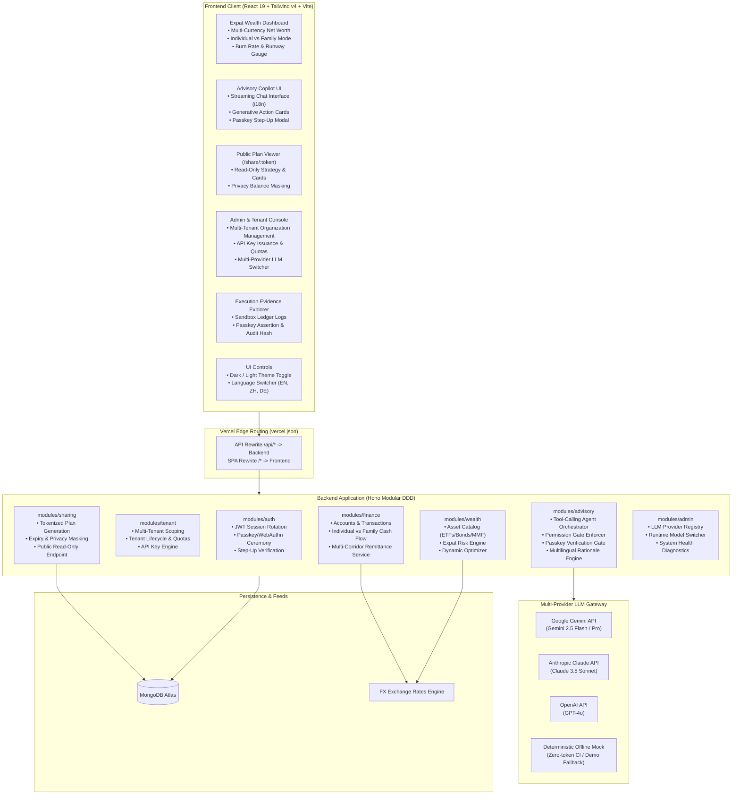
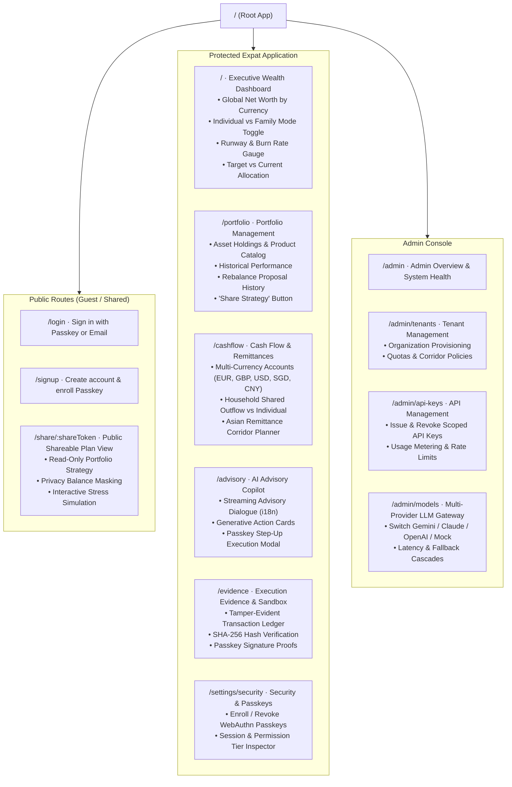
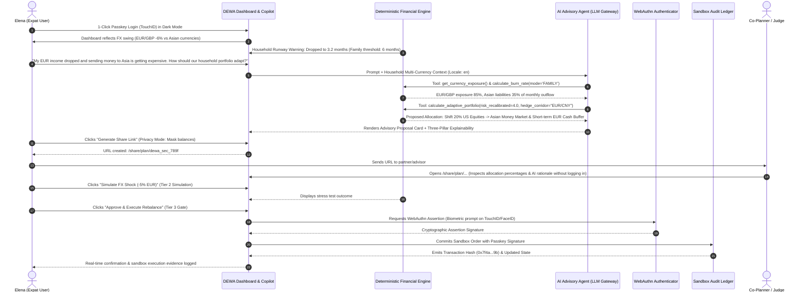

# FinTechathon 2026: Implementation Plan
**Project:** Dynamic Expat Wealth Agent (DEWA)  
**Competition Track:** International Track — "AI as a Financial Participant"  
**Core Topic:** Topic B (Wealth Advisory Agent)  
**Synergistic Extensions:** Topic A (Personal & Family Finance) & Topic C (Cross-Border & Student Finance)  
**Key Architectural Highlights:** Multi-Tenant Platform, API Key Management, Biometric Passkeys (FIDO2/WebAuthn), Multi-Provider LLM Gateway, Shareable Plan URLs, Multi-Language (i18n), and Dark Mode  
**Primary Persona:** Elena — Cross-border remote professional in Europe with multi-corridor family remittances to East Asia facing FX currency swings  

---

## 1. Executive Summary & Competition Alignment

### 1.1 Scoring Rubric Alignment
| Evaluation Pillar | Weight | DEWA System Realization |
|---|---|---|
| **Task Completion** | **40%** | Autonomous end-to-end advisory lifecycle: multi-currency cash flow ingestion (EUR, GBP, USD, SGD, CNY), individual vs. family household liquidity pooling, expat risk profiling, multi-asset matching, Black-Litterman/MVO allocation, and simulated sandbox trade execution. |
| **Security & Compliance** | **30%** | Strict 4-tier permission model (Tier 0 to Tier 3), hardware-backed **FIDO2/WebAuthn Passkey biometric authorization for Tier 3 execution gates**, multi-tenant data isolation, read-only tokenized plan sharing with privacy masking, deterministic financial calculation shield, cross-border regulatory boundary validation, and immutable sandbox audit logs. |
| **Innovation & Interaction** | **30%** | Dynamic burn-rate risk recalibration (Topic A $\to$ B), cross-border FX shock absorption & remittance timing optimization (Topic C $\to$ B), streaming copilot dialogue with generative UI action cards, three-pillar explainability rationale, shareable strategy URLs for family/co-planners, multi-language support (EN, ZH-CN, ZH-HK, DE), and modern dark mode UX. |
| **Bonus Exploration** | **0–5 pts** | Cryptographic hash verification of sandbox ledger events with an optional on-chain settlement anchor. |

### 1.2 Strategic Scope Analysis: Individual vs. Family Budgeting in Topic B
* **Is budgeting in scope for Topic B?** Standalone retail expense-tracking (e.g. categorizing coffees and groceries) strictly belongs to Topic A. However, in professional wealth advisory, **Individual vs. Joint/Family Household Wealth Profiling** is the single greatest driver of portfolio asset allocation:
  * **Individual Mode:** Single expat/student; single income stream; personal burn rate; higher risk capacity; emergency buffer = 3–6 months.
  * **Family / Joint Household Mode:** Multi-earner expat household; pooled cross-border income (e.g., EUR + GBP); joint emergency runway; dependent obligations (children's education funds, elderly parents' remittances); conservative risk capacity; emergency buffer = 6–12 months.
* **The Synergy:** By modeling budgeting as **Household Liquidity & Cash Flow Pooling**, we seamlessly bridge Topic A into Topic B: household burn rate and dependent cash liabilities directly determine the liquidity carve-out and dynamic risk penalty in the portfolio optimizer.

---

## 2. Core Development Principles & Architectural Guardrails

### 2.1 Workspace Dependency Direction
Strict unidirectional hierarchy enforced across the monorepo:
$$\text{rules} \longleftarrow \text{contracts} \longleftarrow \text{backend} \quad\text{and}\quad \text{frontend}$$
* **`@wealth-advisor/rules` (Zero dependencies):** Pure domain rules, financial constants, currency codes, asset classes, permission tiers, passkey constraints, tenant limits, i18n locales, theme constants, error codes, and validation patterns.
* **`@wealth-advisor/contracts` (Depends only on `rules` and `zod`):** Request/response Zod schemas and TypeScript types.
* **`backend` (Depends on `rules`, `contracts`, `hono`, `mongodb`):** Domain logic, use cases, Mongo repositories, WebAuthn verification, and Hono route handlers.
* **`frontend` (Depends on `rules`, `contracts`, `react`, `@tanstack/react-query`, `tailwindcss`):** SPA user interface, WebAuthn browser APIs, i18n dictionaries, theme state, and presentation components.

### 2.2 Erasable TypeScript & Runtime Cleanliness
* No TypeScript `enum`s, namespaces, decorators, or parameter properties. Closed sets are defined as `as const` string objects.
* Relative imports carry `.ts`/`.tsx` extensions for runtime compatibility with Node native module resolution.
* Only one default export exists across the backend: `backend/src/app.ts` (Vercel entrypoint). All other exports are strictly named.

### 2.3 The Deterministic Calculation Shield (Anti-Hallucination)
To ensure regulatory compliance and prevent LLM hallucinations:
* The LLM **never** calculates portfolio weights, returns, variances, or burn rates directly in text.
* The LLM calls typed internal calculation tools.
* The financial calculation engine executes deterministic TypeScript algorithms and returns structured JSON.
* The LLM interprets the result, provides conversational context in the user's active language, and delivers the three-pillar explainability report.

### 2.4 The 4-Tier Permission Architecture & Passkey Step-Up
Every agent capability and API endpoint is bound to an explicit permission tier:
* **Tier 0 (Read & Analytics):** Read-only data access (account balances, past transactions, asset catalog, portfolio status, shared plan view). Executed autonomously.
* **Tier 1 (Advisory Recommendation):** Analytical recommendations (risk profile update, target portfolio proposal, currency hedge suggestions). Executed autonomously; output is advisory only.
* **Tier 2 (Supervised Simulation):** What-if stress testing (e.g. simulating a -10% FX shock or a €15,000 family remittance spike). Executed on user request.
* **Tier 3 (Execution Gate):** Sandbox ledger mutations (portfolio rebalancing order, scheduled liquidity ring-fencing). **Mandatory hardware-backed Passkey (TouchID/FaceID/FIDO2) biometric signature required** before state commits.

---

## 3. System Architecture, Multi-Tenancy & Passkeys

### 3.1 Shareable Advisory Plans via URL (`/share/:shareToken`)
* **Use Case:** An expat user (or family) can generate a shareable link of their AI-recommended wealth strategy to share with a partner, family co-planner, or financial advisor.
* **Security & Privacy Guardrails (Tier 0 Read-Only):**
  * **Privacy Masking Mode:** Toggle to hide absolute currency amounts (displays only percentage weights, asset classes, and risk metrics).
  * **Cryptographic Tokenization:** Accessible via a random, unguessable URL token (`/share/:token`) stored with a TTL (e.g. 7 or 30 days) and optional passphrase.
  * **Read-Only Sandbox:** Recipients can inspect the strategy, view the three-pillar explainability rationale, and run non-mutating stress simulations, but **cannot** execute trades.
  * **Competition Utility:** Perfect for judges to review saved plan instances directly via browser URL without needing an active account!

### 3.2 Multi-Language Architecture (i18n)
* **Supported Locales:**
  * `en` (English — Official International Track language)
  * `zh-CN` (Simplified Chinese — WeBank / Shenzhen FinTechathon host language)
  * `zh-HK` (Traditional Chinese — Hong Kong cross-border finance hub)
  * `de` (German — Elena's European residency context)
* **Design:** Lightweight client-side dictionary provider; instant locale switching stored in `localStorage`.
* **Multilingual AI Advisory:** System prompts inform the LLM of the user's active locale so explanations, disclaimers, and dialogue are rendered natively in the chosen language.

### 3.3 Dark Mode Design Tokens
* **Tailwind v4 Theme Extension:** CSS variables mapped for `--color-surface`, `--color-surface-subtle`, `--color-ink`, `--color-line`, and `--color-brand`.
* **Aesthetics:** Sleek dark palette (deep slate `#0b0f19`, elevated cards `#111827`, borders `#1f2937`) with WCAG AA compliant contrast ratios.
* **Theme Control:** Sun/Moon toggle in top navigation bar with auto system preference detection (`prefers-color-scheme`).

---

## 4. Application Sitemap

### Detailed Route Specifications:
| Route | Access | Component / Page | Key Features |
|---|---|---|---|
| `/login` | Guest | `LoginPage` | Passkey 1-click biometric sign-in, email/password fallback, demo persona quick-fill. |
| `/signup` | Guest | `SignupPage` | Expat onboarding, currency selection, automatic Passkey registration prompt. |
| `/share/:token` | Public | `SharedPlanPage` | Read-only strategy viewer, privacy balance toggle, three-pillar explainability, interactive stress simulation. |
| `/` | Expat | `DashboardPage` | Net worth in base currency, individual vs family household toggle, multi-currency donut, runway health gauge. |
| `/portfolio` | Expat | `PortfolioPage` | Asset holdings (Equities, Bonds, MMF, Hedges), rebalancing visualizer, "Create Share Link" button. |
| `/cashflow` | Expat | `CashflowPage` | Multi-currency bank balances, household pooled cash flow, Asian remittance scheduler. |
| `/advisory` | Expat | `AdvisoryPage` | Conversational wealth copilot (i18n), tool execution stream, three-pillar explainability drawer, Tier 3 Passkey execution approval modal. |
| `/evidence` | Expat / Judge | `EvidencePage` | Immutable sandbox ledger table, before/after portfolio state diffs, Passkey signature proofs, SHA-256 verification, JSON export. |
| `/settings/security` | Expat | `SecuritySettingsPage` | Register/manage Passkeys (TouchID/FaceID), view active sessions, inspect permission tiers. |
| `/admin` | Admin / Judge | `AdminDashboardPage` | Platform overview, active tenants, aggregate token usage, system health diagnostics. |
| `/admin/tenants` | Admin | `AdminTenantsPage` | Provision institutional tenants, configure member limits, allowed remittance corridors, risk policies. |
| `/admin/api-keys` | Admin | `AdminApiKeysPage` | Issue scoped API keys with permission tiers, inspect usage logs, revoke keys immediately. |
| `/admin/models` | Admin / Judge | `AdminModelsPage` | Runtime LLM switcher (Gemini 2.5 / Claude 3.5 / OpenAI GPT-4o / Deterministic Mock), latency graphs, demo scenario reset. |

---

## 5. Showcase Persona & Journey: Elena

### 5.1 Persona Background
* **Name & Role:** Elena, 31, cross-border remote software consultant living between Berlin and London with family dependents in East Asia.
* **Planning Mode:** **Family Household Mode** (Supporting parents and managing joint household emergency reserves).
* **Tenant:** *Global Nomads Wealth* (or standard Expat workspace).
* **Income Streams:** Receives €7,500/month from EU clients and £3,000/month from UK contracts.
* **Cross-Border Commitments (Topic C):**
  * Fixed family remittances to East Asia: sends equivalent of 25,000 RMB / ~S$4,800 monthly to Singapore/Shanghai for family support and savings.
* **Current Portfolio (Topic B):**
  * €95,000 total net worth split across US Tech Equities (60%), European Corporate Bonds (25%), and Euro Cash (15%).
  * Baseline Currency: EUR (€).
* **Security & Interaction Credentials:** Enrolled MacBook TouchID Passkey; uses dark mode with English/German/Chinese interface.

### 5.2 Scenario Workflow, Plan Sharing & Passkey Execution Gate

---

## 6. Phase-Wise Implementation Roadmap

### Phase 1: Domain Foundations, Rules & Contracts (Days 1–3)
**Objective:** Establish typed data contracts, validation rules, Passkey WebAuthn types, multi-tenant schemas, household cashflow models, plan sharing, i18n locales, and deterministic calculation engines.

#### 1.1 Shared Rules (`rules/src/`)
- [ ] `currency.rule.ts`: ISO currency codes (`EUR`, `GBP`, `USD`, `SGD`, `CNY`, `JPY`, `HKD`), baseline currency definitions, and remittance corridor pairs.
- [ ] `asset-class.rule.ts`: Categories (`EQUITY_GLOBAL`, `EQUITY_US`, `FIXED_INCOME_GOV`, `MONEY_MARKET`, `FX_HEDGE`), risk scores (1–10), and volatility metrics.
- [ ] `permission-tier.rule.ts`: Tier definitions (`TIER_0_READ`, `TIER_1_ADVISORY`, `TIER_2_SIMULATE`, `TIER_3_EXECUTE`).
- [ ] `household-mode.rule.ts`: Modes (`INDIVIDUAL`, `FAMILY_HOUSEHOLD`), reserve multiplier (Individual: 1.0x, Family: 1.5x–2.0x).
- [ ] `burn-rate.rule.ts`: Runway thresholds (Critical: $<3$ months, Warning: $3$–$6$ months, Healthy: $>6$ months).
- [ ] `passkey.rule.ts`: WebAuthn challenge timeouts, RP ID configurations, user verification requirements.
- [ ] `sharing.rule.ts`: Share token format, default expiry TTL (7–30 days), privacy masking options.
- [ ] `locale.rule.ts`: Supported locales (`en`, `zh-CN`, `zh-HK`, `de`).
- [ ] `tenant.rule.ts`: Tenant status, plan tiers (`STARTER`, `INSTITUTIONAL`), member limits.
- [ ] `llm-provider.rule.ts`: Provider keys (`gemini`, `claude`, `openai`, `mock`) and model string constants.
- [ ] Export rules in `rules/src/index.ts` and verify unit tests.

#### 1.2 Shared Contracts (`contracts/src/`)
- [ ] `auth/passkey/`: Registration & authentication challenge/verify contracts, step-up assertion contracts.
- [ ] `sharing/`: `create-share-link.contract.ts`, `shared-plan-view.contract.ts`.
- [ ] `tenant/`: `tenant.contract.ts`, `api-key.contract.ts`.
- [ ] `finance/`: `account.contract.ts`, `transaction.contract.ts`, `cashflow-summary.contract.ts` (with `householdMode` flag).
- [ ] `wealth/`: `asset-product.contract.ts`, `portfolio.contract.ts`, `rebalance-proposal.contract.ts`.
- [ ] `advisory/`: `advisory-chat.contract.ts`, `sandbox-execution.contract.ts`.
- [ ] `admin/`: `admin-settings.contract.ts`.

#### 1.3 Deterministic Financial Engines (`backend/src/modules/`)
- [ ] **`BurnRateCalculator`:** Aggregates multi-currency transactions converted to baseline currency; adapts emergency reserve targets based on Individual vs. Family Household mode.
- [ ] **`ExpatRiskProfiler`:** Recalibrates base risk score dynamically based on liquidity runway and foreign currency mismatch.
- [ ] **`PortfolioOptimizer`:** Computes target asset allocation adapting to the effective risk score and ring-fencing scheduled Asian remittance capital.
- [ ] **Unit Tests:** 100% test coverage for calculations under Elena's family cashflow squeeze scenario.

---

### Phase 2: Backend Modules, Passkeys, Multi-Tenant Engine, Sharing & AI Gateway (Days 4–7)
**Objective:** Build the Passkey/WebAuthn service, multi-tenant scoping, plan sharing module, API key manager, multi-provider LLM gateway, and auditable sandbox ledger.

#### 2.1 Backend Modules Implementation
- [ ] **`auth.module.ts` (Passkeys):** WebAuthn registration, login, and step-up challenge verification using `@simplewebauthn/server` or native WebCrypto.
- [ ] **`tenant.module.ts` & `admin.module.ts`:** Tenant provisioning, multi-tenant query scoping, scoped API key issuance, and runtime LLM provider switcher.
- [ ] **`finance.module.ts`:** Collections `accounts` and `transactions` with Individual vs. Family mode filtering and Elena demo seeds.
- [ ] **`wealth.module.ts`:** Collections `portfolios` and `asset_products`.
- [ ] **`sharing.module.ts`:** Generates secure tokenized read-only links (`POST /api/sharing/create`, `GET /api/sharing/:token`) with optional balance masking.
- [ ] **`advisory.module.ts`:** Multi-provider LLM gateway (`Gemini`, `Claude`, `OpenAI`, `Mock`) with locale-aware system prompts, tool execution, and Passkey-enforced Tier 3 gatekeeper.
- [ ] **`sandbox_ledgers`:** Audited immutable transaction collection.

---

### Phase 3: Frontend Executive Dashboard, Copilot UX, Theming & i18n (Days 8–11)
**Objective:** Deliver an intuitive, responsive, and visually compelling user interface with dark mode, multi-language support, public shareable plan views, and Passkey biometric authorization.

#### 3.1 Design System, Dark Mode & i18n Foundations
- [ ] **Dark Mode:** Configure Tailwind v4 `@theme` with CSS variables for dark surface/line/ink tokens. Implement `ThemeToggle` with system preference auto-detection.
- [ ] **i18n:** Lightweight translation dictionary provider supporting `en`, `zh-CN`, `zh-HK`, `de`. Implement `LanguageSelect` dropdown in navbar.

#### 3.2 Expat Wealth Dashboard & Cashflow Views
- [ ] **Dashboard (`/`):** Multi-currency net worth cards, Individual vs. Family Household toggle, burn-rate health gauge, target vs current allocation.
- [ ] **Portfolio Page (`/portfolio`):** Asset holdings, rebalancing drift visualizer, and "Share Strategy URL" modal with privacy balance masking toggle.
- [ ] **Cashflow Page (`/cashflow`):** Multi-currency accounts, recurring bills, Asian remittance corridor planner.

#### 3.3 AI Advisory Copilot & Biometric Execution Modal (`/advisory`)
- [ ] **Conversational Interface:** Full-height streaming dialogue panel with chat history and multilingual responses.
- [ ] **Generative UI Action Cards:** Product Comparison, Dynamic Risk Recalibration, and Rebalance Proposal cards.
- [ ] **Tier 3 Biometric Step-Up Modal:** Triggers browser Passkey prompt (TouchID/FaceID) to sign transaction before submission.

#### 3.4 Public Shared Plan View (`/share/:token`)
- [ ] Read-only strategy presentation rendering asset allocation, three-pillar explainability, and interactive stress simulation.
- [ ] Privacy toggle: view as exact amounts or relative percentages.

#### 3.5 Evidence Explorer & Admin Console
- [ ] **Evidence Page (`/evidence`):** Sandbox audit table, before/after diffs, Passkey signature proofs, SHA-256 hashes, JSON download.
- [ ] **Admin Console (`/admin/*`):** Tenant management, API key manager, runtime LLM selector, and demo scenario reset.

---

## 4. Phase 4: Submission Deliverables, Verification & Hardening (Days 12–14)
**Objective:** Fulfill all 6 FinTechathon submission checklist requirements and verify production stability on Vercel.

#### 4.1 Competition Submission Checklist Production
- [ ] **01 Technical Documentation:** Complete `docs/architecture/` with C1–C3 diagrams, algorithm specs, multi-tenancy models, and Passkey/permission-tier security design.
- [ ] **02 Presentation Deck (`docs/submission/presentation-deck.md`):** 10-slide outline structured for the 10-minute presentation: Problem $\to$ DEWA Solution $\to$ Architecture $\to$ 3-Topic Synergy $\to$ Live Demo $\to$ Passkey Security & Compliance $\to$ Multi-Tenant Future.
- [ ] **03 Demo Video Storyboard (`docs/submission/demo-video-script.md`):** Step-by-step 5-minute script featuring Elena's journey (burn rate spike + FX dip $\to$ agent consultation $\to$ share link generation $\to$ TouchID Passkey execution in dark mode).
- [ ] **04 Source Code Cleanliness:** `npm run typecheck` zero errors, `npm test` green, clean deployment on Vercel.
- [ ] **05 Security Self-Assessment Report (`docs/submission/security-self-assessment.md`):** Formal permission-tier implementation matrix, WebAuthn cryptographic proof, tokenized sharing privacy controls, and known-risk list.
- [ ] **06 Execution Evidence Package (`docs/submission/execution-evidence.md`):** Seeded sandbox run logs and sample audit digests.

#### 4.2 Deployment & Cloud Verification
- [ ] Run `make build` and test production bundle.
- [ ] Verify Vercel deployment with edge routing and serverless Hono execution.
- [ ] Verify end-to-end user session flow: Passkey registration $\to$ login $\to$ dashboard $\to$ advisory dialogue $\to$ share link generation $\to$ biometric sandbox rebalance $\to$ evidence verification.

---

## 7. Definition of Done (DoD) by Phase

* **Phase 1 Done:** `npm run typecheck` clean across `@wealth-advisor/rules` and `@wealth-advisor/contracts`. All financial math formulas, household cashflow, share contracts, and Passkey schemas have passing unit tests.
* **Phase 2 Done:** Hono `auth` (with Passkeys), `tenant`, `finance`, `wealth`, `sharing`, `advisory`, and `admin` modules mounted. Multi-tenant scoping and API key hashing verified. Tier 3 execution blocked without valid Passkey signature.
* **Phase 3 Done:** All routes (`/`, `/portfolio`, `/cashflow`, `/advisory`, `/evidence`, `/share/:token`, `/settings/security`, `/admin/*`) fully rendered with dark mode, i18n, and responsive UI.
* **Phase 4 Done:** All 6 submission checklist items documented in `docs/submission/`. Vercel deployment verified live.
