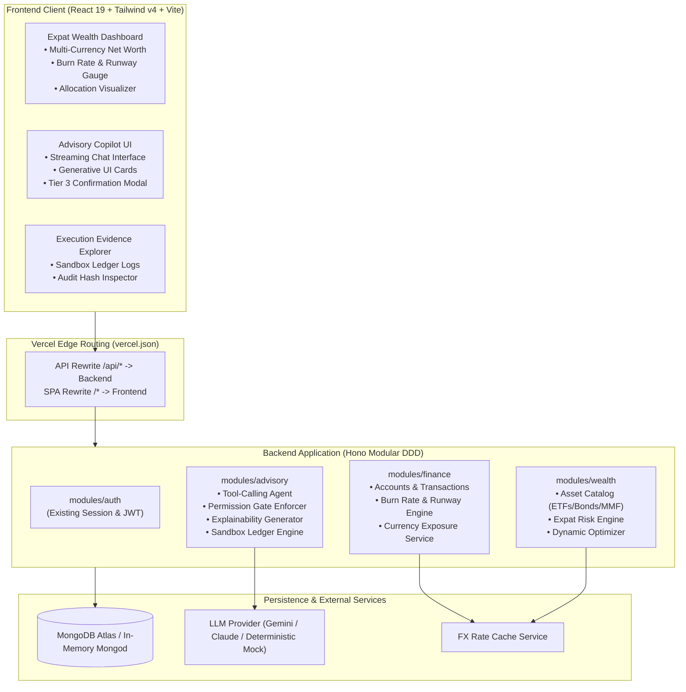

# FinTechathon 2026: Implementation Plan
**Project:** Dynamic Expat Wealth Agent (DEWA)  
**Competition Track:** International Track — "AI as a Financial Participant"  
**Core Topic:** Topic B (Wealth Advisory Agent)  
**Synergistic Extensions:** Topic A (Personal Finance Assistant) & Topic C (Cross-Border & Student Finance Assistant)  
**Target Persona:** Expatriates, international students, and cross-border mobile professionals  

---

## 1. Executive Summary & Competition Alignment

### 1.1 Scoring Rubric Alignment
| Evaluation Pillar | Weight | DEWA System Realization |
|---|---|---|
| **Task Completion** | **40%** | Autonomous end-to-end advisory lifecycle: multi-currency cash flow ingestion, burn-rate calculation, expat risk profiling, multi-asset matching, Black-Litterman/MVO allocation, and simulated sandbox trade execution. |
| **Security & Compliance** | **30%** | Strict 4-tier permission model (Tier 0 to Tier 3), deterministic financial calculation shield (decoupling quantitative math from LLM dialogue), cross-border regulatory boundary validation, and immutable sandbox audit logs. |
| **Innovation & Interaction** | **30%** | Dynamic burn-rate risk recalibration (Topic A $\to$ B), cross-border FX shock absorption (Topic C $\to$ B), streaming copilot dialogue with generative UI action cards, and three-pillar explainability rationale. |
| **Bonus Exploration** | **0–5 pts** | Cryptographic hash verification of sandbox ledger events with an optional on-chain settlement anchor. |

### 1.2 Mandatory Submission Checklist Mapping
1. **01 Technical Documentation:** C1–C3 architecture, algorithm specifications (burn rate, runway, dynamic risk, allocation optimizer), and permission-tier security design.
2. **02 Presentation Deck:** 10-minute slide deck focused on the expat financial fragmentation problem, DEWA agent architecture, demo results, and compliance.
3. **03 Demo Video:** 5-minute screencast following a structured expat journey (Alex: sudden tuition/medical spike triggering proactive rebalancing).
4. **04 Source Code:** Monorepo with passing unit/integration tests, zero type errors, clean Vercel deployment, and reproduction guides.
5. **05 Security Self-Assessment Report:** Comprehensive risk matrix, permission-tier implementation details, and LLM safety guardrails.
6. **06 Execution Evidence:** Exportable simulated-account/sandbox execution logs with before/after portfolio state diffs and SHA-256 audit digests.

---

## 2. Core Development Principles & Architectural Guardrails

### 2.1 Workspace Dependency Direction
Strict unidirectional hierarchy enforced across the monorepo:
$$\text{rules} \longleftarrow \text{contracts} \longleftarrow \text{backend} \quad\text{and}\quad \text{frontend}$$
* **`@wealth-advisor/rules` (Zero dependencies):** Pure domain rules, financial constants, currency codes, asset classes, permission tiers, error codes, and validation patterns.
* **`@wealth-advisor/contracts` (Depends only on `rules` and `zod`):** Request/response Zod schemas and TypeScript types.
* **`backend` (Depends on `rules`, `contracts`, `hono`, `mongodb`):** Domain logic, use cases, Mongo repositories, and Hono route handlers.
* **`frontend` (Depends on `rules`, `contracts`, `react`, `@tanstack/react-query`, `tailwindcss`):** SPA user interface and presentation components.

### 2.2 Erasable TypeScript & Runtime Cleanliness
* No TypeScript `enum`s, namespaces, decorators, or parameter properties. Closed sets are defined as `as const` string objects.
* Relative imports carry `.ts`/`.tsx` extensions for runtime compatibility with Node native module resolution.
* Only one default export exists across the backend: `backend/src/app.ts` (Vercel entrypoint). All other exports are strictly named.

### 2.3 The Deterministic Calculation Shield (Anti-Hallucination)
To ensure regulatory compliance and prevent LLM hallucinations:
* The LLM **never** calculates portfolio weights, returns, variances, or burn rates directly in text.
* The LLM calls typed internal calculation tools.
* The financial calculation engine executes deterministic TypeScript algorithms and returns structured JSON.
* The LLM interprets the result, provides conversational context, and delivers the three-pillar explainability report.

### 2.4 The 4-Tier Permission Architecture
Every agent capability and API endpoint is bound to an explicit permission tier:
* **Tier 0 (Read & Analytics):** Read-only data access (account balances, past transactions, asset catalog, portfolio status). Executed autonomously.
* **Tier 1 (Advisory Recommendation):** Analytical recommendations (risk profile update, target portfolio proposal, currency hedge suggestions). Executed autonomously; output is advisory only.
* **Tier 2 (Supervised Simulation):** What-if stress testing (e.g. simulating a -10% FX shock or a $15,000 tuition burn spike). Executed on user request.
* **Tier 3 (Execution Gate):** Sandbox ledger mutations (portfolio rebalancing order, scheduled liquidity ring-fencing). **Mandatory explicit user confirmation required** before state commits.

---

## 3. Target System Architecture

---

## 4. Phase-Wise Implementation Roadmap

### Phase 1: Domain Foundations, Rules & Contracts (Days 1–3)
**Objective:** Establish the typed data contracts, validation rules, and deterministic calculation engines for Personal Finance (Topic A), Wealth Advisory (Topic B), and Cross-Border Management (Topic C).

#### 1.1 Shared Rules (`rules/src/`)
- [ ] Add `currency.rule.ts`: ISO currency codes (`USD`, `EUR`, `GBP`, `SGD`, `CNY`, `JPY`, `HKD`), baseline currency constants, and corridor pairs.
- [ ] Add `asset-class.rule.ts`: Categories (`EQUITY_GLOBAL`, `EQUITY_US`, `FIXED_INCOME_GOV`, `MONEY_MARKET`, `FX_HEDGE`), volatility bounds, and expense ratio limits.
- [ ] Add `permission-tier.rule.ts`: Tier definitions (`TIER_0_READ`, `TIER_1_ADVISORY`, `TIER_2_SIMULATE`, `TIER_3_EXECUTE`).
- [ ] Add `burn-rate.rule.ts`: Runway thresholds (Critical: $<3$ months, Warning: $3$–$6$ months, Healthy: $>6$ months).
- [ ] Export rules in `rules/src/index.ts` and verify unit tests.

#### 1.2 Shared Contracts (`contracts/src/`)
- [ ] `finance/`:
  - `account.contract.ts`: Account type, balance, currency, institution, last updated.
  - `transaction.contract.ts`: Category (income, fixed bill, variable expense, remittance, tuition), currency, amount, timestamp.
  - `cashflow-summary.contract.ts`: Monthly income, rolling 30/90-day burn rate, runway months, currency distribution.
- [ ] `wealth/`:
  - `asset-product.contract.ts`: Symbol, name, asset class, currency, risk rating (1–10), historical 3y/5y return, expense ratio.
  - `portfolio.contract.ts`: Holdings list, total valuation in baseline currency, asset class weights, currency weights.
  - `rebalance-proposal.contract.ts`: Proposed trades, target weights vs. current weights, estimated fees, rationale summary.
- [ ] `advisory/`:
  - `advisory-chat.contract.ts`: Chat message request/response, generative card attachments, stream payload.
  - `sandbox-execution.contract.ts`: Execution request, confirmation signature, audit event record, transaction hash.

#### 1.3 Deterministic Financial Engines (`backend/src/modules/`)
- [ ] **`BurnRateCalculator`:** Aggregates transactions converted to baseline currency; calculates rolling burn and safe emergency reserve.
- [ ] **`ExpatRiskProfiler`:** Recalibrates base risk score based on liquidity runway:
  $$\text{Effective Risk} = \text{Base Risk} \times \min\left(1.0, \frac{\text{Runway Months}}{\text{Target Buffer Months}}\right) \times (1 - \text{FX Mismatch Factor})$$
- [ ] **`PortfolioOptimizer`:** Computes target asset allocation adapting to the effective risk score and reserving 100% of upcoming 90-day tuition/remittance obligations in liquid local currency instruments.
- [ ] **Unit Tests:** 100% test coverage for deterministic calculations under volatile cashflow and FX shock scenarios.

---

### Phase 2: Autonomous Advisory Agent & Security Guardrails (Days 4–7)
**Objective:** Build the AI Agent orchestrator, structured tool-calling pipelines, 4-tier permission enforcer, and auditable sandbox ledger.

#### 2.1 Backend `finance` & `wealth` Modules
- [ ] Implement `finance.module.ts`:
  - Routes: `GET /api/finance/accounts`, `GET /api/finance/cashflow`, `POST /api/finance/transactions`.
  - Persistence: MongoDB collections `accounts` and `transactions` with indexing and `$jsonSchema` validators.
  - Pre-seeded expat demo profiles (e.g. Alex: earning in USD, studying/living in Singapore/London with EUR tuition obligations).
- [ ] Implement `wealth.module.ts`:
  - Routes: `GET /api/wealth/portfolio`, `GET /api/wealth/products`, `POST /api/wealth/optimize`.
  - Persistence: `portfolios` and `asset_products` collections.

#### 2.2 Tool-Calling Agent Framework (`backend/src/modules/advisory`)
- [ ] **Pluggable LLM Adapter:** Supports Google Gemini API (Gemini 2.5 Flash / Pro) and Claude 3.5 Sonnet, with an offline deterministic mock agent for CI tests.
- [ ] **Registered Agent Tools:**
  1. `get_cashflow_and_runway`: Returns monthly burn rate, emergency reserves, and upcoming scheduled liabilities.
  2. `get_currency_exposure`: Returns net worth broken down by currency and flags FX volatility risk.
  3. `calculate_adaptive_portfolio`: Executes deterministic optimizer for a proposed risk level and horizon.
  4. `simulate_stress_test`: Evaluates portfolio resilience against simulated FX depreciation or sudden expenses.
  5. `create_rebalance_proposal`: Prepares a structured rebalancing action plan.
  6. `execute_sandbox_trade`: Commits rebalancing actions into the sandbox ledger (Tier 3 Gate).

#### 2.3 Permission-Tier Gatekeeper & Sandbox Audit Ledger
- [ ] **Gatekeeper Interceptor:** Rejects any direct execution of `execute_sandbox_trade` unless preceded by a validated user confirmation token.
- [ ] **Sandbox Ledger (`sandbox_ledgers` collection):**
  - Records every simulated execution with:
    $$\text{Audit Digest} = \text{SHA256}(\text{userId} + \text{timestamp} + \text{initialState} + \text{trades} + \text{finalState})$$
  - Generates immutable operation logs matching FinTechathon submission criteria.
- [ ] **Three-Pillar Explainability Formatter:**
  - Enforces that every advisory recommendation provides:
    1. *Personal Finance Reason:* How burn rate / runway altered the risk tolerance.
    2. *Cross-Border Reason:* How FX mismatch or scheduled remittance shaped currency choice.
    3. *Wealth Strategy Reason:* Why specific ETFs/bonds were selected for risk-adjusted returns.
  - Appends cross-border compliance disclaimers automatically.

---

### Phase 3: Frontend Executive Dashboard & Copilot UX (Days 8–11)
**Objective:** Deliver an intuitive, responsive, and visually compelling user interface that showcases autonomous financial advisory, explainability, and sandbox execution.

#### 3.1 Expat Wealth Dashboard (`frontend/src/features/dashboard/`)
- [ ] **Global Net Worth & Currency Breakdown:** Multi-currency cards with converted baseline totals and interactive currency exposure ring.
- [ ] **Burn-Rate & Liquidity Runway Gauge:** Visual health meter (Healthy / Warning / Critical) showing runway in months and upcoming tuition/remittance countdowns.
- [ ] **Current vs. Target Allocation Visualizer:** Side-by-side breakdown across Equities, Fixed Income, Money Market, and FX Hedges.

#### 3.2 AI Advisory Copilot (`frontend/src/features/advisory/`)
- [ ] **Conversational Interface:** Full-height streaming dialogue panel with user message history and suggested starter prompts.
- [ ] **Generative Action Cards:**
  - *Product Comparison Card:* Side-by-side ETF/Bond vehicle metrics (expense ratio, currency, yield, risk).
  - *Dynamic Risk Recalibration Card:* Interactive slider showing how a change in monthly burn rate recalibrates recommended risk.
  - *Rebalance Proposal Card:* Breakdown of buy/sell actions with fee estimates and an "Approve Execution" button.
- [ ] **Tier 3 Execution Confirmation Modal:** Displays explicit risk disclaimer, proposed trade summary, and one-click cryptographic commit.

#### 3.3 Execution Evidence & Compliance Explorer (`frontend/src/features/evidence/`)
- [ ] **Audit Ledger View:** Real-time log table displaying transaction IDs, execution timestamps, state diffs, and SHA-256 verification hashes.
- [ ] **Exportable Sandbox Report:** One-click JSON / Markdown download of execution logs for submission evidence.

---

### Phase 4: Submission Deliverables, Verification & Hardening (Days 12–14)
**Objective:** Fulfill all 6 FinTechathon submission checklist requirements and verify production stability on Vercel.

#### 4.1 Competition Submission Checklist Production
- [ ] **01 Technical Documentation:**
  - Update `docs/architecture/` with comprehensive C1, C2, and C3 diagrams.
  - Add `docs/algorithms/rebalancing.md` detailing the Expat-Adaptive Asset Allocation formula.
  - Add `docs/security/permission-tiers.md` documenting Tiers 0–3.
- [ ] **02 Presentation Deck (`docs/submission/presentation-deck.md`):**
  - 10-slide outline structured for the 10-minute presentation: Problem $\to$ DEWA Solution $\to$ Architecture $\to$ 3-Topic Synergy $\to$ Live Demo $\to$ Security & Compliance $\to$ Future Roadmap.
- [ ] **03 Demo Video Storyboard (`docs/submission/demo-video-script.md`):**
  - Step-by-step 5-minute script featuring Alex's journey (burn rate spike $\to$ runway warning $\to$ agent consultation $\to$ explainable proposal $\to$ Tier 3 execution).
- [ ] **04 Source Code Cleanliness:**
  - Verify `npm run typecheck` passes with zero errors across all workspaces.
  - Verify `npm test` runs green for all unit and integration tests.
  - Update `README.md` with complete architecture diagram and one-command local/docker setup.
- [ ] **05 Security Self-Assessment Report (`docs/submission/security-self-assessment.md`):**
  - Formal permission-tier implementation matrix.
  - Known-risk list & mitigation strategies (hallucinations, currency control boundaries, session security).
- [ ] **06 Execution Evidence Package (`docs/submission/execution-evidence.md`):**
  - Seeded sandbox run logs and sample audit digests.

#### 4.2 Deployment & Cloud Verification
- [ ] Run `make build` and test production bundle.
- [ ] Verify Vercel deployment with edge routing and serverless Hono execution.
- [ ] Test end-to-end user session flow: registration $\to$ login $\to$ dashboard $\to$ advisory dialogue $\to$ sandbox rebalance.

---

## 5. Architectural Decision Log & Clarification Areas

| Area | Decision / Recommendation | Status |
|---|---|---|
| **LLM Provider** | Dual-mode: Google Gemini API as primary production engine (long context, fast tool calling) + deterministic offline mock for tests/CI. | **Recommended** |
| **Data Ingestion** | Pre-seeded expat persona scenarios (Alex) + manual transaction entry interface to simulate real banking/remittance feeds. | **Recommended** |
| **Execution Environment** | High-fidelity in-memory/MongoDB sandbox ledger with SHA-256 audit digests (meets checklist Item 06 without testnet gas friction). | **Recommended** |

---

## 6. Definition of Done (DoD) by Phase

* **Phase 1 Done:** `npm run typecheck` clean across `@wealth-advisor/rules` and `@wealth-advisor/contracts`. All financial math formulas have passing unit tests.
* **Phase 2 Done:** Hono `finance`, `wealth`, and `advisory` modules mounted and verified with integration tests. Tier 3 execution blocked without confirmation.
* **Phase 3 Done:** Frontend dashboard, streaming chat, generative action cards, and sandbox ledger fully functional and styled with design tokens.
* **Phase 4 Done:** All 6 submission checklist items documented in `docs/submission/`. Vercel deployment verified live.
