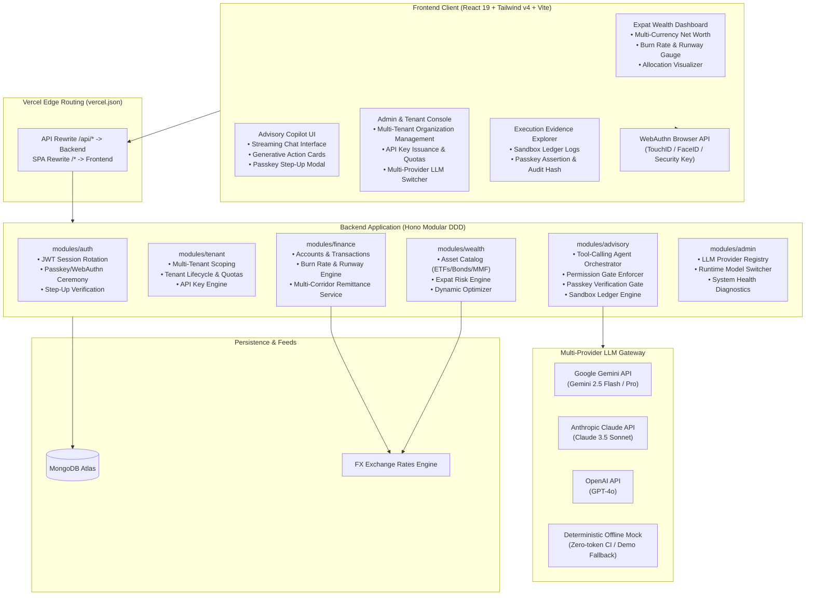
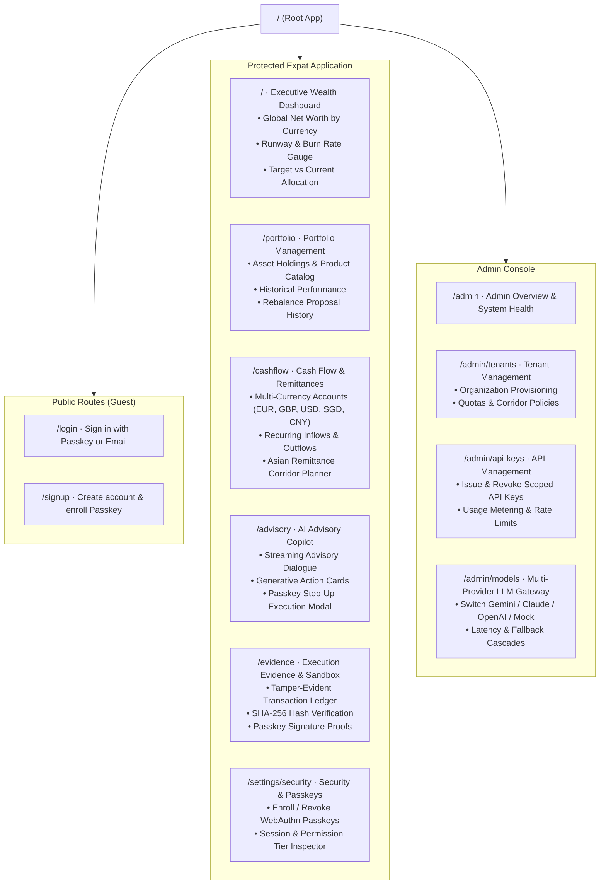
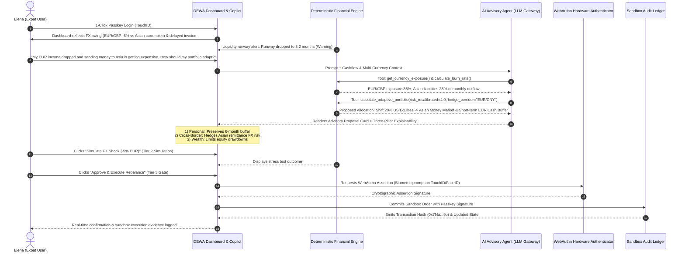

# FinTechathon 2026: Implementation Plan
**Project:** Dynamic Expat Wealth Agent (DEWA)  
**Competition Track:** International Track — "AI as a Financial Participant"  
**Core Topic:** Topic B (Wealth Advisory Agent)  
**Synergistic Extensions:** Topic A (Personal Finance Assistant) & Topic C (Cross-Border & Student Finance Assistant)  
**Key Architectural Highlights:** Multi-Tenant Platform, API Key Management, Biometric Passkeys (FIDO2/WebAuthn), and Multi-Provider LLM Gateway  
**Primary Persona:** Elena — Cross-border remote professional in Europe with multi-corridor remittances to East Asia facing FX currency swings  

---

## 1. Executive Summary & Competition Alignment

### 1.1 Scoring Rubric Alignment
| Evaluation Pillar | Weight | DEWA System Realization |
|---|---|---|
| **Task Completion** | **40%** | Autonomous end-to-end advisory lifecycle: multi-currency cash flow ingestion (EUR, GBP, USD, SGD, CNY), burn-rate tracking, expat risk profiling, multi-asset matching, Black-Litterman/MVO allocation, and simulated sandbox trade execution. |
| **Security & Compliance** | **30%** | Strict 4-tier permission model (Tier 0 to Tier 3), hardware-backed **FIDO2/WebAuthn Passkey biometric authorization for Tier 3 execution gates**, multi-tenant row-level data isolation, deterministic financial calculation shield (decoupling quantitative math from LLM dialogue), cross-border regulatory boundary validation, and immutable sandbox audit logs. |
| **Innovation & Interaction** | **30%** | Dynamic burn-rate risk recalibration (Topic A $\to$ B), cross-border FX shock absorption & remittance timing optimization (Topic C $\to$ B), streaming copilot dialogue with generative UI action cards, three-pillar explainability rationale, and dedicated Admin Console for tenant and API management. |
| **Bonus Exploration** | **0–5 pts** | Cryptographic hash verification of sandbox ledger events with an optional on-chain settlement anchor. |

### 1.2 Mandatory Submission Checklist Mapping
1. **01 Technical Documentation:** C1–C3 architecture, algorithm specifications (burn rate, runway, dynamic risk, allocation optimizer), multi-tenant isolation, and Passkey/permission-tier security design.
2. **02 Presentation Deck:** 10-minute slide deck focused on expat financial fragmentation, DEWA agent architecture, demo results, biometric compliance, and multi-tenant scalability.
3. **03 Demo Video:** 5-minute screencast following a structured expat journey (Elena: European income, Asian family remittance commitments, EUR/GBP depreciation vs. Asian currencies triggering automated portfolio hedging, ending with a TouchID/FaceID Passkey biometric signature to commit sandbox rebalancing).
4. **04 Source Code:** Monorepo with passing unit/integration tests, zero type errors, clean Vercel deployment, and reproduction guides.
5. **05 Security Self-Assessment Report:** Comprehensive risk matrix, permission-tier implementation details, Passkey authentication ceremony specifications, and LLM safety guardrails.
6. **06 Execution Evidence:** Exportable simulated-account/sandbox execution logs with before/after portfolio state diffs and SHA-256 audit digests linked to Passkey assertion signatures.

---

## 2. Core Development Principles & Architectural Guardrails

### 2.1 Workspace Dependency Direction
Strict unidirectional hierarchy enforced across the monorepo:
$$\text{rules} \longleftarrow \text{contracts} \longleftarrow \text{backend} \quad\text{and}\quad \text{frontend}$$
* **`@wealth-advisor/rules` (Zero dependencies):** Pure domain rules, financial constants, currency codes, asset classes, permission tiers, passkey constraints, tenant limits, error codes, and validation patterns.
* **`@wealth-advisor/contracts` (Depends only on `rules` and `zod`):** Request/response Zod schemas and TypeScript types.
* **`backend` (Depends on `rules`, `contracts`, `hono`, `mongodb`):** Domain logic, use cases, Mongo repositories, WebAuthn verification, and Hono route handlers.
* **`frontend` (Depends on `rules`, `contracts`, `react`, `@tanstack/react-query`, `tailwindcss`):** SPA user interface, WebAuthn browser APIs, and presentation components.

### 2.2 Erasable TypeScript & Runtime Cleanliness
* No TypeScript `enum`s, namespaces, decorators, or parameter properties. Closed sets are defined as `as const` string objects.
* Relative imports carry `.ts`/`.tsx` extensions for runtime compatibility with Node native module resolution.
* Only one default export exists across the backend: `backend/src/app.ts` (Vercel entrypoint). All other exports are strictly named.

### 2.3 The Deterministic Calculation Shield (Anti-Hallucination)
To ensure regulatory compliance and prevent LLM hallucinations:
* The LLM **never** calculates portfolio weights, returns, variances, or burn rates directly in text.
* The LLM calls typed internal calculation tools.
* The financial calculation engine executes deterministic TypeScript algorithms and returns structured JSON.
* The LLM interprets the result, provides conversational context, and delivers the three-pillar explainability report.

### 2.4 The 4-Tier Permission Architecture & Passkey Step-Up
Every agent capability and API endpoint is bound to an explicit permission tier:
* **Tier 0 (Read & Analytics):** Read-only data access (account balances, past transactions, asset catalog, portfolio status). Executed autonomously.
* **Tier 1 (Advisory Recommendation):** Analytical recommendations (risk profile update, target portfolio proposal, currency hedge suggestions). Executed autonomously; output is advisory only.
* **Tier 2 (Supervised Simulation):** What-if stress testing (e.g. simulating a -10% FX shock or a €15,000 remittance commitment spike). Executed on user request.
* **Tier 3 (Execution Gate):** Sandbox ledger mutations (portfolio rebalancing order, scheduled liquidity ring-fencing). **Mandatory hardware-backed Passkey (TouchID/FaceID/FIDO2) biometric signature required** before state commits.

---

## 3. System Architecture, Multi-Tenancy & Passkeys

### 3.1 Multi-Tenant Platform Architecture
The system supports multi-tenant isolation, allowing institutions (wealth advisory practices, universities, global relocation firms) to manage distinct expat client cohorts:
* **Tenant Scoping:** Every user, account, portfolio, and audit ledger document is tagged with `tenantId`. Repositories enforce query filtering scoped to the authenticated tenant context.
* **Tenant Configuration:** Each tenant can set distinct baseline currencies, supported remittance corridors, custom risk tolerance boundaries, and default LLM provider overrides.
* **Tenant Isolation Test Suite:** Automated integration tests ensure tenant data cannot leak across tenant boundaries.

### 3.2 API Management & Institutional Access
* **Scoped API Keys:** Institutional tenants can generate API keys with scoped permission tiers (`read:analytics`, `advisory:recommend`, `simulate:stress-test`, `execute:sandbox`).
* **Rate Limiting & Quotas:** Enforces requests-per-minute (RPM) and monthly token budgets per tenant.
* **Tamper-Evident API Key Storage:** Only SHA-256 hashes of API keys are stored in MongoDB; keys carry standard prefixes (e.g., `dewa_live_...`).

### 3.3 Passkey Authentication & Biometric Step-Up Authorization
* **FIDO2 / WebAuthn Standard:**
  * Zero-password vulnerability: Public-key cryptography replaces phishable passwords.
  * Credential Enrollment: Users register their TouchID / FaceID / hardware security key via `/settings/security` or during onboarding.
  * Seamless Passwordless Sign-In: Instant 1-tap login with biometric verification.
* **Biometric Step-Up for Tier 3 Execution Gate:**
  * When the AI Copilot prepares a high-stakes portfolio rebalancing order or locks remittance buffers, it generates a cryptographically signed execution challenge.
  * The user's device requests biometric assertion (`navigator.credentials.get`).
  * Backend verifies the WebAuthn signature against the user's registered public key.
  * The verified signature is embedded directly into the transaction record in `sandbox_ledgers`:
    $$\text{Audit Digest} = \text{SHA256}(\text{userId} + \text{tenantId} + \text{timestamp} + \text{passkeySignature} + \text{tradeDiff})$$
  * This provides unforgeable evidence that an AI agent recommendation was authenticated by an authorized human participant before execution.

---

## 4. Application Sitemap

### Detailed Route Specifications:
| Route | Role | Component / Page | Key Features |
|---|---|---|---|
| `/login` | Guest | `LoginPage` | Passkey 1-click biometric sign-in, email/password fallback, demo persona quick-fill. |
| `/signup` | Guest | `SignupPage` | Expat onboarding, initial currency selection, automatic Passkey registration prompt. |
| `/` | Expat | `DashboardPage` | Net worth in base currency, multi-currency exposure donut, burn-rate & runway health gauge, dynamic risk score. |
| `/portfolio` | Expat | `PortfolioPage` | Detailed asset breakdown (Equities, Bonds, Money Market, FX Hedges), expected yield, rebalancing drift visualizer. |
| `/cashflow` | Expat | `CashflowPage` | Bank balances across jurisdictions, recurring bills, Asian remittance schedules with corridor fee tracking. |
| `/advisory` | Expat | `AdvisoryPage` | Conversational wealth copilot, tool execution stream, three-pillar explainability drawer, Tier 3 Passkey execution approval modal. |
| `/evidence` | Expat / Judge | `EvidencePage` | Immutable sandbox ledger table, before/after portfolio state diffs, Passkey signature proofs, SHA-256 verification, JSON export. |
| `/settings/security` | Expat | `SecuritySettingsPage` | Register/manage Passkeys (TouchID/FaceID), view active sessions, inspect personal permission tier. |
| `/admin` | Admin / Judge | `AdminDashboardPage` | Platform overview, active tenants, aggregate token usage, system health diagnostics. |
| `/admin/tenants` | Admin | `AdminTenantsPage` | Provision institutional tenants, configure member limits, allowed remittance corridors, risk policies. |
| `/admin/api-keys` | Admin | `AdminApiKeysPage` | Issue scoped API keys with permission tiers, inspect usage logs, revoke keys immediately. |
| `/admin/models` | Admin / Judge | `AdminModelsPage` | Runtime LLM switcher (Gemini 2.5 / Claude 3.5 / OpenAI GPT-4o / Deterministic Mock), latency graphs, demo scenario reset. |

---

## 5. Showcase Persona & Journey: Elena

### 5.1 Persona Background
* **Name & Role:** Elena, 31, cross-border remote software consultant living between Berlin and London.
* **Tenant:** Standard Expat Individual Workspace (or Institutional Tenant: *Global Nomads Wealth*).
* **Income Streams:** Receives €7,500/month from EU clients and £3,000/month from UK contracts.
* **Cross-Border Commitments (Topic C):**
  * Fixed family remittances to East Asia: sends equivalent of 25,000 RMB / ~S$4,800 monthly to Singapore/Shanghai for family support and savings.
* **Current Portfolio (Topic B):**
  * €95,000 total net worth split across US Tech Equities (60%), European Corporate Bonds (25%), and Euro Cash (15%).
  * Baseline Currency: EUR (€).
* **Security Credentials:** Has enrolled MacBook TouchID Passkey as primary credential.

### 5.2 Scenario Workflow & Passkey Execution Gate

---

## 6. Phase-Wise Implementation Roadmap

### Phase 1: Domain Foundations, Rules & Contracts (Days 1–3)
**Objective:** Establish typed data contracts, validation rules, Passkey WebAuthn types, multi-tenant schemas, and deterministic calculation engines.

#### 1.1 Shared Rules (`rules/src/`)
- [ ] `currency.rule.ts`: ISO currency codes (`EUR`, `GBP`, `USD`, `SGD`, `CNY`, `JPY`, `HKD`), baseline currency definitions, and remittance corridor pairs.
- [ ] `asset-class.rule.ts`: Categories (`EQUITY_GLOBAL`, `EQUITY_US`, `FIXED_INCOME_GOV`, `MONEY_MARKET`, `FX_HEDGE`), risk scores (1–10), and volatility metrics.
- [ ] `permission-tier.rule.ts`: Tier definitions (`TIER_0_READ`, `TIER_1_ADVISORY`, `TIER_2_SIMULATE`, `TIER_3_EXECUTE`).
- [ ] `burn-rate.rule.ts`: Runway thresholds (Critical: $<3$ months, Warning: $3$–$6$ months, Healthy: $>6$ months).
- [ ] `passkey.rule.ts`: WebAuthn challenge timeouts, RP ID configurations, user verification requirements (`preferred` / `required`).
- [ ] `tenant.rule.ts`: Tenant status, plan tiers (`STARTER`, `INSTITUTIONAL`), member limits.
- [ ] `llm-provider.rule.ts`: Provider keys (`gemini`, `claude`, `openai`, `mock`) and model string constants.
- [ ] Export rules in `rules/src/index.ts` and verify unit tests.

#### 1.2 Shared Contracts (`contracts/src/`)
- [ ] `auth/passkey/`:
  - `passkey-register-options.contract.ts`: Registration challenge options.
  - `passkey-register-verify.contract.ts`: Attestation response payload.
  - `passkey-auth-options.contract.ts`: Authentication challenge options.
  - `passkey-auth-verify.contract.ts`: Assertion response payload.
  - `passkey-stepup.contract.ts`: Execution challenge & biometric verification token.
- [ ] `tenant/`:
  - `tenant.contract.ts`: Tenant profile, policy settings, member count.
  - `api-key.contract.ts`: Key creation request, masked key response, permissions list.
- [ ] `finance/`:
  - `account.contract.ts`: Multi-currency accounts, balances, institutions.
  - `transaction.contract.ts`: Inflows, outflows, cross-border remittances, exchange fees.
  - `cashflow-summary.contract.ts`: Rolling burn rate, runway months, currency distribution.
- [ ] `wealth/`:
  - `asset-product.contract.ts`: Symbol, name, asset class, currency, risk score, expense ratio.
  - `portfolio.contract.ts`: Holdings list, valuation in base currency, asset and currency weights.
  - `rebalance-proposal.contract.ts`: Target weights, proposed trade diffs, fee estimate, rationale.
- [ ] `advisory/`:
  - `advisory-chat.contract.ts`: Messages, streaming responses, generative action card payloads.
  - `sandbox-execution.contract.ts`: Execution orders, Passkey assertion token, transaction receipts.

#### 1.3 Deterministic Financial Engines (`backend/src/modules/`)
- [ ] **`BurnRateCalculator`:** Aggregates multi-currency transactions converted to baseline currency; calculates rolling burn and safe emergency reserve.
- [ ] **`ExpatRiskProfiler`:** Recalibrates base risk score dynamically based on liquidity runway and foreign currency mismatch.
- [ ] **`PortfolioOptimizer`:** Computes target asset allocation adapting to the effective risk score and ring-fencing scheduled Asian remittance capital.
- [ ] **Unit Tests:** 100% test coverage for calculations under Elena's FX swing and cashflow squeeze scenario.

---

### Phase 2: Backend Modules, Passkeys, Multi-Tenant Engine & AI Gateway (Days 4–7)
**Objective:** Build the Passkey/WebAuthn service, multi-tenant scoping, API key manager, multi-provider LLM gateway, and auditable sandbox ledger.

#### 2.1 Passkey / WebAuthn & Auth Extension (`backend/src/modules/auth`)
- [ ] Integrate WebAuthn verification adapter (`@simplewebauthn/server` or native WebCrypto).
- [ ] Extend user entity with embedded Passkey credentials (`credentialId`, `publicKey`, `counter`, `transports`).
- [ ] Endpoints:
  - `POST /api/auth/passkey/register-options`
  - `POST /api/auth/passkey/register-verify`
  - `POST /api/auth/passkey/login-options`
  - `POST /api/auth/passkey/login-verify`
  - `POST /api/auth/passkey/step-up-challenge`

#### 2.2 Multi-Tenant & API Key Module (`backend/src/modules/tenant` & `admin`)
- [ ] Implement `tenant.module.ts`:
  - Collections: `tenants` and `api_keys` with partial unique indexes.
  - Multi-tenant middleware: Scopes database queries to `tenantId` from JWT or API key header (`X-API-Key`).
  - API Key hashing & verification: Validates key prefix, hash, and permission tier.
- [ ] Implement `admin.module.ts`:
  - Routes: `GET /api/admin/tenants`, `POST /api/admin/tenants`, `GET /api/admin/api-keys`, `POST /api/admin/api-keys`, `GET /api/admin/models`, `POST /api/admin/models`.

#### 2.3 Finance & Wealth Modules
- [ ] Implement `finance.module.ts`:
  - Collections: `accounts`, `transactions` (tenant-scoped).
  - Pre-seeded Elena demo scenario (European income + Asian remittances).
- [ ] Implement `wealth.module.ts`:
  - Collections: `portfolios`, `asset_products` (tenant-scoped).

#### 2.4 Multi-Provider LLM Gateway & Tool-Calling Agent (`backend/src/modules/advisory`)
- [ ] Implement `LlmGateway` abstraction with concrete adapters:
  - `GeminiAdapter` (`@google/genai` or direct REST API)
  - `ClaudeAdapter` (`@anthropic-ai/sdk` or REST)
  - `OpenAiAdapter` (`openai` or REST)
  - `MockLlmAdapter` (deterministic offline engine with canned tool calling & explainability)
- [ ] Registered Agent Tools:
  1. `get_cashflow_and_runway`
  2. `get_currency_exposure`
  3. `calculate_adaptive_portfolio`
  4. `simulate_stress_test`
  5. `create_rebalance_proposal`
  6. `execute_sandbox_trade` (Requires Passkey verification proof)

#### 2.5 Tier 3 Gatekeeper & Sandbox Audit Ledger
- [ ] **Passkey-Enforced Execution Gate:** Rejects `execute_sandbox_trade` unless accompanied by a verified Passkey step-up assertion.
- [ ] **Sandbox Ledger (`sandbox_ledgers` collection):**
  - Records every simulated execution with:
    $$\text{Audit Digest} = \text{SHA256}(\text{userId} + \text{tenantId} + \text{timestamp} + \text{passkeySignature} + \text{tradeDiff})$$
  - Generates immutable operation logs matching FinTechathon submission criteria.
- [ ] **Three-Pillar Explainability Formatter:**
  - Formats structured explanations across Personal Finance, Cross-Border FX, and Wealth Strategy.
  - Automatically appends cross-border compliance disclaimers.

---

### Phase 3: Frontend Executive Dashboard, Copilot UX & Admin Console (Days 8–11)
**Objective:** Deliver an intuitive, responsive, and visually compelling user interface that showcases autonomous financial advisory, Passkey biometric authorization, admin controls, and sandbox execution.

#### 3.1 Passkey Integration & Security Settings
- [ ] 1-Click Passkey login and enrollment flows using `@simplewebauthn/browser`.
- [ ] `SecuritySettingsPage` (`/settings/security`): Manage enrolled Passkeys, device names, and active sessions.

#### 3.2 Expat Wealth Dashboard & Cashflow Views
- [ ] **Dashboard (`/`):**
  - Multi-currency net worth cards (EUR, GBP, USD, SGD, CNY) converted to EUR.
  - Visual burn-rate & runway health meter (Healthy / Warning / Critical).
  - Target vs. Current allocation comparison chart.
- [ ] **Portfolio Page (`/portfolio`):**
  - Detailed asset holdings table with risk ratings and expense ratios.
  - Rebalancing drift visualizer.
- [ ] **Cashflow Page (`/cashflow`):**
  - Multi-currency account balance explorer.
  - Remittance corridor scheduler with live FX rate comparisons.

#### 3.3 AI Advisory Copilot & Biometric Execution Modal (`/advisory`)
- [ ] **Conversational Interface:** Full-height streaming dialogue panel with chat history and starter prompts tailored to Elena's scenario.
- [ ] **Generative UI Action Cards:**
  - *Product Comparison Card:* Side-by-side ETF and Money Market vehicle metrics.
  - *Dynamic Risk Recalibration Card:* Interactive slider showing how burn-rate changes alter recommended portfolio risk.
  - *Rebalance Proposal Card:* Breakdown of buy/sell trades with fee estimates and an "Approve Execution" CTA.
- [ ] **Tier 3 Biometric Step-Up Modal:** Triggers browser Passkey prompt (TouchID/FaceID) to sign transaction before submission.

#### 3.4 Evidence Explorer & Admin Console
- [ ] **Execution Evidence Explorer (`/evidence`):**
  - Live sandbox audit table with transaction IDs, execution timestamps, state diffs, Passkey signature proofs, and SHA-256 verification hashes.
  - One-click JSON / Markdown download of execution logs for submission evidence (Checklist Item 06).
- [ ] **Admin Console (`/admin`, `/admin/tenants`, `/admin/api-keys`, `/admin/models`):**
  - Organization and tenant management table.
  - API key issuance with permission tier checkboxes.
  - Runtime LLM switcher: Google Gemini $\leftrightarrow$ Claude $\leftrightarrow$ OpenAI $\leftrightarrow$ Deterministic Mock.
  - System diagnostics and one-click demo data reset button.

---

## 4. Phase 4: Submission Deliverables, Verification & Hardening (Days 12–14)
**Objective:** Fulfill all 6 FinTechathon submission checklist requirements and verify production stability on Vercel.

#### 4.1 Competition Submission Checklist Production
- [ ] **01 Technical Documentation:** Complete `docs/architecture/` with C1–C3 diagrams, algorithm specs, multi-tenancy models, and Passkey/permission-tier security design.
- [ ] **02 Presentation Deck (`docs/submission/presentation-deck.md`):** 10-slide outline structured for the 10-minute presentation: Problem $\to$ DEWA Solution $\to$ Architecture $\to$ 3-Topic Synergy $\to$ Live Demo $\to$ Passkey Security & Compliance $\to$ Multi-Tenant Future.
- [ ] **03 Demo Video Storyboard (`docs/submission/demo-video-script.md`):** Step-by-step 5-minute script featuring Elena's journey (burn rate spike + FX dip $\to$ agent consultation $\to$ explainable proposal $\to$ TouchID Passkey execution).
- [ ] **04 Source Code Cleanliness:** `npm run typecheck` zero errors, `npm test` green, clean deployment on Vercel.
- [ ] **05 Security Self-Assessment Report (`docs/submission/security-self-assessment.md`):** Formal permission-tier implementation matrix, WebAuthn cryptographic proof, and known-risk list.
- [ ] **06 Execution Evidence Package (`docs/submission/execution-evidence.md`):** Seeded sandbox run logs and sample audit digests.

#### 4.2 Deployment & Cloud Verification
- [ ] Run `make build` and test production bundle.
- [ ] Verify Vercel deployment with edge routing and serverless Hono execution.
- [ ] Verify end-to-end user session flow: Passkey registration $\to$ login $\to$ dashboard $\to$ advisory dialogue $\to$ biometric sandbox rebalance $\to$ evidence verification.

---

## 7. Definition of Done (DoD) by Phase

* **Phase 1 Done:** `npm run typecheck` clean across `@wealth-advisor/rules` and `@wealth-advisor/contracts`. All financial math formulas and Passkey schemas have passing unit tests.
* **Phase 2 Done:** Hono `auth` (with Passkeys), `tenant`, `finance`, `wealth`, `advisory`, and `admin` modules mounted. Multi-tenant scoping and API key hashing verified. Tier 3 execution blocked without valid Passkey signature.
* **Phase 3 Done:** All routes (`/`, `/portfolio`, `/cashflow`, `/advisory`, `/evidence`, `/settings/security`, `/admin/*`) fully rendered with design tokens, Passkey prompts, and responsive UI.
* **Phase 4 Done:** All 6 submission checklist items documented in `docs/submission/`. Vercel deployment verified live.
