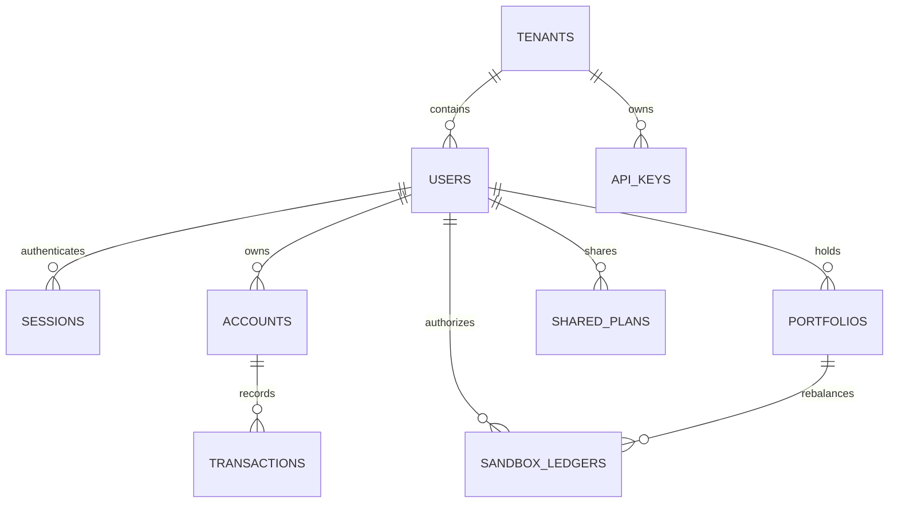

# MongoDB Atlas Database Schema Specification

Precedence: where this file differs, `backend/docs/collections.md` (built collections) and `backend/docs/planned-collections.md` (planned collections) hold.

**Project:** Dynamic Expat Wealth Agent (DEWA)  
**Database Engine:** MongoDB Atlas (MongoDB 7.x+)  
**Default Database Name:** `wealth_advisor` (configurable via `MONGODB_DB_NAME`)  
**Architecture Pattern:** Domain-Driven Multi-Tenant Document Stores with Partial Indexes & Strict Schema Validation  

---

## 1. Overview & Multi-Tenant Partitioning Model

Every persistent collection (with the exception of global system indexes and tenants themselves) is scoped by `tenantId`.
* **Tenant Scoping:** All queries from authenticated expat users and institutional API keys include `{ tenantId }` in their filter predicates.
* **Partial Unique Indexes:** Uniqueness constraints (such as user email, provider IDs, and account numbers) are enforced conditionally among active documents per tenant.
* **Serverless Connection Lifecycle:** Connections are initialized via `getMongoClient()` in `backend/src/core/db/connection/mongo-client.ts`, caching the client promise on `globalThis` across Vercel serverless function invocations with `maxPoolSize: 10`.



---

## 2. Collection Specifications

### 2.1 `tenants`
Holds organizational workspaces (e.g. independent expat tenants, wealth management firms, universities, corporate mobility desks).

```typescript
interface TenantDocument {
  _id: string; // ObjectId as hex string
  slug: string; // Unique URL-friendly slug (e.g. "global-nomads", "default")
  name: string; // Display name
  plan: 'STARTER' | 'INSTITUTIONAL';
  status: 'ACTIVE' | 'SUSPENDED';
  settings: {
    baselineCurrency: 'EUR' | 'USD' | 'GBP' | 'SGD' | 'CNY';
    allowedCorridors: Array<'EUR_CNY' | 'GBP_SGD' | 'USD_CNY' | 'EUR_SGD'>;
    defaultLlmProvider: 'gemini' | 'claude' | 'openai' | 'mock';
    maxMembers: number;
    requirePasskeyForRebalance: boolean;
  };
  createdAt: Date;
  updatedAt: Date;
}
```
**Indexes:**
* `{ slug: 1 }` (unique)
* `{ status: 1 }`

---

### 2.2 `api_keys`
Holds programmatic API access credentials for institutional tenants.

```typescript
interface ApiKeyDocument {
  _id: string;
  tenantId: string;
  name: string; // e.g. "Hong Kong Family Office Backend"
  keyPrefix: string; // e.g. "dewa_live_3f9a" (unhashed prefix for identification)
  keyHash: string; // SHA-256 hash of full secret
  permissions: Array<'read:analytics' | 'advisory:recommend' | 'simulate:stress-test' | 'execute:sandbox'>;
  rateLimitPerMinute: number; // default: 60
  monthlyTokenQuota: number; // default: 1000000
  usedTokensThisMonth: number;
  status: 'ACTIVE' | 'REVOKED';
  lastUsedAt: Date | null;
  expiresAt: Date | null;
  createdAt: Date;
}
```
**Indexes:**
* `{ tenantId: 1, keyPrefix: 1 }` (unique)
* `{ keyHash: 1 }` (unique)

---

### 2.3 `users`
Account root. Embeds linked providers, WebAuthn Passkey credentials, roles, consents, and withdrawal state. Creating or updating a user account requires only a single atomic write.

```typescript
interface PasskeyCredential {
  credentialId: string; // Base64URL-encoded credential ID
  publicKey: string; // Base64URL-encoded public key (COSE / SPKI)
  counter: number; // Sign counter for clone/replay detection
  deviceType: 'singleDevice' | 'multiDevice'; // iCloud Keychain, Google Password Manager, YubiKey
  backedUp: boolean;
  transports: Array<'usb' | 'nfc' | 'ble' | 'internal' | 'hybrid'>;
  deviceName: string; // e.g. "Elena's iPhone 16 Pro (FaceID)"
  createdAt: Date;
  lastUsedAt: Date | null;
}

interface LinkedProvider {
  type: 'EMAIL' | 'PASSKEY';
  subject: string; // Normalized email or credentialId
  email: string | null;
  linkedAt: Date;
  lastLoginAt: Date | null;
}

interface UserDocument {
  _id: string;
  tenantId: string;
  email: string; // Normalized lowercase email
  emailVerifiedAt: Date | null;
  passwordHash: string | null; // Optional if onboarded via Passkey
  displayName: string | null;
  status: 'ACTIVE' | 'WITHDRAWN';
  roles: Array<'EXPAT' | 'ADMIN' | 'COMPLIANCE_OFFICER'>;
  householdMode: 'INDIVIDUAL' | 'FAMILY_HOUSEHOLD';
  preferredLocale: 'en' | 'zh-CN' | 'zh-HK' | 'de';
  preferredTheme: 'dark' | 'light' | 'system';
  providers: LinkedProvider[];
  passkeys: PasskeyCredential[];
  consents: Array<{
    termsType: string;
    version: string;
    locale: string;
    agreed: boolean;
    decidedAt: Date;
  }>;
  withdrawal: {
    at: Date;
    reason: string | null;
  } | null;
  createdAt: Date;
  updatedAt: Date;
}
```
**Indexes:**
* `{ tenantId: 1, email: 1 }` (unique, partial filter: `{ status: 'ACTIVE' }`)
* `{ 'passkeys.credentialId': 1 }` (sparse, unique)
* `{ tenantId: 1, status: 1 }`

---

### 2.4 `sessions`
Holds refresh token state for JWT family rotation. Expired tokens are purged automatically by MongoDB's background TTL monitor.

```typescript
interface SessionDocument {
  _id: string; // Refresh token ID (JTI)
  familyId: string; // Rotation family identifier
  userId: string;
  tenantId: string;
  clientType: 'web' | 'mobile_ios' | 'mobile_android';
  fingerprintHash: string;
  createdAt: Date;
  expiresAt: Date;
  purgeAt: Date; // expiresAt + 7 days (TTL purge target)
  rotatedAt: Date | null;
  revokedAt: Date | null;
  revokeReason: 'ROTATED' | 'LOGOUT' | 'FAMILY_REUSE_DETECTED' | null;
}
```
**Indexes:**
* `{ purgeAt: 1 }` (TTL index, `expireAfterSeconds: 0`)
* `{ familyId: 1 }`
* `{ userId: 1, revokedAt: 1 }`

---

### 2.5 `accounts`
Holds multi-currency banking, fintech, and brokerage cash balances for personal and household pooling.

```typescript
interface AccountDocument {
  _id: string;
  tenantId: string;
  userId: string;
  householdMode: 'INDIVIDUAL' | 'FAMILY_HOUSEHOLD';
  institutionName: string; // e.g. "Wise", "DBS Singapore", "Revolut UK", "Sparkasse"
  accountType: 'CHECKING' | 'SAVINGS' | 'MULTI_CURRENCY_WALLET' | 'BROKERAGE_CASH';
  currency: 'EUR' | 'GBP' | 'USD' | 'SGD' | 'CNY';
  balance: number; // Floating decimal stored in atomic fractional units (e.g. cents)
  lastSyncedAt: Date;
  isPrimaryLiquidity: boolean;
  createdAt: Date;
}
```
**Indexes:**
* `{ tenantId: 1, userId: 1, currency: 1 }`

---

### 2.6 `transactions`
Records inflows, fixed recurring bills, living expenses, cross-border remittances, and tuition obligations.

```typescript
interface TransactionDocument {
  _id: string;
  tenantId: string;
  userId: string;
  accountId: string;
  category: 
    | 'INCOME_SALARY' 
    | 'INCOME_FREELANCE' 
    | 'BILL_HOUSING' 
    | 'BILL_UTILITIES' 
    | 'EXPENSE_DISCRETIONARY' 
    | 'FAMILY_REMITTANCE' 
    | 'TUITION_FEE' 
    | 'FX_CONVERSION';
  amount: number;
  currency: 'EUR' | 'GBP' | 'USD' | 'SGD' | 'CNY';
  convertedBaseAmount: number; // Converted to user's primary baseline currency
  baseCurrency: 'EUR' | 'USD' | 'GBP';
  remittanceMetadata?: {
    recipientCountry: 'CN' | 'SG' | 'GB' | 'DE';
    destinationCurrency: 'CNY' | 'SGD';
    exchangeRateApplied: number;
    feePaid: number;
  };
  tuitionMetadata?: {
    institution: string;
    semesterDeadline: Date;
    isLiquidityCarveOut: boolean;
  };
  timestamp: Date;
  createdAt: Date;
}
```
**Indexes:**
* `{ tenantId: 1, userId: 1, timestamp: -1 }`
* `{ tenantId: 1, userId: 1, category: 1, timestamp: -1 }`

---

### 2.7 `portfolios`
Holds the user's investment portfolio state, asset holdings, dynamic risk profile score, and target asset-allocation weights.

```typescript
interface HoldingItem {
  assetSymbol: string; // e.g. "VT", "BIL", "BNDX", "FX_EUR_CNY"
  assetName: string;
  assetClass: 'EQUITY_GLOBAL' | 'EQUITY_US' | 'FIXED_INCOME_GOV' | 'MONEY_MARKET' | 'FX_HEDGE';
  currency: 'USD' | 'EUR' | 'GBP' | 'SGD' | 'CNY';
  quantity: number;
  averageCostBasis: number;
  currentPrice: number;
  marketValueBase: number;
  currentWeight: number; // 0.0 to 1.0
  targetWeight: number;  // Recommended by optimizer
}

interface PortfolioDocument {
  _id: string;
  tenantId: string;
  userId: string;
  baseCurrency: 'EUR' | 'USD' | 'GBP';
  totalValuationBase: number;
  baseRiskScore: number; // 1 to 10 (static tolerance)
  effectiveRiskScore: number; // 1 to 10 (dynamically recalibrated by burn rate)
  burnRateRunwayMonths: number;
  holdings: HoldingItem[];
  lastRebalancedAt: Date | null;
  updatedAt: Date;
}
```
**Indexes:**
* `{ tenantId: 1, userId: 1 }` (unique)

---

### 2.8 `asset_products`
Catalog of investment vehicles (ETFs, Treasury bond funds, short-term money market funds, and currency hedges).

```typescript
interface AssetProductDocument {
  _id: string;
  symbol: string; // e.g. "VT", "VTI", "BNDX", "BIL", "FX_EUR_CNY"
  name: string;
  assetClass: 'EQUITY_GLOBAL' | 'EQUITY_US' | 'FIXED_INCOME_GOV' | 'MONEY_MARKET' | 'FX_HEDGE';
  denominationCurrency: 'USD' | 'EUR' | 'GBP' | 'SGD' | 'CNY';
  riskRating: number; // 1 (safest cash/MMF) to 10 (speculative equity)
  expenseRatio: number; // e.g. 0.0007 (0.07%)
  annualizedYield: number;
  threeYearReturn: number;
  fiveYearReturn: number;
  domicileCountry: string; // e.g. "IE" (UCITS compliant for European expat tax efficiency), "US"
  description: string;
  isActive: boolean;
  updatedAt: Date;
}
```
**Indexes:**
* `{ symbol: 1 }` (unique)
* `{ assetClass: 1, riskRating: 1 }`

---

### 2.9 `shared_plans`
Stores tokenized snapshots of AI wealth recommendations for secure URL sharing (`/share/:token`).

```typescript
interface SharedPlanDocument {
  _id: string;
  shareToken: string; // Unguessable cryptographically random token (e.g. 32-byte hex)
  tenantId: string;
  userId: string;
  ownerDisplayName: string;
  privacyMasked: boolean; // When true, absolute monetary values are stripped in API responses
  planSnapshot: {
    recommendedWeights: Record<string, number>;
    currentWeights: Record<string, number>;
    threePillarRationale: {
      personalFinance: string;
      crossBorder: string;
      wealthStrategy: string;
    };
    stressTestScenario: {
      fxShockPercent: number;
      estimatedDrawdownPercent: number;
    };
  };
  passphraseHash: string | null; // Optional user-set password protection
  expiresAt: Date; // TTL expiry
  createdAt: Date;
}
```
**Indexes:**
* `{ shareToken: 1 }` (unique)
* `{ expiresAt: 1 }` (TTL index, `expireAfterSeconds: 0`)

---

### 2.10 `sandbox_ledgers`
Immutable audit trail recording every Tier 3 simulated rebalance or scheduled liquidity ring-fence, coupled with hardware-backed Passkey assertions. **Primary evidence store for FinTechathon Checklist Item 06.**

```typescript
interface SandboxLedgerDocument {
  _id: string; // Internal transaction ID
  tenantId: string;
  userId: string;
  orderType: 'PORTFOLIO_REBALANCE' | 'SCHEDULED_REMITTANCE_BUFFER' | 'TUITION_CARVE_OUT';
  initialPortfolioStateHash: string; // SHA-256 of state prior to mutation
  executedTrades: Array<{
    assetSymbol: string;
    action: 'BUY' | 'SELL';
    amountBase: number;
    targetWeight: number;
  }>;
  resultingPortfolioStateHash: string; // SHA-256 of resulting state
  passkeyAssertionProof: {
    credentialId: string;
    clientDataJson: string; // Base64URL
    authenticatorData: string; // Base64URL
    signature: string; // Base64URL cryptographic signature from FaceID/TouchID
    verifiedAt: Date;
  };
  auditDigest: string; // SHA256(userId + tenantId + timestamp + signature + tradeDiff)
  transactionHash: string; // Formatted hash (e.g. "0x7f4a...9b")
  status: 'COMMITTED' | 'REJECTED';
  timestamp: Date;
}
```
**Indexes:**
* `{ auditDigest: 1 }` (unique)
* `{ transactionHash: 1 }` (unique)
* `{ tenantId: 1, userId: 1, timestamp: -1 }`

---

## 3. Database Migration, Index Setup & Local Seeding

### 3.1 Applying Schema Validators and Indexes
To sync MongoDB Atlas collection definitions and indexes during deployment:
```bash
npm run db:indexes -w backend
# Or via Makefile:
make db-indexes
```
Script located at: [`backend/src/scripts/ensure-indexes.ts`](../src/scripts/ensure-indexes.ts).

### 3.2 Seeding Demo Personas
To seed the Elena demonstration dataset (European multi-currency income, Asian remittances, TouchID Passkey profile, and multi-asset holdings):
```bash
npm run db:seed-demo -w backend
# Or via Makefile:
make seed-demo
```
*(Refuses to execute when `NODE_ENV=production` to prevent test contamination).*
