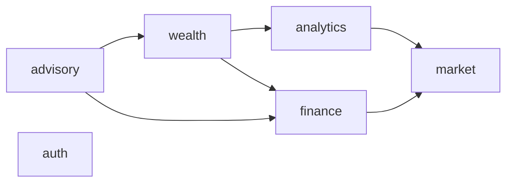

# Module dependencies

Allowed imports between backend modules. `make deps-lint` (`backend/scripts/module-deps.mjs`) reads the `## Edges` table.

## Diagram

## Edges
| From | To |
|---|---|
| `advisory` | `wealth` |
| `advisory` | `finance` |
| `wealth` | `analytics` |
| `wealth` | `finance` |
| `analytics` | `market` |
| `finance` | `market` |

## Properties
- An edge `A → B` lets files under `backend/src/modules/<A>/` import `backend/src/modules/<B>/public.ts` and no other file of B.
- The graph is acyclic; `make deps-lint` fails on a cycle in the table.
- `market` depends on no module; `auth` has no edges in either direction.
- `backend/src/core/` imports no module file, by `#modules/` or relative path; `make deps-lint` fails otherwise.
- Facts between modules travel as events (`backend/docs/events.md`); an event subscription is not an import edge.
