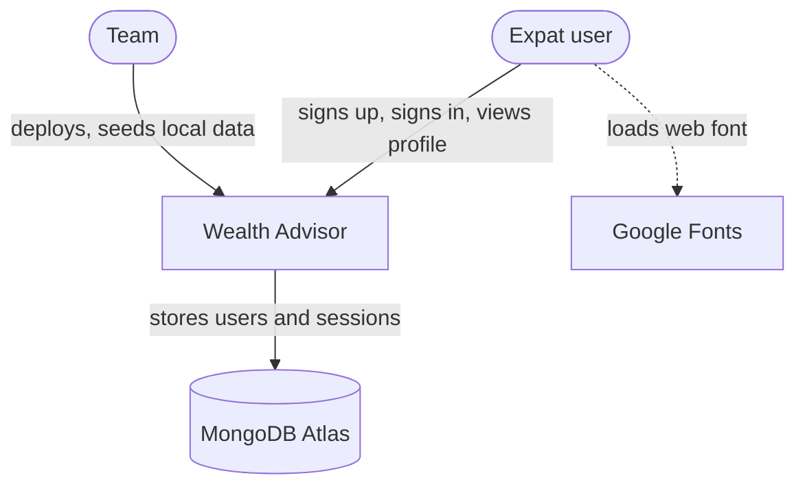

# C1: System context

## Diagram

## Users
| User | Does |
|---|---|
| Expat user | signs up, signs in, views their profile |
| Team | deploys with the Vercel CLI, runs local seeds and index setup |

## External systems
| System | Purpose | Trust |
|---|---|---|
| MongoDB Atlas | user and session storage | server-side only; credentials in `MONGODB_URI` |
| Google Fonts | DM Sans web font | fetched by the browser; receives no application data |

## Trust boundaries
- browser → API: untrusted; every body is validated against `@wealth-advisor/contracts`
- API → database: trusted; reachable only with the server's credentials
