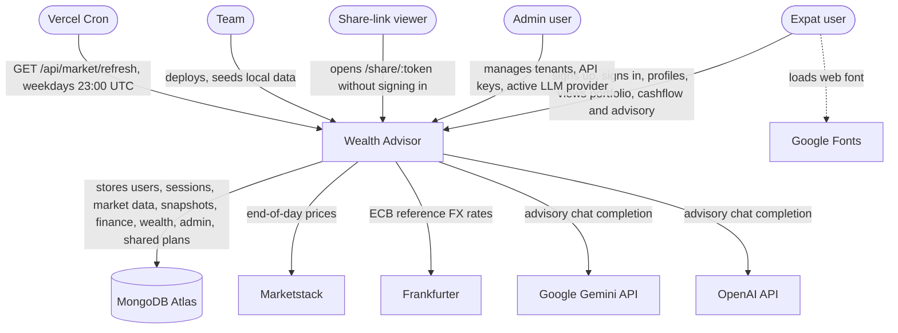

# C1: System context

## Diagram

## Users
| User | Does |
|---|---|
| Expat user | signs up, signs in, completes profiling, views dashboard, portfolio, cashflow, advisory and evidence pages, creates share links |
| Admin user | a signed-in user with the `ADMIN` role; uses the admin console: tenants, API keys, active LLM provider |
| Share-link viewer | opens a public `/share/:token` page; no sign-in |
| Team | deploys with the Vercel CLI, runs local seeds and index setup |

## External systems
| System | Purpose | Trust |
|---|---|---|
| MongoDB Atlas | persistence for every module and core collection (`backend/docs/collections.md`) | server-side only; credentials in `MONGODB_URI` |
| Marketstack | end-of-day prices (`https://api.marketstack.com`) | called by the backend; key in `MARKETSTACK_ACCESS_KEY`; calls counted by the monthly request budget |
| Frankfurter | ECB reference FX rates (`https://api.frankfurter.dev/v1`) | called by the backend; no key |
| Vercel Cron | triggers the market refresh (`vercel.json` `crons`: `/api/market/refresh`, `0 23 * * 1-5`) | sends `Authorization: Bearer <CRON_SECRET>`; the route rejects any other caller |
| Google Gemini API | advisory chat completion (`gemini-2.5-flash`) when the active provider is `gemini` | called by the backend only when `GEMINI_API_KEY` is set; otherwise and on failure the deterministic mock answers |
| OpenAI API | advisory chat completion when the active provider is `openai` | called by the backend only when `OPENAI_API_KEY` is set; otherwise and on failure the deterministic mock answers |
| Google Fonts | DM Sans and Fraunces web fonts | fetched by the browser; receives no application data |

## Trust boundaries
- browser → API: untrusted; every body is validated against `@wealth-advisor/contracts`
- API → database: trusted; reachable only with the server's credentials
- API → Marketstack, Frankfurter, Gemini, OpenAI: outbound HTTPS from the backend only; the browser never calls them
- `ADMIN` role: checked by the frontend `AdminRoute` only; `/api/admin/*` requires a valid access token and no role
- provider `claude` is answered by the deterministic mock; no Anthropic API call is made
