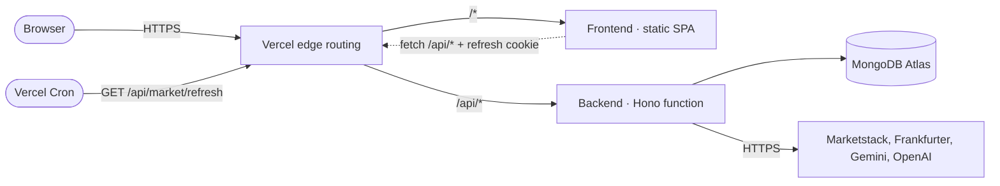
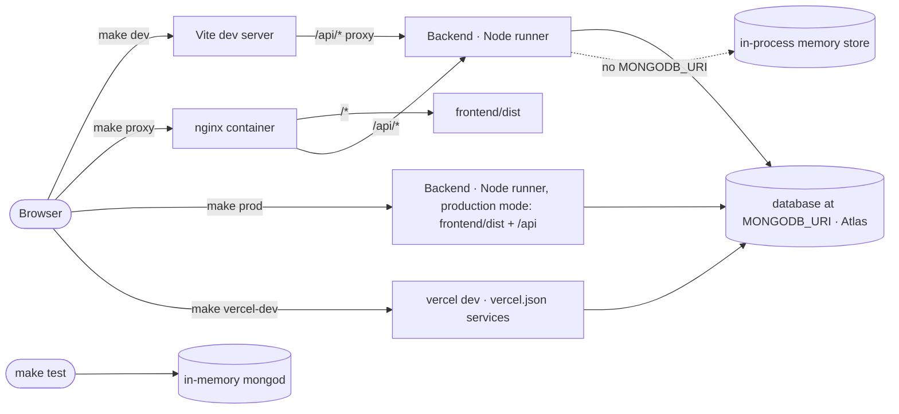

# C2: Containers

## Diagram: production

## Diagram: local

## Containers
| Container | Technology | Responsibility |
|---|---|---|
| Frontend | React, Vite; static build | UI; access token in memory; calls `/api` |
| Edge routing | Vercel Services (`vercel.json`) | sends each request to frontend or backend |
| Backend | Hono on Vercel Functions; Node runner locally | API, auth, contract validation; outbound calls to market data and LLM providers |
| Database | MongoDB Atlas, wherever `MONGODB_URI` points; tests use an in-memory mongod; local runs without it use the in-process memory store (`infra/docs/env.md`) | persistence |
| nginx | Docker, local only | production-like edge for testing |

## Request mapping
`infra/docs/routing.md`. Ports: `infra/docs/ports.md`.

## Data stores
| Store | Owner | Collections |
|---|---|---|
| MongoDB | modules auth, market, analytics, admin, finance, wealth, sharing; core (events: `processed_events`; http-client: `request_budgets`) | `backend/docs/collections.md` |
