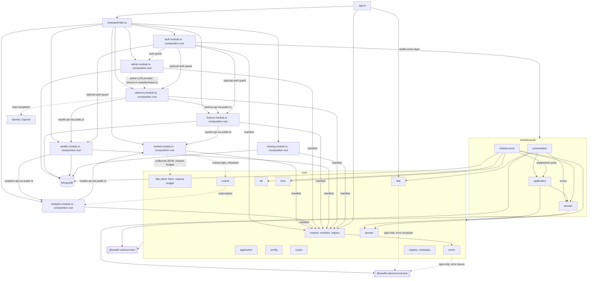

# C3: Backend components

Unrooted `core/` and `modules/` paths are under `backend/src/`.

## Diagram

## Components
| Path | Responsibility | Depends on |
|---|---|---|
| `backend/src/app.ts` | builds the HTTP app: registers manifests, error handler from the error catalog, `/health`, `/ai` (forwards to `/advisory/chat` with the caller's `authorization` header), 404 fallback | `core/module`, `core/http`, `backend/src/modules/index.ts` |
| `backend/src/core/` | mechanisms: application, config, crypto, domain, errors, events (envelope, bus, processed events), http, http-client (outbound JSON, request budget), module, db, registry, time | contracts (type-only: error envelope), rules; nothing in `modules/` |
| `backend/src/modules/index.ts` | explicit module list; build order auth, market, analytics, admin, finance, wealth, advisory, sharing; hands market api to analytics and finance, analytics api to wealth, finance and wealth apis and admin's `getActiveProvider` to advisory, auth guard to admin, optional auth guard to finance, wealth and advisory | each module's composition root |
| `backend/src/modules/admin/admin.module.ts` | composition root: store-selected tenant, API key and settings repositories; returns the manifest and the admin api | every admin layer, `core/module`, `core/config`, `core/db`, rules |
| `backend/src/modules/admin/admin.api.ts` | function orchestrators: list and create tenants, list, create and revoke API keys, read and update the active LLM provider (`getActiveProvider`) | application ports, domain (errors), infrastructure documents, `core/crypto`, `core/time`, contracts, rules |
| `backend/src/modules/admin/public.ts` | admin api type; no module imports it | api type |
| `backend/src/modules/admin/presentation/` | tenant, API key and model routes behind the auth guard and the ADMIN role guard, error statuses | `admin.api.ts`, `core/http`, contracts, rules |
| `backend/src/modules/admin/application/` | repository ports | infrastructure documents, rules |
| `backend/src/modules/admin/domain/` | errors | `core/domain`, rules |
| `backend/src/modules/admin/infrastructure/` | Mongo and memory repositories for tenants, API keys and admin settings, documents, schema | application ports, `core/db`, rules |
| `backend/src/modules/advisory/advisory.module.ts` | composition root: LLM gateway from `GEMINI_API_KEY`, `OPENAI_API_KEY`, `ANTHROPIC_API_KEY`; returns the manifest and the advisory api; no collections | every advisory layer, finance `public.ts`, wealth `public.ts`, `core/module`, `core/config`, rules |
| `backend/src/modules/advisory/advisory.api.ts` | chat: cashflow summary and portfolio, then the gateway with the active provider (`mock` when none is wired) | domain, finance `public.ts`, wealth `public.ts`, contracts, rules |
| `backend/src/modules/advisory/public.ts` | advisory api type; no module imports it | api type |
| `backend/src/modules/advisory/presentation/` | chat route behind the optional auth guard, error statuses | `advisory.api.ts`, `core/http`, contracts, rules |
| `backend/src/modules/advisory/domain/` | LLM gateway: mock, Gemini and OpenAI adapters; Gemini and OpenAI fall back to the mock without a key or on failure; provider `claude` maps to the mock | contracts, rules |
| `backend/src/modules/analytics/analytics.module.ts` | composition root: store-selected snapshot repository, processed-events guard; subscribes to `market.data_refreshed`; returns the manifest | every analytics layer, market `public.ts`, `core/module`, `core/events`, `core/config`, rules |
| `backend/src/modules/analytics/analytics.api.ts` | function orchestrators: onMarketDataRefreshed (history → align → returns → covariance → upsert → mark), latestSnapshot, snapshotAt | application steps and ports, domain, market `public.ts` (api type), `core/events`, `core/time` |
| `backend/src/modules/analytics/public.ts` | the only analytics file other modules import | api and MarketSnapshot types |
| `backend/src/modules/analytics/presentation/` | snapshot route, contract mapper, error statuses | `analytics.api.ts`, domain, `core/http`, contracts, rules |
| `backend/src/modules/analytics/application/` | snapshot repository port; event reading, window and price-point steps | domain, market `public.ts` (Price type), `core/*`, contracts (event payload), rules |
| `backend/src/modules/analytics/domain/` | alignment, log returns, annualized covariance, MarketSnapshot, errors | `core/domain`, `core/time`, rules |
| `backend/src/modules/analytics/infrastructure/` | Mongo and memory snapshot repositories, schema | application ports, domain, `core/db` |
| `backend/src/modules/auth/auth.module.ts` | composition root: builds every layer; returns the manifest, the auth guard and the optional auth guard | every auth layer, `core/module`, `core/config`, rules |
| `backend/src/modules/auth/presentation/` | routes, auth middleware, refresh cookie, token delivery, mappers, error statuses | application, domain (errors), `core/http`, contracts, rules |
| `backend/src/modules/auth/application/` | use cases, DTOs, ports | domain, `core/*`, rules |
| `backend/src/modules/auth/domain/` | entities, value objects, policies, errors, events | `core/domain`, rules |
| `backend/src/modules/auth/infrastructure/` | Mongo and memory repositories, schemas, demo seed, crypto adapters | application ports, domain, `core/domain`, `core/db`, `core/time`, rules |
| `backend/src/modules/finance/finance.module.ts` | composition root: store-selected account and transaction repositories; returns the manifest and the finance api | every finance layer, market `public.ts`, `core/module`, `core/config`, `core/db`, rules |
| `backend/src/modules/finance/finance.api.ts` | function orchestrators: accounts, create account, transactions, cashflow summary (currency conversion through the market api) | application ports, domain, infrastructure documents, market `public.ts`, `core/db`, `core/domain`, `core/time`, contracts, rules |
| `backend/src/modules/finance/public.ts` | the only finance file other modules import | api type |
| `backend/src/modules/finance/presentation/` | accounts, transactions and cashflow routes behind the optional auth guard, error statuses | `finance.api.ts`, `core/http`, contracts, rules |
| `backend/src/modules/finance/application/` | repository ports | infrastructure documents |
| `backend/src/modules/finance/domain/` | burn-rate calculator | infrastructure documents, rules |
| `backend/src/modules/finance/infrastructure/` | Mongo and memory account and transaction repositories, documents, schema | application ports, `core/db`, contracts, rules |
| `backend/src/modules/market/market.module.ts` | composition root: store-selected repositories, provider adapters, request budget; returns the manifest and the market api | every market layer, `core/module`, `core/config`, `core/http-client`, rules |
| `backend/src/modules/market/market.api.ts` | function orchestrators: refresh, quotes, history, rates, convert | application steps and ports, domain, `core/events`, `core/time`, contracts (event payload) |
| `backend/src/modules/market/public.ts` | the only market file other modules import | api and domain types |
| `backend/src/modules/market/presentation/` | quotes, fx and cron-guarded refresh routes, contract mappers, error statuses | `market.api.ts`, domain (errors), `core/http`, contracts, rules |
| `backend/src/modules/market/application/` | ports and refresh / conversion steps | domain, `core/*`, contracts (event payload), rules |
| `backend/src/modules/market/domain/` | Money, Price, FxRate, Valuation, rate table, convertBatch, tracked symbols, errors | `core/domain`, `core/time`, rules |
| `backend/src/modules/market/infrastructure/` | Marketstack and Frankfurter adapters, Mongo and memory repositories, schemas | application ports, domain, `core/http-client`, `core/db`, `core/time`, rules |
| `backend/src/modules/sharing/sharing.module.ts` | composition root: store-selected shared-plan repository; returns the manifest and the sharing api | every sharing layer, `core/module`, `core/config`, `core/db`, rules |
| `backend/src/modules/sharing/sharing.api.ts` | function orchestrators: create share link (random token), shared plan by token | application ports, `core/crypto`, `core/db`, `core/domain`, `core/time`, contracts, rules |
| `backend/src/modules/sharing/public.ts` | sharing api type; no module imports it | api type |
| `backend/src/modules/sharing/presentation/` | create route behind the optional auth guard, public get-by-token route; error statuses | `sharing.api.ts`, `core/http`, contracts, rules |
| `backend/src/modules/sharing/application/` | repository port | infrastructure documents |
| `backend/src/modules/sharing/infrastructure/` | Mongo and memory shared-plan repositories, document, schema | application ports, `core/db`, contracts |
| `backend/src/modules/wealth/wealth.module.ts` | composition root: store-selected asset product, portfolio and sandbox ledger repositories; returns the manifest and the wealth api | every wealth layer, analytics `public.ts`, `core/module`, `core/config`, `core/db`, rules |
| `backend/src/modules/wealth/wealth.api.ts` | function orchestrators: products, portfolio, optimize (latest analytics snapshot when present), execute sandbox trade, ledger | application ports, infrastructure documents, analytics `public.ts`, `core/crypto`, `core/db`, `core/domain`, `core/time`, contracts, rules |
| `backend/src/modules/wealth/public.ts` | the only wealth file other modules import | api type |
| `backend/src/modules/wealth/presentation/` | products, portfolio, optimize, execute and ledger routes behind the optional auth guard, error statuses | `wealth.api.ts`, `core/http`, contracts, rules |
| `backend/src/modules/wealth/application/` | repository ports | infrastructure documents |
| `backend/src/modules/wealth/infrastructure/` | Mongo and memory asset product, portfolio and sandbox ledger repositories, documents, schema | application ports, `core/db`, contracts, rules |

Module manifest and mounting: `backend/docs/module-contract.md`. Allowed imports between modules: `backend/docs/module-dependencies.md`.
