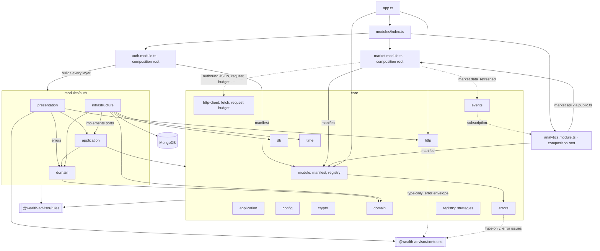

# C3: Backend components

Unrooted `core/` and `modules/` paths are under `backend/src/`.

## Diagram

## Components
| Path | Responsibility | Depends on |
|---|---|---|
| `backend/src/app.ts` | builds the HTTP app: registers manifests, error handler from the error catalog, `/health`, `/ai`, 404 fallback | `core/module`, `core/http`, `backend/src/modules/index.ts` |
| `backend/src/core/` | mechanisms: application, config, crypto, domain, errors, events (envelope, bus, processed events), http, http-client (outbound JSON, request budget), module, db, registry, time | contracts (type-only: error envelope), rules; nothing in `modules/` |
| `backend/src/modules/index.ts` | explicit module list; builds market first and hands its api to analytics | each module's composition root |
| `backend/src/modules/analytics/analytics.module.ts` | composition root: store-selected snapshot repository, processed-events guard; subscribes to `market.data_refreshed`; returns the manifest | every analytics layer, market `public.ts`, `core/module`, `core/events`, `core/config`, rules |
| `backend/src/modules/analytics/analytics.api.ts` | function orchestrators: onMarketDataRefreshed (history → align → returns → covariance → upsert → mark), latestSnapshot, snapshotAt | application steps and ports, domain, market `public.ts` (api type), `core/events`, `core/time` |
| `backend/src/modules/analytics/presentation/` | snapshot route, contract mapper, error statuses | `analytics.api.ts`, domain, `core/http`, contracts, rules |
| `backend/src/modules/analytics/application/` | snapshot repository port; event reading, window and price-point steps | domain, market `public.ts` (Price type), `core/*`, contracts (event payload), rules |
| `backend/src/modules/analytics/domain/` | alignment, log returns, annualized covariance, MarketSnapshot, errors | `core/domain`, `core/time`, rules |
| `backend/src/modules/analytics/infrastructure/` | Mongo and memory snapshot repositories, schema | application ports, domain, `core/db` |
| `backend/src/modules/auth/auth.module.ts` | composition root: builds every layer, returns the manifest | every auth layer, `core/module`, `core/config`, rules |
| `backend/src/modules/auth/presentation/` | routes, auth middleware, refresh cookie, token delivery, mappers, error statuses | application, domain (errors), `core/http`, contracts, rules |
| `backend/src/modules/auth/application/` | use cases, DTOs, ports | domain, `core/*`, rules |
| `backend/src/modules/auth/domain/` | entities, value objects, policies, errors, events | `core/domain`, rules |
| `backend/src/modules/auth/infrastructure/` | Mongo and memory repositories, schemas, demo seed, crypto adapters | application ports, domain, `core/domain`, `core/db`, `core/time`, rules |
| `backend/src/modules/market/market.module.ts` | composition root: store-selected repositories, provider adapters, request budget; returns the manifest and the market api | every market layer, `core/module`, `core/config`, `core/http-client`, rules |
| `backend/src/modules/market/market.api.ts` | function orchestrators: refresh, quotes, history, rates, convert | application steps and ports, domain, `core/events`, `core/time`, contracts (event payload) |
| `backend/src/modules/market/public.ts` | the only market file other modules import | api and domain types |
| `backend/src/modules/market/presentation/` | quotes, fx and cron-guarded refresh routes, contract mappers, error statuses | `market.api.ts`, domain (errors), `core/http`, contracts, rules |
| `backend/src/modules/market/application/` | ports and refresh / conversion steps | domain, `core/*`, contracts (event payload), rules |
| `backend/src/modules/market/domain/` | Money, Price, FxRate, Valuation, rate table, convertBatch, tracked symbols, errors | `core/domain`, `core/time`, rules |
| `backend/src/modules/market/infrastructure/` | Marketstack and Frankfurter adapters, Mongo and memory repositories, schemas | application ports, domain, `core/http-client`, `core/db`, `core/time`, rules |

Module manifest and mounting: `backend/docs/module-contract.md`. Allowed imports between modules: `backend/docs/module-dependencies.md`.
