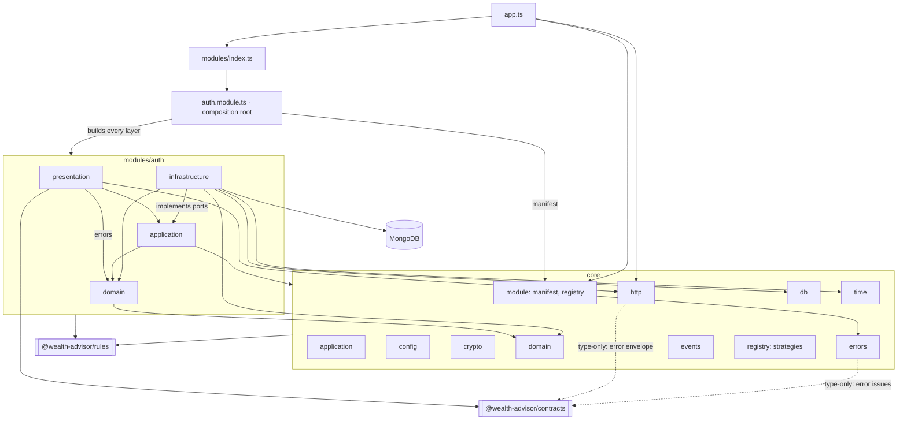

# C3: Backend components

## Diagram

## Components
| Path | Responsibility | Depends on |
|---|---|---|
| `backend/src/app.ts` | builds the HTTP app: registers manifests, error handler from the error catalog, `/health`, `/ai`, 404 fallback | `core/module`, `core/http`, `backend/src/modules/index.ts` |
| `backend/src/core/` | framework: application, config, crypto, domain, errors, events, http, module, db, registry, time | contracts (type-only: error envelope), rules; nothing in `modules/` |
| `backend/src/modules/index.ts` | explicit module list | each module's composition root |
| `backend/src/modules/auth/auth.module.ts` | composition root: builds every layer, returns the manifest | every auth layer, `core/module`, `core/config`, rules |
| `backend/src/modules/auth/presentation/` | routes, auth middleware, refresh cookie, token delivery, mappers, error statuses | application, domain (errors), `core/http`, contracts, rules |
| `backend/src/modules/auth/application/` | use cases, DTOs, ports | domain, `core/*`, rules |
| `backend/src/modules/auth/domain/` | entities, value objects, policies, errors, events | `core/domain`, rules |
| `backend/src/modules/auth/infrastructure/` | Mongo and memory repositories, schemas, demo seed, crypto adapters | application ports, domain, `core/domain`, `core/db`, `core/time`, rules |

Module manifest and mounting: `docs/backend/module-contract.md`.
