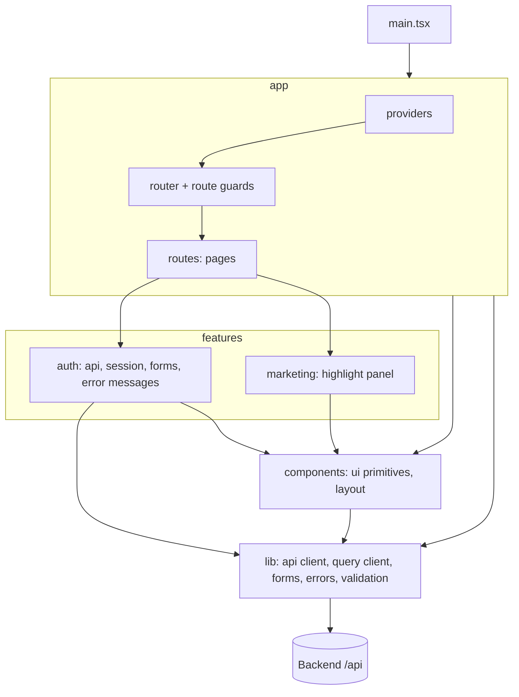

# C3: Frontend components

## Diagram

## Components
| Path | Responsibility | Depends on |
|---|---|---|
| `frontend/src/app/` | providers, router, guards, pages composing features | features, components, lib |
| `frontend/src/features/auth/` | auth API calls, session, signup and login forms, auth error messages | components, lib, contracts, rules |
| `frontend/src/features/marketing/` | auth-page highlight panel | components |
| `frontend/src/components/` | shared UI primitives and layout | lib |
| `frontend/src/lib/` | API client, query client, contract forms, error and validation messages, class helper | contracts, rules |
