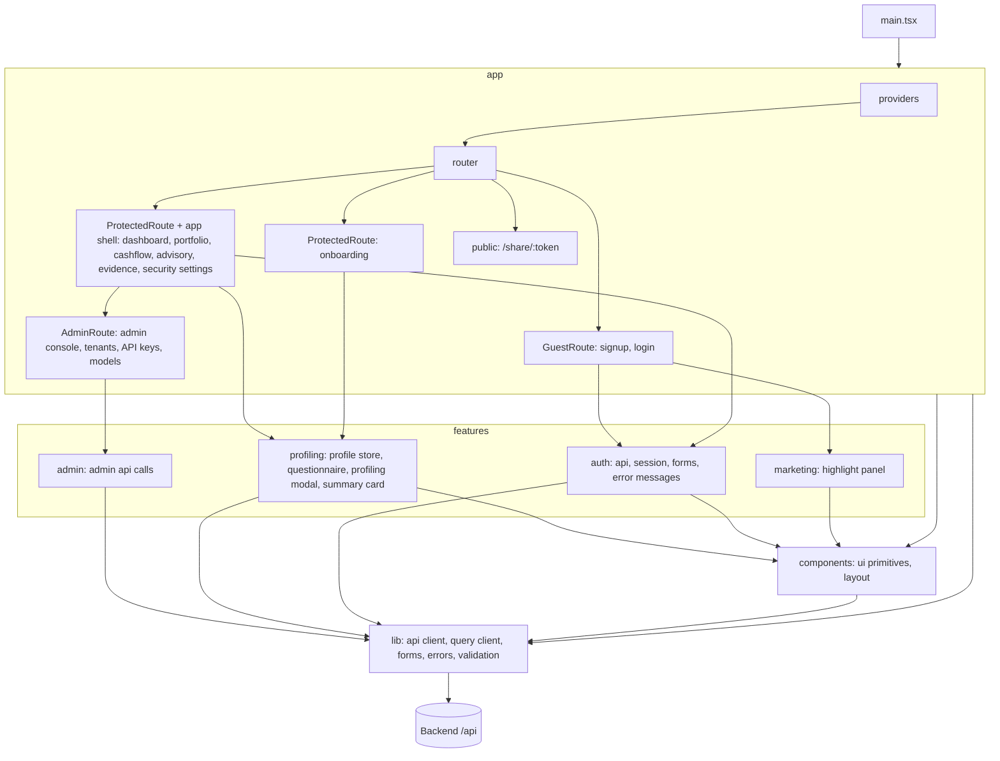

# C3: Frontend components

## Diagram

## Components
| Path | Responsibility | Depends on |
|---|---|---|
| `frontend/src/app/` | providers; router; `GuestRoute`, `ProtectedRoute`, `AdminRoute` guards; auth pages, onboarding page, signed-in pages inside the app shell, admin console, public `/share/:token` page | features, components, lib, rules |
| `frontend/src/features/admin/` | admin API calls: tenants, API keys and revoke, model settings | lib, contracts |
| `frontend/src/features/auth/` | auth API calls, session, signup and login forms, auth error messages | components, lib, contracts, rules |
| `frontend/src/features/marketing/` | auth-page highlight panel | components |
| `frontend/src/features/profiling/` | profile store (`localStorage`, keyed by email), profiling questionnaire, country tag input, profiling modal, profile summary card, country list | components, lib, rules, `country-list` |
| `frontend/src/components/` | shared UI primitives; layout: app shell (signed-in frame and navigation), split layout (auth pages) | lib |
| `frontend/src/lib/` | API client, query client, contract forms, error and validation messages, class helper, theme and locale stores, UI dictionaries, demo fixture, money formatting, motion hooks, chart colors | contracts, rules |
