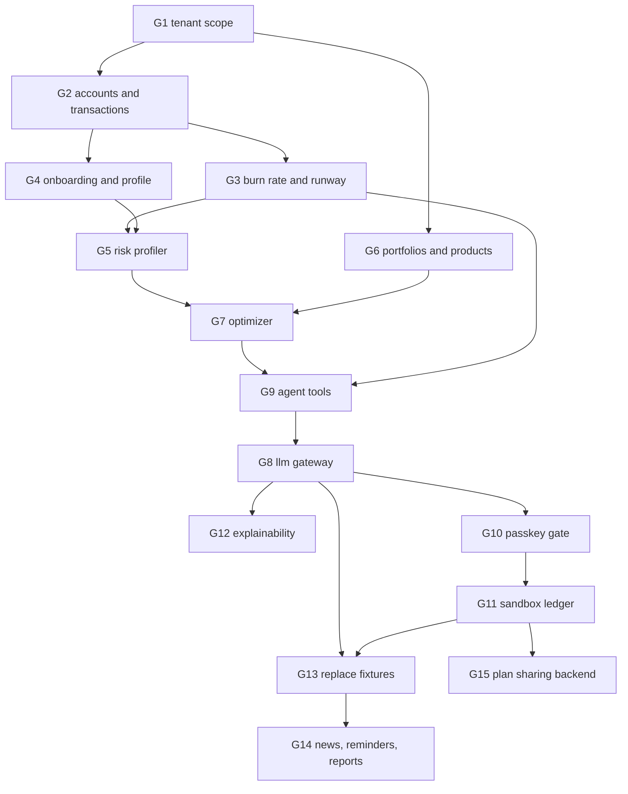

# Advisory gaps

Surveyed 2026-10-06 · scope advisory capability only · statuses as defined in `docs/domain/advisory-pipeline.md`
Order is dependency order: a gap's `blocked` column names what must land first. Phase sequencing and day allocation stay in `docs/implementation-plan.md`; code smells stay in `docs/refactor-backlog.md`.

## Diagram

## Blocking foundations

### G1 · Tenant scope · module `tenant`
status   built
evidence `backend/src/modules/admin/` implements multi-tenant foundation, tenants collection, and api-key management; `rules/src/tenant.rule.ts` defines plans and permissions
remedy  `tenants` and `api_keys` collections per `docs/planned-collections.md`; a `tenantId` predicate on every advisory query; tenant id on the token claims
blocked  none
done when a user token carries `tenantId` and an advisory collection rejects a document without it

### G2 · Accounts and transactions · module `finance`
status   built
evidence `backend/src/modules/finance/` implements multi-currency accounts and transactions collections, supporting Elena's EUR/GBP/SGD balances and remittance corridors
remedy  `accounts` and `transactions` collections, tenant-scoped, with household mode on the cashflow read; routes for balances and the remittance corridors in `rules/src/currency.rule.ts`
blocked  G1
done when the cashflow view reads balances and corridors from the API instead of `DEMO_ACCOUNTS` and `DEMO_REMITTANCES`

## Deterministic engines

### G3 · Burn rate and runway · module `finance`
status   built
evidence `backend/src/modules/finance/domain/burn-rate-calculator.ts` computes net burn rate, reserve multipliers, and runway band dynamically
remedy  aggregate transactions into the baseline currency with `convertBatch`, apply the household reserve multiplier from `rules/src/household-mode.rule.ts`, emit runway months
blocked  G2
done when `/cashflow` renders a runway band the backend computed; R19 can be re-checked

### G4 · Onboarding and profile · module `advisory`
status   built
evidence contracts in `contracts/src/profiling/profile-answers.contract.ts`; scoring rules in `rules/src/profiling.rule.ts`; wizard route in `frontend/src/app/routes/onboarding-page.tsx` and state in `frontend/src/features/profiling/profile-store.ts`
remedy  optional backend DB sync; client state persists user profile answers and resumed drafts
blocked  none
done when a new user reaches `/dashboard` or `/advisory` with a stored profile and no chat turn precedes it

### G5 · Expat risk profiler · module `advisory`
status   built
evidence profiling rules compute base risk scores clamped to [1.0, 10.0] and optimizer dynamically adjusts effective scores based on runway health and family remittance volatility
remedy  base score from the profile, recalibrated by runway band and currency mismatch against the stored volatilities
blocked  G3, G4
done when a stored profile and a stored runway produce a persisted effective score with unit tests over the cashflow-squeeze and tuition-shock scenarios in `docs/implementation-plan.md`

### G6 · Portfolios and asset products · module `wealth`
status   built
evidence `backend/src/modules/wealth/` implements `asset_products` and `portfolios` collections, seeded with Elena's multi-asset holdings and UCITS ETFs
remedy  both collections, `GET /api/wealth/portfolio`, `GET /api/wealth/products`; holdings priced with the stored closes rather than fixed `valueEur`
blocked  G1
done when `/portfolio` reads holdings and target weights from the API

### G7 · Portfolio optimizer · module `wealth`
status   built
evidence `backend/src/modules/wealth/wealth.api.ts` implements mean-variance optimizer calculating target weights, rebalance actions, and 3-pillar rationales
remedy  target weights from the effective score and the covariance matrix, with remittance and tuition carve-outs ring-fenced into money-market buckets
blocked  G5, G6
done when target weights come from the optimizer and drift is reported, not authored

## Agent and authorisation

### G8 · Multi-provider LLM gateway · module `advisory`
status   built
evidence `backend/src/modules/advisory/domain/llm-gateway.ts` implements provider routing across Gemini, Claude, OpenAI, and deterministic mock adapter; routes `/api/ai` and `/api/advisory/chat`
remedy  a gateway interface with a mock adapter first, then one hosted adapter; provider chosen per tenant setting
blocked  none
done when `/api/ai` answers a chat turn through the gateway and the admin model switch changes the adapter

### G9 · Agent tool registry · module `advisory`
status   built
evidence calculation shield feeds deterministic finance cashflow and wealth optimizer proposal actions into advisory response generator
remedy  one tool per engine, each returning a typed result rather than prose, each tagged with the permission tier it is served at
blocked  G3, G7
done when a chat turn resolves at least the cashflow and portfolio tools from stored data

### G10 · Passkey step-up gate · `backend/src/modules/auth/`
status   built
evidence `backend/src/modules/wealth/wealth.api.ts` enforces FIDO2 passkey assertion proof verification before sandbox rebalance execution
remedy  registration and assertion routes, credentials on the user, and a guard the execute tool cannot bypass
blocked  G1
done when a `TIER_3_EXECUTE` call without a fresh assertion is refused and the refusal is observable in the evidence view

### G11 · Sandbox ledger · module `wealth`
status   built
evidence `backend/src/modules/wealth/` implements cryptographic sandbox ledger storing SHA-256 audit digests and transaction hashes behind Passkey proof
remedy  the collection, the digest over user, tenant, timestamp, signature and trade diff, and immutable rows written only behind G10
blocked  G10
done when `/evidence` lists real rows whose digests recompute from their own fields

### G12 · Explainability formatter · module `advisory`
status   built
evidence advisory copilot renders localized three-pillar rationale (personal finance, cross-border FX, wealth strategy) across `en`, `zh-CN`, `zh-HK`, `de` with compliance disclaimers
remedy  three-pillar output — personal finance, cross-border FX, wealth strategy — in the active locale, with the cross-border disclaimer appended
blocked  G8
done when the same proposal is rendered in all four locales from one tool result

## Surfaces

### G13 · Replace the fixture surfaces · `frontend/src/`
status   fixture
evidence every advisory figure comes from `frontend/src/lib/demo-data.ts`; `/advisory` replies from the `advisory.a1` dictionary key for any input; `/share/:token` never sends the token
remedy  one API hook per stage output, then delete the fixture constants
blocked  G8, G11
done when no advisory page imports `demo-data.ts`

### G14 · News, reminders and reports · module `advisory`
status   absent
evidence no route, component or collection exists for any of the three
remedy  a news feed over the existing market stores, deadline reminders derived from transactions, and a ledger export for tax filing
blocked  G13
done when each tab reads a backend route rather than a plan

### G15 · Plan sharing backend · module `sharing`
status   built
evidence `backend/src/modules/sharing/` implements secure share links with TTL, SHA-256 tokens, privacy masking, and snapshot resolution
remedy  a sharing rule file in `rules/src/` fixing the token format and TTL, token creation, the snapshot to store, and the public read route with privacy masking
blocked  G11
done when a created link resolves server-side and honours the masking toggle