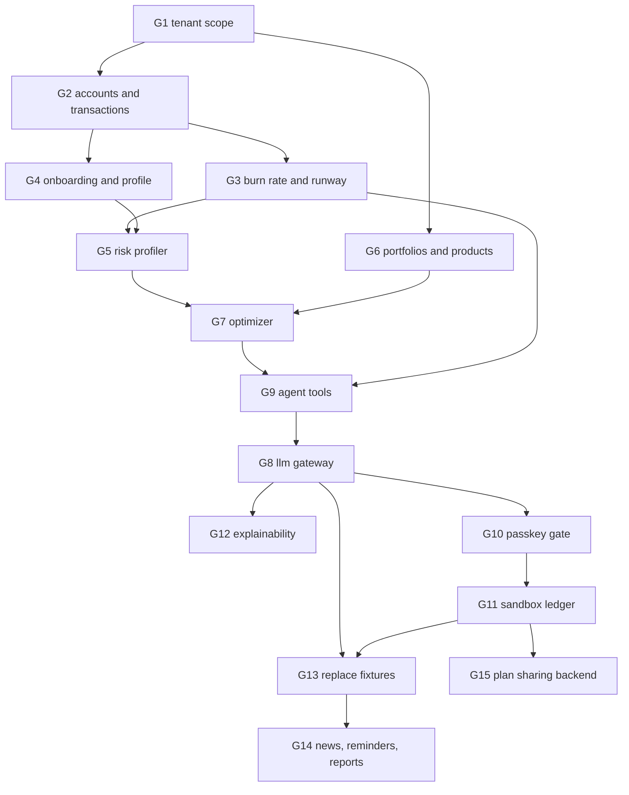

# Advisory gaps

Surveyed 2026-10-06 · scope advisory capability only · statuses as defined in `docs/domain/advisory-pipeline.md`
Order is dependency order: a gap's `blocked` column names what must land first. Phase sequencing and day allocation stay in `docs/implementation-plan.md`; code smells stay in `docs/refactor-backlog.md`.

## Diagram

## Blocking foundations

### G1 · Tenant scope · module `tenant`
status   absent
evidence `backend/src/modules/index.ts` builds auth, market and analytics only; `backend/src/core/db/schema/core-collections.ts` declares `processed_events` and `request_budgets` with no `tenantId`; `docs/backend/module-dependencies.md` already declares the `advisory→wealth` and `advisory→finance` edges this module would consume
remedy  `tenants` and `api_keys` collections per `docs/planned-collections.md`; a `tenantId` predicate on every advisory query; tenant id on the token claims
blocked  none
done when a user token carries `tenantId` and an advisory collection rejects a document without it

### G2 · Accounts and transactions · module `finance`
status   absent
evidence grep `portfolio|account` over `backend/src` returns nothing; `frontend/src/lib/demo-data.ts:32` supplies `DEMO_ACCOUNTS` as literals
remedy  `accounts` and `transactions` collections, tenant-scoped, with household mode on the cashflow read; routes for balances and the remittance corridors in `rules/src/currency.rule.ts`
blocked  G1
done when the cashflow view reads balances and corridors from the API instead of `DEMO_ACCOUNTS` and `DEMO_REMITTANCES`

## Deterministic engines

### G3 · Burn rate and runway · module `finance`
status   absent
evidence `runwayBand` (`rules/src/burn-rate.rule.ts`) bands a number no code computes; `MarketApi.convert` (`backend/src/modules/market/market.api.ts`) has zero callers, held open in `docs/refactor-backlog.md` R19 for exactly this consumer
remedy  aggregate transactions into the baseline currency with `convertBatch`, apply the household reserve multiplier from `rules/src/household-mode.rule.ts`, emit runway months
blocked  G2
done when `/cashflow` renders a runway band the backend computed; R19 can be re-checked

### G4 · Onboarding and profile · module `advisory`
status   built
evidence contracts in `contracts/src/profiling/profile-answers.contract.ts`; scoring rules in `rules/src/profiling.rule.ts`; wizard route in `frontend/src/app/routes/onboarding-page.tsx` and state in `frontend/src/features/profiling/profile-store.ts`
remedy  optional backend DB sync; client state persists user profile answers and resumed drafts
blocked  none
done when a new user reaches `/dashboard` or `/advisory` with a stored profile and no chat turn precedes it

### G5 · Expat risk profiler · module `advisory`
status   absent
evidence `rules/src/asset-class.rule.ts` line 1 defers risk scores and volatilities to the optimizer; no `riskScore` field exists in `contracts/src`
remedy  base score from the profile, recalibrated by runway band and currency mismatch against the stored volatilities
blocked  G3, G4
done when a stored profile and a stored runway produce a persisted effective score with unit tests over the cashflow-squeeze and tuition-shock scenarios in `docs/implementation-plan.md`

### G6 · Portfolios and asset products · module `wealth`
status   absent
evidence `docs/planned-collections.md` designs `portfolios` and `asset_products`; neither is declared by any module; current and target weights are literals in `frontend/src/lib/demo-data.ts:38`
remedy  both collections, `GET /api/wealth/portfolio`, `GET /api/wealth/products`; holdings priced with the stored closes rather than fixed `valueEur`
blocked  G1
done when `/portfolio` reads holdings and target weights from the API

### G7 · Portfolio optimizer · module `wealth`
status   absent
evidence drift is `target - current` computed per row in `frontend/src/app/routes/portfolio-page.tsx:30`; the only covariance input is `market_snapshots`
remedy  target weights from the effective score and the covariance matrix, with remittance and tuition carve-outs ring-fenced into money-market buckets
blocked  G5, G6
done when target weights come from the optimizer and drift is reported, not authored

## Agent and authorisation

### G8 · Multi-provider LLM gateway · module `advisory`
status   absent
evidence `backend/src/app.ts` answers `/api/ai` with `501`; `rules/src/llm-provider.rule.ts` defines four provider keys; no provider dependency is declared in `backend/package.json`
remedy  a gateway interface with a mock adapter first, then one hosted adapter; provider chosen per tenant setting
blocked  none
done when `/api/ai` answers a chat turn through the gateway and the admin model switch changes the adapter

### G9 · Agent tool registry · module `advisory`
status   absent
evidence no tool registry or function-calling code exists in `backend/src`; the tool list in `docs/implementation-plan.md` section 2.5 is a checklist
remedy  one tool per engine, each returning a typed result rather than prose, each tagged with the permission tier it is served at
blocked  G3, G7
done when a chat turn resolves at least the cashflow and portfolio tools from stored data

### G10 · Passkey step-up gate · `backend/src/modules/auth/`
status   absent
evidence `frontend/src/app/routes/advisory-page.tsx` sets local state on sign and shows a notice that a backend gate is required; no WebAuthn route or credential field exists; `rules/src/permission-tier.rule.ts` has no verifier
remedy  registration and assertion routes, credentials on the user, and a guard the execute tool cannot bypass
blocked  G1
done when a `TIER_3_EXECUTE` call without a fresh assertion is refused and the refusal is observable in the evidence view

### G11 · Sandbox ledger · module `wealth`
status   absent
evidence `DEMO_LEDGER` (`frontend/src/lib/demo-data.ts:66`) holds literal digests; `sandbox_ledgers` is unbuilt per `docs/planned-collections.md`
remedy  the collection, the digest over user, tenant, timestamp, signature and trade diff, and immutable rows written only behind G10
blocked  G10
done when `/evidence` lists real rows whose digests recompute from their own fields

### G12 · Explainability formatter · module `advisory`
status   absent
evidence `rules/src/locale.rule.ts` defines the locales; no formatter or compliance disclaimer text exists
remedy  three-pillar output — personal finance, cross-border FX, wealth strategy — in the active locale, with the cross-border disclaimer appended
blocked  G8
done when the same proposal is rendered in all four locales from one tool result

## Surfaces

### G13 · Replace the fixture surfaces · `frontend/src/`
status   fixture
evidence every advisory figure comes from `frontend/src/lib/demo-data.ts`; `/advisory` replies from the `advisory.a1` dictionary key for any input; `/share/:token` never sends the token
remedy  one API hook per stage output, then delete the fixture constants
blocked  G8, G11
done when no advisory page imports `demo-data.ts`

### G14 · News, reminders and reports · module `advisory`
status   absent
evidence no route, component or collection exists for any of the three
remedy  a news feed over the existing market stores, deadline reminders derived from transactions, and a ledger export for tax filing
blocked  G13
done when each tab reads a backend route rather than a plan

### G15 · Plan sharing backend · module `sharing`
status   absent
evidence `SharedPlanPage` echoes its `:token` parameter; `shared_plans` is unbuilt per `docs/planned-collections.md`; no sharing rule file exists in `rules/src/`
remedy  a sharing rule file in `rules/src/` fixing the token format and TTL, token creation, the snapshot to store, and the public read route with privacy masking
blocked  G11
done when a created link resolves server-side and honours the masking toggle