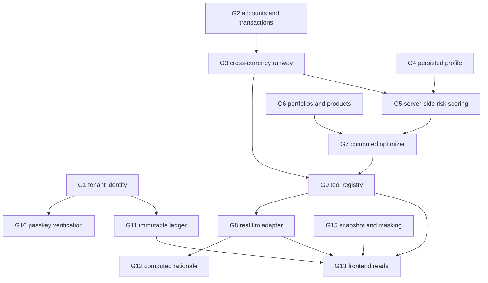

# Advisory gaps

Surveyed 2026-10-06 · re-verified after `19f4b73` · statuses as defined in `docs/domain/advisory-pipeline.md`
Order is dependency order: a gap's `blocked` column names what must land first. Gap numbers are stable across surveys so they can be tracked. Phase sequencing and day allocation stay in `docs/implementation-plan.md`; code smells stay in `docs/refactor-backlog.md`.

`19f4b73` closed G2, G3, G6 and most of G15 by adding the finance, wealth, admin and sharing modules. What it did not close is the subject of this survey: the values those modules serve are authored, the identity behind them is hardcoded, and nothing reads any of it.

## Diagram

## Blocking foundations

### G1 · Tenant identity from the token · `backend/src/modules/auth/`
status   `partial`
evidence `AccessTokenClaims` carries `tenantId`, the signer writes it as `tenant_id`, and `requireAuth`/`optionalAuth` put it on the principal every scoped route reads; no route reads a tenant header, and an unusable scope id is refused by the write paths rather than falling back to the demo tenant. Open: `sharing.routes.ts` still passes the literal `'default'` (its repository filters on `shareToken` alone), and signup joins one tenant because there is no tenant provisioning
remedy  add `tenantId` to the claims and the me contract; resolve it per request; filter the sharing repository on it too (`mongo-sharing.repository.ts:13` filters on `shareToken` alone)
blocked  none
done when every advisory route derives its tenant from the verified token and no route contains a tenant literal

### G2 · Accounts and transactions
status   closed by `19f4b73`
evidence `finance-collections.ts` declares both; `finance.routes.ts` exposes `GET,POST /accounts`, `GET /transactions`, `GET /cashflow`; covered by `backend/test/unit/finance/finance-api.test.ts`
blocked  —
done when closed

### G3 · Cross-currency runway
status   `partial`
evidence account balances are valued into the base currency through `MarketApi.convert`/`convertBatch` in one shared pass, and `AccountDto.baseBalance` is `null` for an account no rate values, so `totalLiquidReservesBase` never mixes minor units; open: transactions are still read from their stored `convertedBaseAmount` rather than routed through `convertBatch`, the 450000/1050000 inflow and 250000/540000 outflow literals still stand in for an empty ledger, and the remittance corridors in `finance.api.ts` are literals
remedy  route every transaction amount through `convertBatch` into the tenant baseline currency; derive the corridors from `rules/src/tenant.rule.ts`; delete the no-transaction fallbacks so an empty ledger reads as zero
blocked  G1
done when the cashflow response moves when a currency or a transaction changes

### G4 · Persisted investor profile
status   `partial`
evidence `rules/src/profiling.rule.ts` and `contracts/src/profiling/profile-answers.contract.ts` define the seven questions and the scoring, and `frontend/src/features/profiling/profile-store.ts:86` keeps the answers in browser storage keyed by email; `grep -rn profil backend/src` finds no collection, document or route
remedy  a tenant-scoped profile collection, a write route the questionnaire calls on completion, and reads from it instead of localStorage
blocked  G1
done when answers survive a new browser and a signed-in read returns them

### G5 · Server-side risk scoring
status   `partial`
evidence `calculateBaseRiskScore` (`rules/src/profiling.rule.ts:222`) and `mapStressAnswerToRiskBand` are pure and tested, and run in the browser; nothing recomputes a score from the stored runway in `finance.api.ts` or reads one back
remedy  a scoring service that takes the stored profile plus the finance runway and currency mismatch, and persists the effective score the portfolio optimizer then consumes
blocked  G3, G4
done when the score a user sees comes from a stored profile and a stored runway

### G6 · Portfolios and asset products
status   closed by `19f4b73`
evidence `wealth-collections.ts` declares `asset_products`, `portfolios`, `sandbox_ledgers`; `wealth.routes.ts` exposes `GET /products` and `GET /portfolio`
blocked  —
done when closed

### G7 · Computed optimizer
status   `fixture`
evidence `planRebalance` in `wealth.api.ts` derives every action from the holdings' own drift, sizes it off `totalValuationBase`, lists sells first, and caps the buys at the sell proceeds so the list is always executable; the strategy sentence names the holding actually rebalanced. Open: the personal-finance and cross-border pillars are still literal strings, and the target weights themselves come from the profile rather than from the effective risk score and the covariance in `market_snapshots`
remedy  target weights from the effective score and the covariance in `market_snapshots`, carve-outs ring-fenced into money-market buckets, actions derived from the difference
blocked  G5
done when changing a holding or the risk score changes the returned actions

### G8 · Real LLM adapter · `backend/src/modules/advisory/domain/llm-gateway.ts`
status   `partial`
evidence `LlmAdapter` and the four provider keys exist, but `llm-gateway.ts:97` binds gemini, claude, openai and mock to the same `MockLlmAdapter`, so the admin model switch cannot change an answer
remedy  one real hosted adapter behind the existing interface, selected by `admin.api.getActiveProvider()`, with the mock kept as the offline default
blocked  none
done when switching provider in `/admin/models` changes the reply and the mock remains reachable

### G9 · Agent tool registry
status   `absent`
evidence `POST /advisory/chat` passes the request straight to the gateway; no tool registry, function-calling schema or dispatch exists in `backend/src`, `contracts/src` or `rules/src`
remedy  one tool per engine in the table in `docs/domain/advisory-pipeline.md`, each returning a typed result and tagged with the tier it is served at
blocked  G3, G7
done when a chat turn resolves the cashflow and portfolio tools from stored data instead of seeded text

### G10 · Passkey verification · `backend/src/modules/auth/`
status   `partial`
evidence `contracts/src/auth/passkey.contract.ts` defines the challenge, verify request and response, and `rules/src/error-codes.ts` reserves `AU_1008`, `WL_1003` and `WL_1004`; `wealth.api.ts` refuses every assertion through `unregisteredPasskeyVerifier` (`WL_1004`) because no credential is stored, `users.schema.ts` has no credential field, and the frontend still shows the string in `frontend/src/lib/dictionaries.ts:45` instead of calling `navigator.credentials`
remedy  registration and assertion routes, a credential per user, and signature verification before the ledger write
blocked  G1
done when an assertion with a bad signature is refused and recorded as a refusal

### G11 · Immutable, verified ledger
status   `partial`
evidence `wealth.api.ts` appends the ledger row before the portfolio moves, so a failed persist leaves an attempt on record rather than an unexplained rebalance, and each executed trade is checked against the holding's recorded target instead of the client's word; the digests cover the initial and resulting state summaries. Open: the digest still folds in an unverified passkey signature, and the evidence page still renders `DEMO_LEDGER`
remedy  verify before hashing, append only, and have the digest cover the resulting state rather than constant strings
blocked  G10
done when `/evidence` lists rows read from the API whose digests recompute from their own fields

### G12 · Computed rationale
status   `fixture`
evidence the three-pillar structure in `contracts/src/advisory/advisory-chat.contract.ts:19` is filled from a per-locale literal record in the mock adapter (`llm-gateway.ts:41`)
remedy  build each pillar from the tool result that produced it — personal finance from the runway, cross-border from the exposure, strategy from the target weights — so the same numbers cannot be narrated differently
blocked  G9
done when a rationale sentence changes when its underlying engine output changes

## Surfaces

### G13 · Frontend reads the API · `frontend/src/`
status   `fixture`
evidence `frontend/src/features/` has `admin` and `auth` only; `/portfolio`, `/cashflow`, `/evidence` and `/share/:token` import `frontend/src/lib/demo-data.ts`, and `/advisory` replies from seeded local state (`frontend/src/app/routes/advisory-page.tsx:17`)
remedy  one hook per module, then delete the fixture constants and the seeded replies
blocked  G8, G9, G11
done when no advisory page imports `demo-data.ts`

### G14 · News, reminders and reports
status   `absent`
evidence no route, component or collection for any of the three
remedy  a news feed over the existing market stores, deadline reminders from transaction dates, and a ledger export for filing
blocked  G13
done when each tab reads a backend route

### G15 · Snapshot content and privacy masking · `backend/src/modules/sharing/`
status   `partial`
evidence token creation, `ttlHours` default 72 capped at 720, and expiry on read all work (`sharing.api.ts:36`, `:83`); the snapshot is the caller's rebalance proposal and `ownerDisplayName` comes from the request (`sharing.api.ts`); `privacyMasked` is stored and echoed back (`sharing.api.ts:45`, `:90`) with no field ever redacted
remedy  redact holdings and amounts when the flag is set
blocked  G6
done when a shared link shows the sharer's real plan and honours the mask toggle