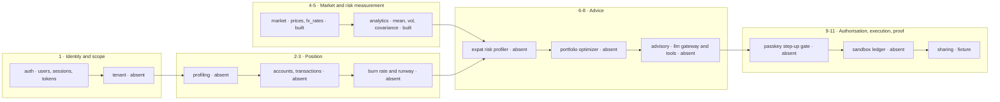
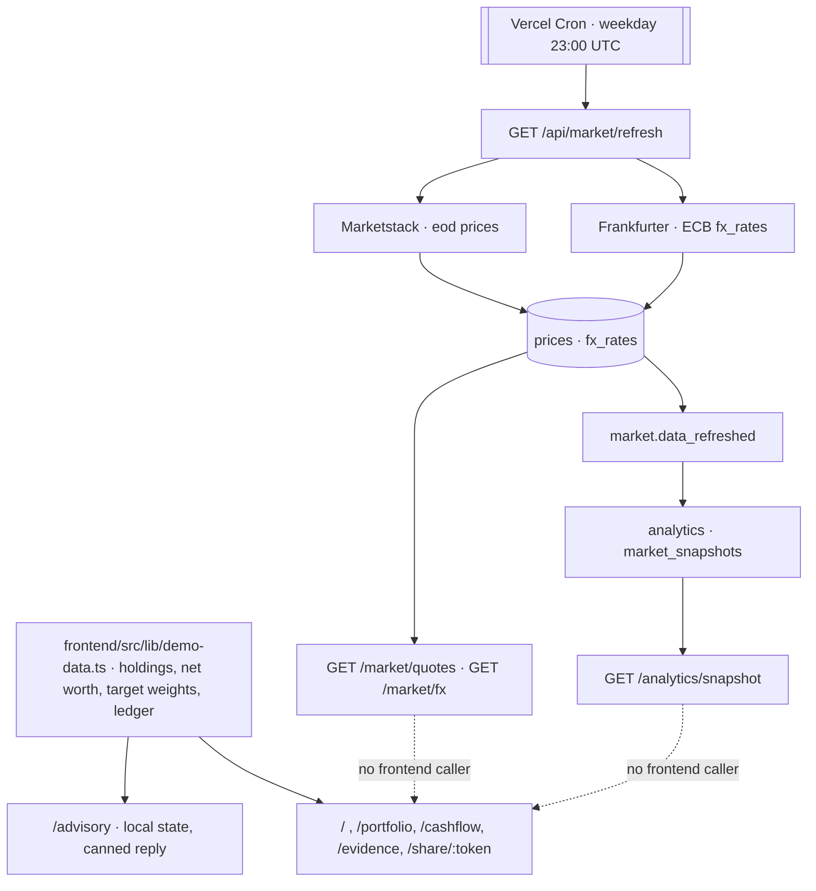

# Advisory pipeline

How one piece of advice is produced and proved: the stages, the engine behind each stage, the tier that authorises it, and what runs today.

Sequence and ownership of the build: `docs/implementation-plan.md`. Missing capabilities and what blocks them: `docs/domain/advisory-gaps.md`.

Status vocabulary used here and in the gaps doc: `built` runs in the deployed backend · `partial` runs but is not reachable from a product surface · `fixture` renders hardcoded demo data with no backend read · `absent` no code owns it.

## Diagram

## Stages
| # | Stage | Input | Output | Owner | Status |
|---|---|---|---|---|---|
| 1 | Identity and tenant scope | email, password, API key | user, session, `tenantId` on every query | `backend/src/modules/auth/` built; tenant scoping `absent` | `partial` |
| 2 | Investor profiling | questionnaire answers | risk profile, liquidity carve-outs | none; contracts listed in `docs/implementation-plan.md` | `absent` |
| 3 | Financial position | accounts, transactions | baseline-currency balances, runway months | none; `MarketApi.convert` (`backend/src/modules/market/domain/convert.ts`) built but unrouted | `absent` |
| 4 | Market state | provider responses | `prices`, `fx_rates` | `backend/src/modules/market/` | `built` |
| 5 | Risk measurement | 365 days of closes | annualized mean, volatility, covariance | `backend/src/modules/analytics/` | `built` |
| 6 | Risk profiling | profile, runway, FX mismatch, volatilities | effective risk score | none; `rules/src/asset-class.rule.ts` defers risk scores to the optimizer and carries none today | `absent` |
| 7 | Portfolio construction | effective risk score, covariance, carve-outs | target weights per asset class | none; drift is client-side arithmetic in `frontend/src/app/routes/portfolio-page.tsx` | `fixture` |
| 8 | Recommendation and explanation | chat turn, tool results | reply, proposal cards, three-pillar rationale | `backend/src/app.ts` serves `501` on `/api/ai`; `frontend/src/app/routes/advisory-page.tsx` replies from a dictionary key | `fixture` |
| 9 | Authorisation gate | rebalance proposal, step-up assertion | permitted or refused | `rules/src/permission-tier.rule.ts` defines the tiers only | `absent` |
| 10 | Execution and evidence | permitted proposal, signature | sandbox ledger row, audit digest | none; `frontend/src/lib/demo-data.ts` holds literal digests | `fixture` |
| 11 | Sharing | plan snapshot, token, masking | public read-only plan | `frontend/src/app/routes/shared-plan-page.tsx` echoes the token and never sends it | `fixture` |

## Permission tiers
`rules/src/permission-tier.rule.ts` is the only place tiers are defined; nothing reads it.

| Tier | Allows | Needs |
|---|---|---|
| `TIER_0_READ` | stored positions, stored snapshots | a valid user token |
| `TIER_1_ADVISORY` | a recommendation that changes nothing | a valid user token |
| `TIER_2_SIMULATE` | stress tests and hypothetical rebalances | a valid user token |
| `TIER_3_EXECUTE` | writing a sandbox ledger row | a verified passkey step-up assertion |

## Deterministic engines
Every advice-bearing number is meant to come from a pure function over stored data; the model narrates, it does not compute.

| Engine | Computes | Status |
|---|---|---|
| `createRateTable`, `convertBatch` (`backend/src/modules/market/domain/`) | direct, inverted and EUR-crossed lookup; per-item conversion with round-half-even minor units | `partial` — tested, no route, no caller |
| `measureSnapshot` (`backend/src/modules/analytics/domain/`) | aligned log returns, annualized mean, volatility, symmetric covariance matrix over a 365-day window | `built` |
| `runwayBand` (`rules/src/burn-rate.rule.ts`) | bands a months figure into `critical`, `warning`, `healthy` | `fixture` — the input is a literal in `frontend/src/lib/demo-data.ts` |
| Burn-rate calculator | aggregates multi-currency transactions into a reserve target scaled by household mode | `absent` |
| Expat risk profiler | recalibrates a base risk score from runway and currency mismatch | `absent` |
| Portfolio optimizer | target allocation from the effective risk score, ring-fencing remittance and tuition carve-outs | `absent` |

## Agent tools
Each tool is a thin wrapper over one of the engines above, so a tool without its engine returns fixture data. Tier column: the tier the tool's result is served at.

| Tool | Engine it needs | Tier | Status |
|---|---|---|---|
| `get_cashflow_and_runway` | burn-rate calculator | `TIER_1_ADVISORY` | `absent` |
| `get_currency_exposure` | `convertBatch` | `TIER_0_READ` | `partial` — engine built, no exposure model |
| `calculate_adaptive_portfolio` | risk profiler, optimizer | `TIER_1_ADVISORY` | `absent` |
| `simulate_stress_test` | snapshot covariance | `TIER_2_SIMULATE` | `absent` |
| `create_rebalance_proposal` | optimizer | `TIER_2_SIMULATE` | `fixture` — a dictionary string in `frontend/src/lib/dictionaries.ts` |
| `execute_sandbox_trade` | sandbox ledger | `TIER_3_EXECUTE` | `absent` |

## Data flow today

The ingestion pipeline is the only part of the advisory path with no consumer: no component in `frontend/src` reads `/api/market/*` or `/api/analytics/snapshot`, and the only backend calls the frontend makes are the auth ones in `frontend/src/features/auth/api/auth-api.ts`.

Route surface: `docs/shared/apis/market.md`, `docs/shared/apis/analytics.md`, `docs/shared/apis/core.md`. Module and event contracts: `docs/backend/module-contract.md`, `docs/backend/events.md`.