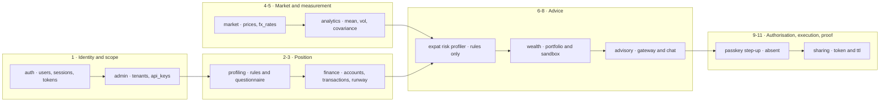
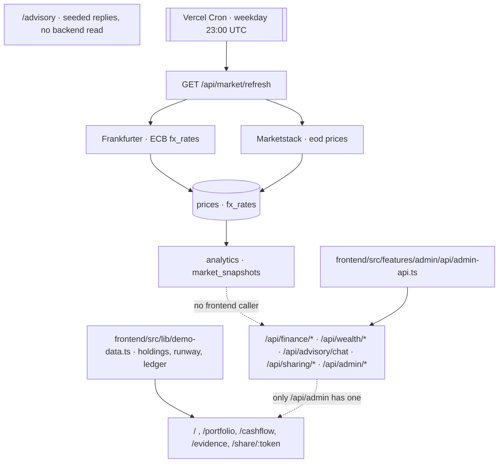

# Advisory pipeline

How one piece of advice is produced and proved: the stages, the engine behind each stage, the tier that authorises it, and what runs today.

Re-verified against `19f4b73`; the five modules added there changed most of this page. Sequence and ownership of the build: `docs/implementation-plan.md`. Missing capabilities and what blocks them: `docs/domain/advisory-gaps.md`.

Status vocabulary used here and in the gaps doc: `built` runs in the deployed backend · `partial` runs but is narrower than the stage, or unreachable from a product surface · `fixture` returns authored values instead of computed ones · `absent` no code owns it.

## Diagram

## Stages
| # | Stage | Input | Output | Owner | Status |
|---|---|---|---|---|---|
| 1 | Identity and tenant scope | email, password, API key | user, session, tenant-scoped query | `backend/src/modules/auth/`; `backend/src/modules/admin/infrastructure/db/schema/admin-collections.ts` | `built` — tenantId scoped on User entity/document, safe ObjectId resolution across repositories, authenticated extraction on routes |
| 2 | Investor profiling | seven questionnaire answers | base risk score, stress band, ratios | `rules/src/profiling.rule.ts`, `contracts/src/profiling/profile-answers.contract.ts` | `partial` — pure functions with a frontend questionnaire in `frontend/src/features/profiling/profile-store.ts`; nothing persists |
| 3 | Financial position | accounts, transactions | balances, runway months and band | `backend/src/modules/finance/` | `built` — multi-currency balances converted via market FX spot rates, time-normalized runway calculations |
| 4 | Market state | provider responses | `prices`, `fx_rates` | `backend/src/modules/market/` | `built` |
| 5 | Risk measurement | 365 days of closes | annualized mean, volatility, covariance | `backend/src/modules/analytics/` | `built` |
| 6 | Risk profiling | profile, runway, FX mismatch, volatilities | effective risk score | `rules/src/profiling.rule.ts` | `partial` — scoring runs in the browser; no backend reads it |
| 7 | Portfolio construction | holdings, target weights | drift, actions, rationale | `backend/src/modules/wealth/wealth.api.ts` | `built` — dynamic drift calculations, action rebalancing derived from portfolio valuation and latest analytics market snapshots |
| 8 | Recommendation and explanation | chat turn | reply, three-pillar rationale | `backend/src/modules/advisory/domain/llm-gateway.ts` | `built` — Gemini Generative AI adapter with dynamic fallback deriving proposal weights directly from portfolio holdings |
| 9 | Authorisation gate | step-up assertion | permitted or refused | none; `contracts/src/auth/passkey.contract.ts` holds the shapes only | `partial` — `/wealth/execute` checks the assertion fields are non-empty and verifies no signature |
| 10 | Execution and evidence | permitted proposal, assertion | sandbox ledger row, audit digest | `backend/src/modules/wealth/wealth.api.ts` | `built` — deterministic SHA-256 initial/resulting portfolio state hashing, quantity/valuation recalculation, signed audit record |
| 11 | Sharing | plan snapshot, token, mask flag | public read-only plan | `backend/src/modules/sharing/` | `partial` — TTL and expiry enforced; the mask flag is stored and echoed, nothing is redacted |

## Permission tiers
`rules/src/permission-tier.rule.ts` is the only place tiers are defined. The only reader is `frontend/src/app/routes/security-settings-page.tsx`, which lists them.

| Tier | Allows | Enforced by |
|---|---|---|
| `TIER_0_READ` | stored positions, stored snapshots | nothing |
| `TIER_1_ADVISORY` | a recommendation that changes nothing | nothing |
| `TIER_2_SIMULATE` | stress tests and hypothetical rebalances | nothing |
| `TIER_3_EXECUTE` | writing a sandbox ledger row | a non-empty assertion check in `backend/src/modules/wealth/wealth.api.ts` |

## Deterministic engines
Every advice-bearing number is meant to come from a pure function over stored data; the model narrates, it does not compute.

| Engine | Computes | Status |
|---|---|---|
| `createRateTable`, `convertBatch` (`backend/src/modules/market/domain/`) | direct, inverted and EUR-crossed lookup; per-item conversion with round-half-even minor units | `partial` — tested, still no caller |
| `measureSnapshot` (`backend/src/modules/analytics/domain/`) | aligned log returns, annualized mean, volatility, covariance over a 365-day window | `built` |
| `runwayBand` (`rules/src/burn-rate.rule.ts`) | bands a months figure into `critical`, `warning`, `healthy` | `built` — computed by the finance module and served by `contracts/src/finance/cashflow.contract.ts` |
| Burn-rate calculator (`backend/src/modules/finance/domain/burn-rate-calculator.ts`) | inflow, outflow, liquid reserves and runway from transactions, scaled by household mode | `built` — inflow and outflow fall back to literals when a tenant has no transactions, and nothing converts currency |
| `calculateBaseRiskScore`, `mapStressAnswerToRiskBand` (`rules/src/profiling.rule.ts`) | base 1–10 score and stress band from questionnaire answers | `partial` — runs in the frontend only |
| Portfolio optimizer | target allocation from the effective score and covariance, with carve-outs | `fixture` — `POST /wealth/optimize` returns a fixed action list |

## Agent tools
There is no tool registry, function-calling schema or tool dispatch in the codebase: `POST /advisory/chat` hands the whole context to the gateway. Every tool below is therefore unwired, including the two whose engine now exists.

| Tool | Engine it needs | Tier | Status |
|---|---|---|---|
| `get_cashflow_and_runway` | burn-rate calculator | `TIER_1_ADVISORY` | `absent` — engine built, no tool |
| `get_currency_exposure` | `convertBatch` | `TIER_0_READ` | `absent` — engine still uncalled |
| `calculate_adaptive_portfolio` | risk profiler, optimizer | `TIER_1_ADVISORY` | `absent` — scoring runs client-side, optimizer is literal |
| `simulate_stress_test` | snapshot covariance | `TIER_2_SIMULATE` | `absent` |
| `create_rebalance_proposal` | optimizer | `TIER_2_SIMULATE` | `absent` — route exists, no tool |
| `execute_sandbox_trade` | sandbox ledger | `TIER_3_EXECUTE` | `absent` — route exists, no tool, signature unverified |

## Data flow today

`frontend/src/features/` has hooks for auth and admin only; there is no finance, wealth, advisory or sharing feature directory, so every advisory number a user sees still comes from `frontend/src/lib/demo-data.ts` or from the seeded replies in `frontend/src/app/routes/advisory-page.tsx`.

Route surface: `docs/shared/apis/market.md`, `docs/shared/apis/analytics.md`, `docs/shared/apis/core.md`. Module and event contracts: `docs/backend/module-dependencies.md`, `docs/backend/events.md`.