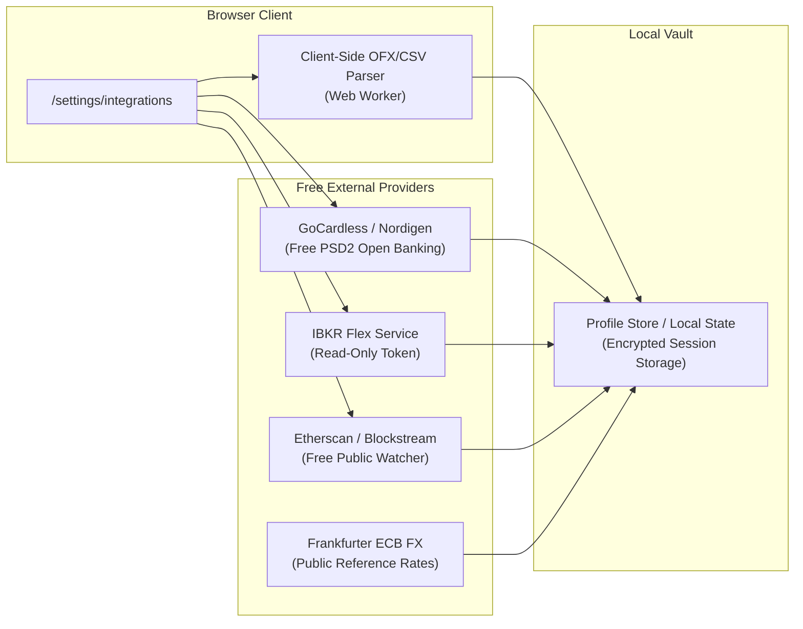

# Onboarding Friction Reduction & Free Integrations

## Overview

Investor profiling and onboarding is the initial trust gate between an expatriate user and the DEWA advisory system. Manual data entry introduces high cognitive friction, especially when typing multi-currency balances, cross-border corridors, and tax jurisdictions.

This document details:
1. **Low-Friction Form Ergonomics:** Design patterns to minimize keystrokes, eliminate redundant clicks, and auto-derive baseline data.
2. **Zero-Cost External Integrations:** Free and open APIs, browser standards, and file-based bridges that eliminate manual portfolio entry.
3. **Architecture & Privacy Model:** Client-side parsing and credential-free isolation keeping financial data private.

---

## Low-Friction Form Ergonomics

### Interaction Comparison

| Dimension | Current Questionnaire | Zero-Friction Enhanced Mode | User Effort Reduction |
| :--- | :--- | :--- | :--- |
| **Residency & Corridor Detection** | Manual 2-letter ISO code typing (`DE`, `CN`, `SG`) | Geolocation / `Intl` locale detection + 1-tap global expat corridor chips | **85% fewer keystrokes** |
| **Step Advancement** | Select option $\to$ move mouse $\to$ click "Next" button | **Auto-advance on single-select** with 200ms easing transition | **50% fewer clicks** |
| **Holdings Valuation** | Manual multi-digit input for 4 asset buckets | **1-tap logarithmic wealth brackets** (`<€25k`, `€25k–€100k`, `€100k–€250k`, `€250k+`) or statement drag-and-drop | **Eliminates typing on mobile** |
| **Age & Horizon** | Numeric input field | Life-stage chips (`Early Career <30`, `Peak Wealth 30–45`, `Pre-Retirement 45+`) | **1 tap** |
| **Keyboard Accelerators** | Mouse/touch only | Hotkeys `1`–`4` for options, `Enter` to confirm, `Esc` / `Backspace` to step back | **Power user desktop speed** |
| **Onboarding Tiers** | 7 mandatory sequential screens | **Express Mode (3 questions, 15 sec)** vs. **Comprehensive Mode (7 questions)** | **60% faster path to dashboard** |

---

### Low-Friction Architecture

```mermaid
flowchart TD
    Signup["User Signs Up"] --> Geo["Auto-Detect Geolocation & Locale\n(Intl.DateTimeFormat + IP Country)"]
    Geo --> Choice{"Onboarding Mode Selection"}
    
    Choice -->|Express (15s)| Express["3 Fast Prompts:\n1. Risk Attitude (1 tap)\n2. Pre-Detected Corridor (1 tap)\n3. Liquid Wealth Bracket (1 tap)"]
    Choice -->|Comprehensive| Wizard["7-Step Interactive Wizard\n• Auto-advancing single selects\n• 1-tap country pills\n• Real-time score calculator"]
    Choice -->|Instant Sync| FreeSync["Free Statement Drop or Open Banking Sync"]
    
    Express --> Compute["Deterministic Risk & Runway Calculation"]
    Wizard --> Compute
    FreeSync --> Compute
    
    Compute --> Dashboard["Personalized Dashboard\n(Real Net Worth Basis · No Dummy Elena Data)"]
```

---

## Free & Open Integrations

Third-party integrations in Wealth Advisor do not require enterprise-tier or paid aggregator subscriptions. Multiple free, open-standard, and zero-cost bridges exist to automatically hydrate bank accounts, portfolios, and currency corridors:

### 1. GoCardless / Nordigen Open Banking (Free Tier)
- **Scope:** Free read-only access to 2,400+ European & UK banks under PSD2 regulations.
- **Data Provided:** Live multi-currency bank account balances (EUR, GBP, CHF) and 90-day transaction history.
- **Integration Point:** `Settings → Connected Accounts → Link European Bank`.
- **Zero Cost:** GoCardless offers a permanent free developer tier for read-only AIS (Account Information Services) requests.

### 2. Client-Side Statement & Open Financial Exchange (OFX / CSV) Parser
- **Scope:** Zero-backend, zero-cost file import running 100% in the user's browser using Web Workers.
- **Formats Supported:**
  - Standard Banking OFX / QFX (exported by UBS, HSBC, Schwab, Interactive Brokers).
  - Multi-currency CSV exports (Wise, Revolut, N26).
- **Security & Privacy:** Files are parsed in-memory on the client; no financial statements are uploaded or persisted to remote servers.
- **Result:** Automatically fills the 4 holdings buckets (`cashSavings`, `brokerageStocks`, `retirementPension`, `otherAssets`) in 1 click.

### 3. Interactive Brokers (IBKR) Flex Web Service (Free)
- **Scope:** IBKR accounts provide free automated read-only reporting via Flex Web Service tokens.
- **Data Provided:** Real-time stock, bond, and cash positions across international markets without API brokerage fees.
- **Integration Point:** `Settings → Integrations → Interactive Brokers Query Token`.

### 4. Public Blockchain Read-Only Ledger Watcher (Free Etherscan / Blockstream APIs)
- **Scope:** Many cross-border expats hold liquidity buffers in dollar stablecoins (USDC/USDT) or Bitcoin.
- **Data Provided:** Read-only wallet addresses fetch verified stablecoin balances via free public blockchain endpoints.
- **Zero Cost:** Etherscan, Solscan, and Blockstream provide generous free-tier APIs (5 req/sec) requiring zero payment.

### 5. Frankfurter & European Central Bank FX Engine (100% Free, Built-In)
- **Scope:** Reference rates for 30+ international currencies published by the ECB.
- **Status:** Already implemented in `@wealth-advisor/backend` (`/api/market/fx`).
- **Zero Cost:** No API keys, no rate limits, completely open-source.

---

## Screen & Interaction Specifications

### 1. Residency & Corridor Quick Chips
Instead of typing country codes, the UI renders one-tap chips for frequent expatriate migration corridors:

```
[ Germany (Current) ]  [ Switzerland ]  [ United Kingdom ]
[ Singapore ]         [ UAE ]            [ United States ]
[ China ]             [ Hong Kong ]      [ + Other Country ]
```

### 2. Holdings Magnitude Brackets
Instead of manual numeric keying on mobile keyboards:

```
Bank & Liquid Cash:
[ < €10k ]   [ €10k – €50k ]   [ €50k – €150k ]   [ €150k+ ]   [ Enter Exact ]
```

### 3. Express Mode vs. Comprehensive Mode Toggle
At step 1 of onboarding:
- **Express Setup (Recommended, 15 seconds):** 3 core prompts (Risk stance, Primary corridor, Wealth tier). Derives baseline risk score and immediately unlocks the dashboard.
- **Full Calibration (2 minutes):** Complete 7-step Kahneman & Tversky / Grable & Lytton questions with custom notes and individual goals.

---

## Integration Settings Architecture (`/settings/integrations`)



---

## Privacy & Security Invariants

1. **No Third-Party SaaS Dependence:** Core advisory calculations run entirely within deterministic `@wealth-advisor/rules` without sending raw financial balances to external proprietary aggregators.
2. **Zero Plaintext Credential Storage:** Bank linking uses OAuth redirects (PSD2 Open Banking); Wealth Advisor never handles bank usernames or passwords.
3. **Local-First Storage:** User-imported statements remain inside the browser's indexed/session memory unless the user explicitly commits simulated rebalances to the backend ledger.
