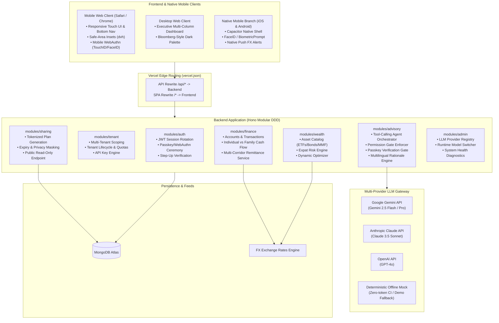
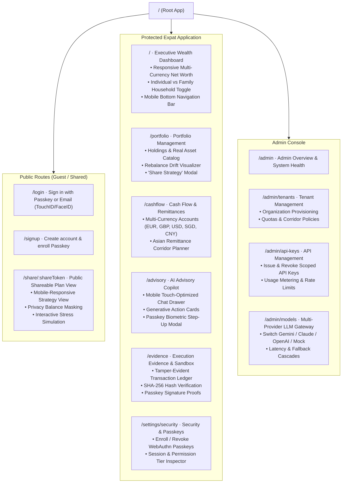
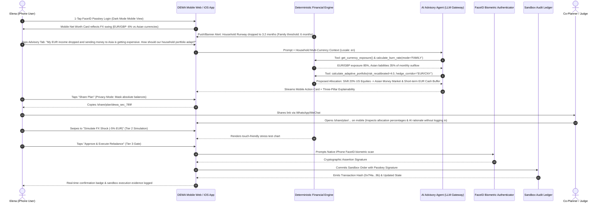

# FinTechathon 2026: Implementation Plan
**Project:** Dynamic Expat Wealth Agent (DEWA)  
**Competition Track:** International Track — "AI as a Financial Participant"  
**Core Topic:** Topic B (Wealth Advisory Agent)  
**Synergistic Extensions:** Topic A (Personal & Family Finance) & Topic C (Cross-Border & Student Finance)  
**Key Architectural Highlights:** Multi-Tenant Platform, API Key Management, Biometric Passkeys (FIDO2/WebAuthn), Multi-Provider LLM Gateway, Shareable Plan URLs, Multi-Language (i18n), Dark Mode, Mobile Web Optimization, and Native Android/iOS Deployment Track  
**Primary Persona:** Elena — Cross-border remote professional in Europe with multi-corridor family remittances to East Asia facing FX currency swings  

---

## 1. Executive Summary & Competition Alignment

### 1.1 Scoring Rubric Alignment
| Evaluation Pillar | Weight | DEWA System Realization |
|---|---|---|
| **Task Completion** | **40%** | Autonomous end-to-end advisory lifecycle: multi-currency cash flow ingestion (EUR, GBP, USD, SGD, CNY), individual vs. family household liquidity pooling, expat risk profiling, multi-asset matching, Black-Litterman/MVO allocation, and simulated sandbox trade execution. |
| **Security & Compliance** | **30%** | Strict 4-tier permission model (Tier 0 to Tier 3), hardware-backed **FIDO2/WebAuthn Passkey biometric authorization for Tier 3 execution gates** (FaceID/TouchID/BiometricPrompt), multi-tenant data isolation, read-only tokenized plan sharing with privacy masking, deterministic financial calculation shield, cross-border regulatory boundary validation, and immutable sandbox audit logs. |
| **Innovation & Interaction** | **30%** | Dynamic burn-rate risk recalibration (Topic A $\to$ B), cross-border FX shock absorption & remittance timing optimization (Topic C $\to$ B), streaming copilot dialogue with generative UI action cards, three-pillar explainability rationale, shareable strategy URLs for family/co-planners, multi-language support (EN, ZH-CN, ZH-HK, DE), modern dark mode UX, and first-class **mobile web & native iOS/Android viewing**. |
| **Bonus Exploration** | **0–5 pts** | Cryptographic hash verification of sandbox ledger events with an optional on-chain settlement anchor. |

### 1.2 Strategic Scope Analysis: Individual vs. Family Budgeting in Topic B
* **Is budgeting in scope for Topic B?** Standalone retail expense-tracking (e.g. categorizing coffees and groceries) strictly belongs to Topic A. However, in professional wealth advisory, **Individual vs. Joint/Family Household Wealth Profiling** is the single greatest driver of portfolio asset allocation:
  * **Individual Mode:** Single expat/student; single income stream; personal burn rate; higher risk capacity; emergency buffer = 3–6 months.
  * **Family / Joint Household Mode:** Multi-earner expat household; pooled cross-border income (e.g., EUR + GBP); joint emergency runway; dependent obligations (children's education funds, elderly parents' remittances); conservative risk capacity; emergency buffer = 6–12 months.
* **The Synergy:** By modeling budgeting as **Household Liquidity & Cash Flow Pooling**, we seamlessly bridge Topic A into Topic B: household burn rate and dependent cash liabilities directly determine the liquidity carve-out and dynamic risk penalty in the portfolio optimizer.

---

## 2. Core Development Principles & Architectural Guardrails

### 2.1 Workspace Dependency Direction
Strict unidirectional hierarchy enforced across the monorepo:
$$\text{rules} \longleftarrow \text{contracts} \longleftarrow \text{backend} \quad\text{and}\quad \text{frontend}$$
* **`@wealth-advisor/rules` (Zero dependencies):** Pure domain rules, financial constants, currency codes, asset classes, permission tiers, passkey constraints, tenant limits, i18n locales, theme constants, viewport breakpoints, error codes, and validation patterns.
* **`@wealth-advisor/contracts` (Depends only on `rules` and `zod`):** Request/response Zod schemas and TypeScript types.
* **`backend` (Depends on `rules`, `contracts`, `hono`, `mongodb`):** Domain logic, use cases, Mongo repositories, WebAuthn verification, and Hono route handlers.
* **`frontend` (Depends on `rules`, `contracts`, `react`, `@tanstack/react-query`, `tailwindcss`):** SPA user interface, WebAuthn browser APIs, i18n dictionaries, theme state, responsive touch layouts, and presentation components.

### 2.2 Erasable TypeScript & Runtime Cleanliness
* No TypeScript `enum`s, namespaces, decorators, or parameter properties. Closed sets are defined as `as const` string objects.
* Relative imports carry `.ts`/`.tsx` extensions for runtime compatibility with Node native module resolution.
* Only one default export exists across the backend: `backend/src/app.ts` (Vercel entrypoint). All other exports are strictly named.

### 2.3 The Deterministic Calculation Shield (Anti-Hallucination)
To ensure regulatory compliance and prevent LLM hallucinations:
* The LLM **never** calculates portfolio weights, returns, variances, or burn rates directly in text.
* The LLM calls typed internal calculation tools.
* The financial calculation engine executes deterministic TypeScript algorithms and returns structured JSON.
* The LLM interprets the result, provides conversational context in the user's active language, and delivers the three-pillar explainability report.

### 2.4 The 4-Tier Permission Architecture & Passkey Step-Up
Every agent capability and API endpoint is bound to an explicit permission tier:
* **Tier 0 (Read & Analytics):** Read-only data access (account balances, past transactions, asset catalog, portfolio status, shared plan view). Executed autonomously.
* **Tier 1 (Advisory Recommendation):** Analytical recommendations (risk profile update, target portfolio proposal, currency hedge suggestions). Executed autonomously; output is advisory only.
* **Tier 2 (Supervised Simulation):** What-if stress testing (e.g. simulating a -10% FX shock or a €15,000 family remittance spike). Executed on user request.
* **Tier 3 (Execution Gate):** Sandbox ledger mutations (portfolio rebalancing order, scheduled liquidity ring-fencing). **Mandatory hardware-backed Passkey (TouchID/FaceID/BiometricPrompt) biometric signature required** before state commits.

---

## 3. System Architecture, Multi-Tenancy & Platform Integrations

### 3.1 Multi-Tenant Platform Architecture
The system supports multi-tenant isolation, allowing institutions (wealth advisory practices, universities, global relocation firms) to manage distinct expat client cohorts:
* **Tenant Scoping:** Every user, account, portfolio, and audit ledger document is tagged with `tenantId`. Repositories enforce query filtering scoped to the authenticated tenant context.
* **Tenant Configuration:** Each tenant can set distinct baseline currencies, supported remittance corridors, custom risk tolerance boundaries, and default LLM provider overrides.
* **Tenant Isolation Test Suite:** Automated integration tests ensure tenant data cannot leak across tenant boundaries.

### 3.2 API Management & Institutional Access
* **Scoped API Keys:** Institutional tenants can generate API keys with scoped permission tiers (`read:analytics`, `advisory:recommend`, `simulate:stress-test`, `execute:sandbox`).
* **Rate Limiting & Quotas:** Enforces requests-per-minute (RPM) and monthly token budgets per tenant.
* **Tamper-Evident API Key Storage:** Only SHA-256 hashes of API keys are stored in MongoDB; keys carry standard prefixes (e.g., `dewa_live_...`).

### 3.3 Passkey Authentication & Biometric Step-Up Authorization
* **FIDO2 / WebAuthn Standard:**
  * Zero-password vulnerability: Public-key cryptography replaces phishable passwords.
  * **Relying Party (`rpId`) Multi-Environment Mapping:** Configured dynamically via environment: `localhost` during local development and `wealth-advisor.vercel.app` in production deployment.
  * Credential Enrollment: Users register their TouchID / FaceID / hardware security key via `/settings/security` or during onboarding.
  * Seamless Passwordless Sign-In: Instant 1-tap login with biometric verification.
* **Biometric Step-Up for Tier 3 Execution Gate:**
  * When the AI Copilot prepares a high-stakes portfolio rebalancing order or locks remittance buffers, it generates a cryptographically signed execution challenge.
  * The user's device requests biometric assertion (`navigator.credentials.get`).
  * Backend verifies the WebAuthn signature against the user's registered public key.
  * The verified signature is embedded directly into the transaction record in `sandbox_ledgers`:
    $$\text{Audit Digest} = \text{SHA256}(\text{userId} + ":" + \text{tenantId} + ":" + \text{timestamp} + ":" + \text{passkeySignature} + ":" + \text{tradeDiff})$$
  * This provides unforgeable evidence that an AI agent recommendation was authenticated by an authorized human participant before execution.

### 3.4 Shareable Advisory Plans via URL (`/share/:shareToken`)
* **Use Case:** An expat user (or family) can generate a shareable link of their AI-recommended wealth strategy to share with a partner, family co-planner, or financial advisor.
* **Security & Privacy Guardrails (Tier 0 Read-Only):**
  * **Privacy Masking Mode:** Toggle to hide absolute currency amounts (displays only percentage weights, asset classes, and risk metrics).
  * **Cryptographic Tokenization:** Accessible via a random, unguessable URL token (`/share/:token`) stored with a TTL (e.g. 7 or 30 days) and optional passphrase.
  * **Read-Only Sandbox:** Recipients can inspect the strategy, view the three-pillar explainability rationale, and run non-mutating stress simulations, but **cannot** execute trades.
  * **Competition Utility:** Perfect for judges to review saved plan instances directly via browser URL without needing an active account!

### 3.5 Multi-Language Architecture (i18n)
* **Supported Locales:**
  * `en` (English — Official International Track language)
  * `zh-CN` (Simplified Chinese — WeBank / Shenzhen FinTechathon host language)
  * `zh-HK` (Traditional Chinese — Hong Kong cross-border finance hub)
  * `de` (German — Elena's European residency context)
* **Design:** Lightweight client-side dictionary provider; instant locale switching stored in `localStorage`.
* **Multilingual AI Advisory:** System prompts inform the LLM of the user's active locale so explanations, disclaimers, and dialogue are rendered natively in the chosen language.

### 3.6 Dark Mode & Mobile Web Viewport Design Tokens
* **Tailwind v4 Theme Extension:** CSS variables mapped for `--color-surface`, `--color-surface-subtle`, `--color-ink`, `--color-line`, and `--color-brand`.
* **Aesthetics:** Sleek dark palette (deep slate `#0b0f19`, elevated cards `#111827`, borders `#1f2937`) with WCAG AA compliant contrast ratios.
* **Mobile-First Touch Architecture:**
  * Dynamic viewport height units (`min-h-dvh`) preventing mobile browser URL-bar jump.
  * Bottom sheet drawer for mobile advisory chat input and quick action cards.
  * Safe-area insets (`padding-bottom: env(safe-area-inset-bottom)`) for iPhone home indicator and notch support.
  * Touch-friendly hit targets ($\ge 44 \times 44\text{px}$) across all interactive buttons, pills, and dropdowns.

### 3.7 Native Mobile App Deployment Track (Android & iOS)
To provide a native banking app experience beyond mobile web:
* **Capacitor Integration Shell:** The React 19 + Vite frontend is wrapped via `@capacitor/core`, `@capacitor/ios`, and `@capacitor/android`.
* **Hardware Biometrics:** Native Passkeys via `@capgo/capacitor-face-id` / native WebAuthn WebView bridge, giving seamless FaceID on iOS and BiometricPrompt on Android.
* **Native Push Notifications via Domain Events:** Real-time push alerts delivered via APNs (Apple Push Notification service) and FCM (Firebase Cloud Messaging). Triggered by domain events published on the backend `InProcessEventBus` (`RunwayThresholdBreached` and `FxVolatilitySpikeDetected`).
* **iOS Distribution Branch:** Xcode project bundle (`App.xcworkspace`), CocoaPods dependencies, Apple Developer Code Signing, TestFlight distribution pipeline.
* **Android Distribution Branch:** Android Studio project, Gradle build system, Keystore release signing, Android App Bundle (`.aab`) generation for Google Play Console.

### 3.8 MongoDB Atlas Multi-Tenant Schema Specification
Built collections: [backend/docs/collections.md](../backend/docs/collections.md). Planned collections: [backend/docs/planned-collections.md](../backend/docs/planned-collections.md).

---

## 4. Application Sitemap & Mobile Viewport Navigation

### Mobile vs. Desktop Navigation Mapping:
* **Desktop ($>768\text{px}$):** Persistent left-hand sidebar with full navigation, currency ticker, quick admin toggle, and user profile avatar.
* **Mobile ($\le 768\text{px}$):** Fixed bottom navigation bar with 4 core tabs:
  1. **Dashboard** (`/`)
  2. **Portfolio** (`/portfolio`)
  3. **Cash Flow** (`/cashflow`)
  4. **Advisory Copilot** (`/advisory`)
  * Top navigation header houses the Organization/Tenant selector, Dark/Light mode toggle, Language selector (`en`/`zh`/`de`), and Avatar menu (linking to `/settings/security`, `/evidence`, and `/admin`).

### Detailed Route Specifications:
| Route | Access | Component / Page | Key Features |
|---|---|---|---|
| `/login` | Guest | `LoginPage` | Passkey 1-click biometric sign-in (TouchID/FaceID), email/password fallback, demo persona quick-fill. |
| `/signup` | Guest | `SignupPage` | Expat onboarding, currency selection, automatic Passkey registration prompt. |
| `/share/:token` | Public | `SharedPlanPage` | Read-only strategy viewer, privacy balance toggle, three-pillar explainability, interactive stress simulation. Fully responsive on mobile. |
| `/` | Expat | `DashboardPage` | Net worth in base currency, individual vs family household toggle, multi-currency donut, runway health gauge. Responsive single-column mobile layout. |
| `/portfolio` | Expat | `PortfolioPage` | Asset holdings (Equities, Bonds, MMF, Hedges), rebalancing visualizer, "Create Share Link" button. |
| `/cashflow` | Expat | `CashflowPage` | Multi-currency bank balances, household pooled cash flow, Asian remittance corridor planner. |
| `/advisory` | Expat | `AdvisoryPage` | Conversational wealth copilot (i18n), tool execution stream, three-pillar explainability drawer, Tier 3 Passkey execution approval modal, touch-optimized mobile chat drawer. |
| `/evidence` | Expat / Judge | `EvidencePage` | Immutable sandbox ledger table, before/after portfolio state diffs, Passkey signature proofs, SHA-256 verification, JSON export. |
| `/settings/security` | Expat | `SecuritySettingsPage` | Register/manage Passkeys (TouchID/FaceID), view active sessions, inspect permission tiers. |
| `/admin` | Admin / Judge | `AdminDashboardPage` | Platform overview, active tenants, aggregate token usage, system health diagnostics. |
| `/admin/tenants` | Admin | `AdminTenantsPage` | Provision institutional tenants, configure member limits, allowed remittance corridors, risk policies. |
| `/admin/api-keys` | Admin | `AdminApiKeysPage` | Issue scoped API keys with permission tiers, inspect usage logs, revoke keys immediately. |
| `/admin/models` | Admin / Judge | `AdminModelsPage` | Runtime LLM switcher (Gemini 2.5 / Claude 3.5 / OpenAI GPT-4o / Deterministic Mock), latency graphs, demo scenario reset. |

---

## 5. Showcase Persona & Journey: Elena

### 5.1 Persona Background
* **Name & Role:** Elena, 31, cross-border remote software consultant living between Berlin and London with family dependents in East Asia.
* **Planning Mode:** **Family Household Mode** (Supporting parents and managing joint household emergency reserves).
* **Tenant:** *Global Nomads Wealth* (or standard Expat workspace).
* **Device Usage:** Uses DEWA on her iPhone 16 Pro (Mobile Web Safari / iOS Native TestFlight App) in Dark Mode, plus MacBook Pro desktop browser.
* **Income Streams:** Receives €7,500/month from EU clients and £3,000/month from UK contracts.
* **Cross-Border Commitments (Topic C):**
  * Fixed family remittances to East Asia: sends equivalent of 25,000 RMB / ~S$4,800 monthly to Singapore/Shanghai for family support and savings.
* **Current Portfolio (Topic B):**
  * €95,000 total net worth split across US Tech Equities (60%), European Corporate Bonds (25%), and Euro Cash (15%).
  * Baseline Currency: EUR (€).
* **Security & Interaction Credentials:** Enrolled iPhone FaceID Passkey; uses dark mode with English/German/Chinese interface.

### 5.2 Scenario Workflow, Mobile Web / Native Journey & Biometric Execution

---

## 6. Phase-Wise Implementation Roadmap

### Phase 1: Domain Foundations, Rules & Contracts (Days 1–3)
**Objective:** Establish typed data contracts, validation rules, Passkey WebAuthn types, multi-tenant schemas, household cashflow models, plan sharing, i18n locales, responsive viewport rules, and deterministic calculation engines.

#### 1.1 Shared Rules (`rules/src/`)
- [x] `currency.rule.ts`: ISO currency codes (`EUR`, `GBP`, `USD`, `SGD`, `CNY`, `JPY`, `HKD`), baseline currency definitions, and remittance corridor pairs.
- [x] `asset-class.rule.ts`: Categories (`EQUITY_GLOBAL`, `EQUITY_US`, `FIXED_INCOME_GOV`, `MONEY_MARKET`, `FX_HEDGE`), 5% rebalance drift corridor (Vanguard 2015 citation).
- [x] `permission-tier.rule.ts`: Tier definitions (`TIER_0_READ`, `TIER_1_ADVISORY`, `TIER_2_SIMULATE`, `TIER_3_EXECUTE`).
- [x] `household-mode.rule.ts`: Modes (`INDIVIDUAL`, `FAMILY_HOUSEHOLD`), reserve multiplier (Individual: 1.0x, Family: 2.0x, OECD/Vanguard citation).
- [x] `burn-rate.rule.ts`: Runway thresholds (Critical: $<3$ months, Warning: $3$–$6$ months, Healthy: $>6$ months, CFP Board / Fed SHED citation).
- [x] `profiling.rule.ts`: Seven onboarding questions as code (`as const`), deterministic base risk scoring (1.0 to 10.0), stress question mapping, time horizon derivation (Kahneman-Tversky / Grable-Lytton citation).
- [x] `fundamental-ratios.rule.ts`: 5Y valuation percentile, corporate bond ICR and Net Debt/EBITDA, foreign revenue FX mismatch trigger, and retail signal badges (Damodaran / Graham-Dodd citation).
- [x] `locale.rule.ts`: Supported locales (`en`, `zh-CN`, `zh-HK`, `de`).
- [x] `llm-provider.rule.ts`: Provider keys (`gemini`, `claude`, `openai`, `mock`) and model string constants.
- [x] `viewport.rule.ts`: Mobile touch targets ($\ge 44\text{px}$), safe-area insets, and responsive breakpoints.
- [x] Export rules in `rules/src/index.ts` and verify unit tests.

#### 1.2 Shared Contracts (`contracts/src/`)
- [x] `profiling/profile-answers.contract.ts`: Zod schema for the 7 questions and profile summary.
- [x] `profiling/fundamental-ratios.contract.ts`: Zod schema for asset fundamental metrics and classification results.
- [ ] `auth/passkey/`: Registration & authentication challenge/verify contracts, step-up assertion contracts.
- [ ] `sharing/`: `create-share-link.contract.ts`, `shared-plan-view.contract.ts`.
- [ ] `tenant/`: `tenant.contract.ts`, `api-key.contract.ts`.
- [ ] `finance/`: `account.contract.ts`, `transaction.contract.ts`, `cashflow-summary.contract.ts` (with `householdMode` flag).
- [ ] `wealth/`: `asset-product.contract.ts`, `portfolio.contract.ts`, `rebalance-proposal.contract.ts`.
- [ ] `advisory/`: `advisory-chat.contract.ts`, `sandbox-execution.contract.ts`.
- [ ] `admin/`: `admin-settings.contract.ts`.

#### 1.4 Modelling Citations, Judges' Published Research & Fundamental Ratios (#12 & #13)
* **Modelling Citations:**
  * **Emergency Runway Thresholds:** CFP Board Financial Planning Practice Guidelines (2022) and US Federal Reserve Survey of Household Economics and Decisionmaking (SHED, 2023) benchmark of 3 to 6 months of non-discretionary expenses in liquid reserves.
  * **Household Mode Reserve Multipliers:** OECD Family Database (2021) and Vanguard Life-Cycle Research (2019) on dependent liability pooling establishing 1.0x (3 months) for individuals vs 2.0x (6 months) for family households.
  * **Behavioral Risk Scoring & Stress Reaction:** Kahneman & Tversky (1979) *Prospect Theory: An Analysis of Decision under Risk* (loss aversion coefficient $\lambda \approx 2.25$ explaining asymmetric panic during 25% drawdowns); Grable & Lytton (1999) *Financial Risk Tolerance Assessment*.
  * **Portfolio Rebalance Drift Corridor:** Vanguard Research (Zilbering et al., 2015) demonstrating a 5% corridor balances transaction costs against risk tracking error.
* **Judges' Published Research Alignment:**
  * WeBank AI Lab research on Trustworthy AI and Federated FinTech (Yang et al., ACM TIST 2019) emphasizes verifiable, audit-proof financial AI systems. DEWA embodies this via deterministic calculation shields preventing hallucination and biometric step-up execution gates (FIDO2 WebAuthn).
* **Fundamental Ratios Driving Allocation:**
  1. **5Y Valuation Percentile:** Trims equity allocation when valuation reaches the 85th percentile of the asset's own history; allows tactical accumulation below the 20th percentile (Damodaran 2012).
  2. **Corporate Bond Coverage (ICR & Net Debt/EBITDA):** Requires $\text{ICR} \ge 3.0\times$ and $\text{Net Debt}/\text{EBITDA} \le 3.5\times$; reallocates vulnerable debt into sovereign bonds or cash (Graham & Dodd 1962).
  3. **Asset Foreign Revenue Ratio:** Identifies underlying currency risk per asset; foreign revenue mismatch exceeding 30% against expat liability corridors triggers currency hedging overlays.
  4. **Free Cash Flow Payout Ratio:** Filters out unsustainable dividend yield traps exceeding 90% payout.

#### 1.3 Deterministic Financial Engines (`backend/src/modules/`)
- [ ] **`BurnRateCalculator`:** Aggregates multi-currency transactions converted to baseline currency; adapts emergency reserve targets based on Individual vs. Family Household mode.
- [ ] **`ExpatRiskProfiler`:** Recalibrates base risk score dynamically based on liquidity runway and foreign currency mismatch.
- [ ] **`PortfolioOptimizer`:** Computes target asset allocation adapting to the effective risk score and ring-fencing scheduled Asian family remittances (`FAMILY_REMITTANCE`) and academic tuition deadlines (`TUITION_FEE`) as non-negotiable liquidity carve-outs into matching short-term cash/money-market buckets.
- [ ] **Unit Tests:** 100% test coverage for calculations under Elena's family cashflow squeeze scenario and student tuition shock tests.

---

### Phase 2: Backend Modules, Passkeys, Multi-Tenant Engine, Sharing & AI Gateway (Days 4–7)
**Objective:** Build the Passkey/WebAuthn service, multi-tenant scoping, plan sharing module, API key manager, multi-provider LLM gateway, and auditable sandbox ledger.

#### 2.1 Passkey / WebAuthn & Auth Extension (`backend/src/modules/auth`)
- [ ] Integrate WebAuthn verification adapter (`@simplewebauthn/server` or native WebCrypto).
- [ ] Extend user entity with embedded Passkey credentials (`credentialId`, `publicKey`, `counter`, `transports`).
- [ ] Endpoints:
  - `POST /api/auth/passkey/register-options`
  - `POST /api/auth/passkey/register-verify`
  - `POST /api/auth/passkey/login-options`
  - `POST /api/auth/passkey/login-verify`
  - `POST /api/auth/passkey/step-up-challenge`

#### 2.2 Multi-Tenant & API Key Module (`backend/src/modules/admin/`)
- [ ] Implement `tenant.module.ts`:
  - Collections: `tenants` and `api_keys` with partial unique indexes.
  - Multi-tenant middleware: Scopes database queries to `tenantId` from JWT or API key header (`X-API-Key`).
  - API Key hashing & verification: Validates key prefix, hash, and permission tier.
- [ ] Implement `admin.module.ts`:
  - Routes: `GET /api/admin/tenants`, `POST /api/admin/tenants`, `GET /api/admin/api-keys`, `POST /api/admin/api-keys`, `GET /api/admin/models`, `POST /api/admin/models`.

#### 2.3 Finance & Wealth Modules (backend/src/modules/finance & `wealth`)
- [ ] Implement `finance.module.ts`:
  - Collections: `accounts`, `transactions` (tenant-scoped).
  - Support Individual vs. Family Household mode cashflow filtering.
  - Pre-seeded Elena demo scenario (European income + Asian remittances).
- [ ] Implement `wealth.module.ts`:
  - Collections: `portfolios`, `asset_products` (tenant-scoped).
  - Routes: `GET /api/wealth/portfolio`, `GET /api/wealth/products`, `POST /api/wealth/optimize`.

#### 2.4 Plan Sharing Module (backend/src/modules/sharing)
- [ ] Implement `sharing.module.ts`:
  - Collection: `shared_plans` (token, planSnapshot, masked, expiresAt).
  - Endpoints: `POST /api/sharing/create` (generates unguessable token with TTL and privacy masking), `GET /api/sharing/:token` (public read-only strategy presentation).

#### 2.5 Multi-Provider LLM Gateway & Tool-Calling Agent (backend/src/modules/advisory)
- [ ] Implement `LlmGateway` abstraction with concrete adapters:
  - `GeminiAdapter` (`@google/genai` or direct REST API)
  - `ClaudeAdapter` (`@anthropic-ai/sdk` or REST)
  - `OpenAiAdapter` (`openai` or REST)
  - `MockLlmAdapter` (deterministic offline engine with canned tool calling & explainability)
- [ ] Registered Agent Tools:
  1. `get_cashflow_and_runway` (with Individual vs. Family mode)
  2. `get_currency_exposure`
  3. `calculate_adaptive_portfolio`
  4. `simulate_stress_test`
  5. `create_rebalance_proposal`
  6. `execute_sandbox_trade` (Requires Passkey verification proof)

#### 2.6 Tier 3 Gatekeeper & Sandbox Audit Ledger
- [ ] **Passkey-Enforced Execution Gate:** Rejects `execute_sandbox_trade` unless accompanied by a verified Passkey step-up assertion.
- [ ] **Sandbox Ledger (`sandbox_ledgers` collection):**
  - Records every simulated execution with:
    $$\text{Audit Digest} = \text{SHA256}(\text{userId} + ":" + \text{tenantId} + ":" + \text{timestamp} + ":" + \text{passkeySignature} + ":" + \text{tradeDiff})$$
  - Generates immutable operation logs matching FinTechathon submission criteria.
- [ ] **Three-Pillar Explainability Formatter:**
  - Formats structured explanations across Personal Finance, Cross-Border FX, and Wealth Strategy in the user's active language (`en`, `zh-CN`, `zh-HK`, `de`).
  - Automatically appends cross-border compliance disclaimers.

---

### Phase 3: Frontend Executive Dashboard, Copilot UX, Mobile Web & Theming (Days 8–11)
**Objective:** Deliver an intuitive, responsive, and visually compelling user interface with mobile web optimization, dark mode, multi-language support, public shareable plan views, Passkey biometric authorization, and Admin console.

#### 3.1 Design System, Dark Mode, Mobile Web & i18n Foundations
- [ ] **Dark Mode:** Configure Tailwind v4 `@theme` with CSS variables for dark surface/line/ink tokens. Implement `ThemeToggle` with system preference auto-detection.
- [ ] **Mobile Web Optimization:** Implement responsive viewport rules (`min-h-dvh`, safe-area insets, touch hit targets $\ge 44\text{px}$, responsive bottom navigation bar on mobile).
- [ ] **i18n:** Lightweight translation dictionary provider supporting `en`, `zh-CN`, `zh-HK`, `de`. Implement `LanguageSelect` dropdown in navbar.

#### 3.2 Passkey Integration & Security Settings (`/settings/security`)
- [ ] 1-Click Passkey login and enrollment flows using `@simplewebauthn/browser` (supports FaceID on iOS Safari and TouchID on Android Chrome).
- [ ] `SecuritySettingsPage` (`/settings/security`): Manage enrolled Passkeys, device names, active sessions, and permission tiers.

#### 3.3 Expat Wealth Dashboard & Cashflow Views (`/`, `/portfolio`, `/cashflow`)
- [ ] **Dashboard (`/`):** Multi-currency net worth cards, Individual vs. Family Household toggle, burn-rate health gauge, target vs current allocation. Responsive single-column mobile layout.
- [ ] **Portfolio Page (`/portfolio`):** Asset holdings, rebalancing drift visualizer, and "Share Strategy URL" modal with privacy balance masking toggle.
- [ ] **Cashflow Page (`/cashflow`):** Multi-currency accounts, recurring bills, Asian remittance corridor planner.

#### 3.4 AI Advisory Copilot & Biometric Execution Modal (`/advisory`)
- [ ] **Conversational Interface:** Full-height streaming dialogue panel with touch-optimized mobile chat drawer and multilingual responses.
- [ ] **Generative UI Action Cards:** Product Comparison, Dynamic Risk Recalibration, and Rebalance Proposal cards.
- [ ] **Tier 3 Biometric Step-Up Modal:** Triggers browser Passkey prompt (TouchID/FaceID) to sign transaction before submission.

#### 3.5 Public Shared Plan View (`/share/:token`)
- [ ] Read-only strategy presentation rendering asset allocation, three-pillar explainability, and interactive stress simulation. Fully responsive on mobile.
- [ ] Privacy toggle: view as exact amounts or relative percentages.

#### 3.6 Evidence Explorer & Admin Console (`/evidence`, `/admin/*`)
- [ ] **Evidence Page (`/evidence`):** Sandbox audit table, before/after diffs, Passkey signature proofs, SHA-256 hashes, JSON download.
- [ ] **Admin Console (`/admin`, `/admin/tenants`, `/admin/api-keys`, `/admin/models`):**
  - Organization and tenant management table.
  - API key issuance with permission tier checkboxes.
  - Runtime LLM switcher: Google Gemini $\leftrightarrow$ Claude $\leftrightarrow$ OpenAI $\leftrightarrow$ Deterministic Mock.
  - System diagnostics and one-click demo data reset button.

---

### Phase 4: Native Mobile Deployment Track (Android & iOS) (Days 11–13)
**Objective:** Deliver working native binary builds for iOS and Android wrapped via Capacitor, complete with native biometric FaceID/BiometricPrompt and push alert capabilities.

#### 4.1 Capacitor Shell Configuration
- [ ] Add `@capacitor/core`, `@capacitor/cli`, `@capacitor/ios`, `@capacitor/android` to frontend.
- [ ] Generate `capacitor.config.ts`:
  - App ID: `com.wealthadvisor.dewa`
  - App Name: `DEWA Wealth`
  - WebDir: `dist`
  - Configure server URL for development hot-reloading vs. production embedded bundle.

#### 4.2 iOS Native App Deployment Branch
- [ ] Run `npx cap add ios` to generate native Xcode project workspace.
- [ ] Configure `Info.plist`: `NSFaceIDUsageDescription` for native biometric authorization.
- [ ] Configure Associated Domains for WebAuthn/Passkey domain association (`webcredentials:wealth-advisor.vercel.app`).
- [ ] Verify Xcode build, simulator execution (iPhone 16 Pro), and TestFlight archive readiness.

#### 4.3 Android Native App Deployment Branch
- [ ] Run `npx cap add android` to generate native Android Studio project.
- [ ] Configure `AndroidManifest.xml`: `USE_BIOMETRIC` permission for native BiometricPrompt.
- [ ] Configure Digital Asset Links (`assetlinks.json`) for seamless Passkey domain binding.
- [ ] Verify Gradle build (`./gradlew assembleRelease`), emulator execution (Pixel 8), and generate Android App Bundle (`.aab`).

---

### Phase 5: Submission Deliverables, Verification & Hardening (Days 13–14)
**Objective:** Fulfill all 6 FinTechathon submission checklist requirements and verify production stability on Vercel and mobile.

#### 5.1 Competition Submission Checklist Production
- [ ] **01 Technical Documentation:** Complete `docs/architecture/` with C1–C3 diagrams, algorithm specs, multi-tenancy models, native mobile architecture, and Passkey/permission-tier security design.
- [ ] **02 Presentation Deck (docs/submission/presentation-deck.md):** 10-slide outline structured for the 10-minute presentation: Problem $\to$ DEWA Solution $\to$ Architecture $\to$ 3-Topic Synergy $\to$ Live Demo (Desktop + Mobile) $\to$ Passkey Security & Compliance $\to$ Multi-Tenant Future.
- [ ] **03 Demo Video Storyboard (docs/submission/demo-video-script.md):** Step-by-step 5-minute script featuring Elena's journey (burn rate spike + FX dip $\to$ mobile web / iOS TestFlight alert $\to$ agent consultation $\to$ share link generation $\to$ FaceID Passkey execution in dark mode).
- [ ] **04 Source Code Cleanliness:** `npm run typecheck` zero errors, `npm test` green, clean deployment on Vercel, reproducible mobile builds.
- [ ] **05 Security Self-Assessment Report (docs/submission/security-self-assessment.md):** Formal permission-tier implementation matrix, WebAuthn cryptographic proof, tokenized sharing privacy controls, and known-risk list.
- [ ] **06 Execution Evidence Package (docs/submission/execution-evidence.md):** Seeded sandbox run logs and sample audit digests.

#### 5.2 Deployment & Cloud Verification
- [ ] Run `make build` and test production bundle.
- [ ] Verify Vercel deployment with edge routing and serverless Hono execution.
- [ ] Verify end-to-end user session flow on desktop and mobile viewports: Passkey registration $\to$ login $\to$ dashboard $\to$ advisory dialogue $\to$ share link generation $\to$ biometric sandbox rebalance $\to$ evidence verification.

---

## 7. Definition of Done (DoD) by Phase

* **Phase 1 Done:** `npm run typecheck` clean across `@wealth-advisor/rules` and `@wealth-advisor/contracts`. All financial math formulas, household cashflow, share contracts, and Passkey schemas have passing unit tests.
* **Phase 2 Done:** Hono `auth` (with Passkeys), `finance`, `wealth`, `sharing`, `advisory`, and `admin` modules mounted. Multi-tenant scoping and API key hashing verified. Tier 3 execution blocked without valid Passkey signature.
* **Phase 3 Done:** All routes (`/`, `/portfolio`, `/cashflow`, `/advisory`, `/evidence`, `/share/:token`, `/settings/security`, `/admin/*`) fully rendered with dark mode, i18n, responsive touch mobile layout, and passing tests.
* **Phase 4 Done:** Capacitor native iOS and Android projects configured, FaceID/BiometricPrompt verified, and release bundles buildable.
* **Phase 5 Done:** All 6 submission checklist items documented in docs/submission/. Vercel deployment and mobile builds verified live.
