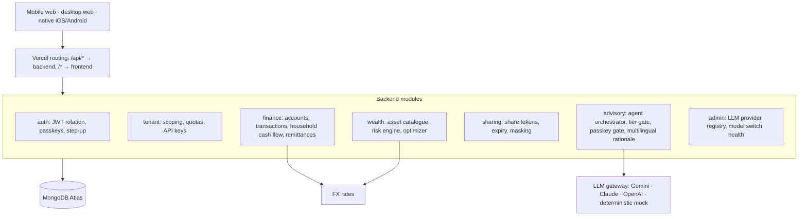

# Platform

## Diagram

## Multi-tenancy
- Tenants are institutions (advisory practices, universities, relocation firms).
- Every user, account, portfolio and ledger document carries `tenantId`; repositories filter by the caller's tenant.
- Per-tenant settings: baseline currency, remittance corridors, risk bounds, default LLM provider.
- Tenant comes from the JWT or the `X-API-Key` header.

## LLM gateway
| Adapter | Use |
|---|---|
| Gemini, Claude, OpenAI | live providers, switchable at runtime from `/admin/models` |
| Mock | deterministic, offline: CI and demo fallback |

## Agent tools
- `get_cashflow_and_runway` (individual or family)
- `get_currency_exposure`
- `calculate_adaptive_portfolio`
- `simulate_stress_test`
- `create_rebalance_proposal`
- `execute_sandbox_trade` (Tier 3: passkey proof required)

## Domain events
`RunwayThresholdBreached` and `FxVolatilitySpikeDetected` on the in-process event bus trigger native push (APNs, FCM).
