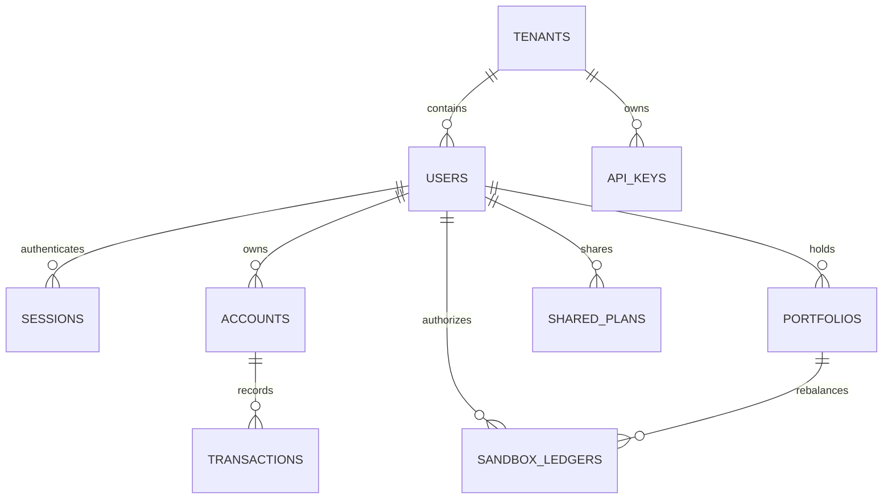

# Planned collections

Status: planned; nothing here exists yet. Built collections: `docs/backend/collections.md`. Ids and references are `ObjectId`; amounts are in minor units.

## Diagram



## Changes to built collections

- `users`: + `tenantId`, `householdMode: 'INDIVIDUAL' | 'FAMILY_HOUSEHOLD'`, `preferredLocale: 'en' | 'zh-CN' | 'zh-HK' | 'de'`, `preferredTheme: 'DARK' | 'LIGHT' | 'SYSTEM'`, `passkeys: PasskeyCredential[]`; provider type + `PASSKEY`; roles `EXPAT | ADMIN | COMPLIANCE_OFFICER` (replaces `USER`).
- `users` indexes: provider uniqueness scoped by tenant `{ tenantId, providers.type, providers.subject }` (unique, partial `status: 'ACTIVE'`); `{ passkeys.credentialId }` (unique, sparse); `{ tenantId, status }`.
- `sessions`: + `tenantId`, `fingerprintHash`.

```typescript
interface PasskeyCredential {
  credentialId: string; // base64url
  publicKey: string; // base64url
  counter: number; // clone/replay detection
  deviceType: 'SINGLE_DEVICE' | 'MULTI_DEVICE';
  backedUp: boolean;
  transports: Array<'USB' | 'NFC' | 'BLE' | 'INTERNAL' | 'HYBRID'>;
  deviceName: string;
  createdAt: Date;
  lastUsedAt: Date | null;
}
```

## tenants

Organisation workspaces.

```typescript
interface TenantDocument {
  _id: ObjectId;
  slug: string;
  name: string;
  plan: 'STARTER' | 'INSTITUTIONAL';
  status: 'ACTIVE' | 'SUSPENDED';
  settings: {
    baselineCurrency: 'EUR' | 'USD' | 'GBP' | 'SGD' | 'CNY';
    allowedCorridors: Array<'EUR_CNY' | 'GBP_SGD' | 'USD_CNY' | 'EUR_SGD'>;
    defaultLlmProvider: 'GEMINI' | 'CLAUDE' | 'OPENAI' | 'MOCK';
    maxMembers: number;
    requirePasskeyForRebalance: boolean;
  };
  createdAt: Date;
  updatedAt: Date;
}
```
Indexes: `{ slug }` (unique); `{ status }`.

## api_keys

Programmatic access for institutional tenants.

```typescript
interface ApiKeyDocument {
  _id: ObjectId;
  tenantId: ObjectId;
  name: string;
  keyPrefix: string; // stored unhashed, for identification
  keyHash: string; // SHA-256 of the full secret
  permissions: Array<'read:analytics' | 'advisory:recommend' | 'simulate:stress-test' | 'execute:sandbox'>;
  rateLimitPerMinute: number;
  monthlyTokenQuota: number;
  usedTokensThisMonth: number;
  status: 'ACTIVE' | 'REVOKED';
  lastUsedAt: Date | null;
  expiresAt: Date | null;
  createdAt: Date;
}
```
Indexes: `{ tenantId, keyPrefix }` (unique); `{ keyHash }` (unique).

## accounts

Cash balances per institution and currency.

```typescript
interface AccountDocument {
  _id: ObjectId;
  tenantId: ObjectId;
  userId: ObjectId;
  householdMode: 'INDIVIDUAL' | 'FAMILY_HOUSEHOLD';
  institutionName: string;
  accountType: 'CHECKING' | 'SAVINGS' | 'MULTI_CURRENCY_WALLET' | 'BROKERAGE_CASH';
  currency: 'EUR' | 'GBP' | 'USD' | 'SGD' | 'CNY';
  balance: number; // minor units
  lastSyncedAt: Date;
  isPrimaryLiquidity: boolean;
  createdAt: Date;
}
```
Indexes: `{ tenantId, userId, currency }`.

## transactions

Inflows, bills, expenses, remittances, tuition.

```typescript
interface TransactionDocument {
  _id: ObjectId;
  tenantId: ObjectId;
  userId: ObjectId;
  accountId: ObjectId;
  category:
    | 'INCOME_SALARY'
    | 'INCOME_FREELANCE'
    | 'BILL_HOUSING'
    | 'BILL_UTILITIES'
    | 'EXPENSE_DISCRETIONARY'
    | 'FAMILY_REMITTANCE'
    | 'TUITION_FEE'
    | 'FX_CONVERSION';
  amount: number; // minor units
  currency: 'EUR' | 'GBP' | 'USD' | 'SGD' | 'CNY';
  convertedBaseAmount: number; // minor units, in baseCurrency
  baseCurrency: 'EUR' | 'USD' | 'GBP';
  remittanceMetadata?: {
    recipientCountry: 'CN' | 'SG' | 'GB' | 'DE';
    destinationCurrency: 'CNY' | 'SGD';
    exchangeRateApplied: number;
    feePaid: number; // minor units
  };
  tuitionMetadata?: {
    institution: string;
    semesterDeadline: Date;
    isLiquidityCarveOut: boolean;
  };
  timestamp: Date;
  createdAt: Date;
}
```
Indexes: `{ tenantId, userId, timestamp: -1 }`; `{ tenantId, userId, category, timestamp: -1 }`.

## portfolios

Holdings, risk scores and target weights per user.

```typescript
interface HoldingItem {
  assetSymbol: string;
  assetName: string;
  assetClass: 'EQUITY_GLOBAL' | 'EQUITY_US' | 'FIXED_INCOME_GOV' | 'MONEY_MARKET' | 'FX_HEDGE';
  currency: 'USD' | 'EUR' | 'GBP' | 'SGD' | 'CNY';
  quantity: number;
  averageCostBasis: number;
  currentPrice: number;
  marketValueBase: number;
  currentWeight: number; // 0–1
  targetWeight: number; // 0–1, from the optimizer
}

interface PortfolioDocument {
  _id: ObjectId;
  tenantId: ObjectId;
  userId: ObjectId;
  baseCurrency: 'EUR' | 'USD' | 'GBP';
  totalValuationBase: number;
  baseRiskScore: number; // 1–10, stated tolerance
  effectiveRiskScore: number; // 1–10, recalibrated by burn rate
  burnRateRunwayMonths: number;
  holdings: HoldingItem[];
  lastRebalancedAt: Date | null;
  updatedAt: Date;
}
```
Indexes: `{ tenantId, userId }` (unique).

## asset_products

Investable product catalogue.

```typescript
interface AssetProductDocument {
  _id: ObjectId;
  symbol: string;
  name: string;
  assetClass: 'EQUITY_GLOBAL' | 'EQUITY_US' | 'FIXED_INCOME_GOV' | 'MONEY_MARKET' | 'FX_HEDGE';
  denominationCurrency: 'USD' | 'EUR' | 'GBP' | 'SGD' | 'CNY';
  riskRating: number; // 1–10
  expenseRatio: number; // fraction
  annualizedYield: number;
  threeYearReturn: number;
  fiveYearReturn: number;
  domicileCountry: string; // ISO 3166-1 alpha-2
  description: string;
  isActive: boolean;
  updatedAt: Date;
}
```
Indexes: `{ symbol }` (unique); `{ assetClass, riskRating }`.

## shared_plans

Shareable snapshots of a recommendation (`/share/:token`).

```typescript
interface SharedPlanDocument {
  _id: ObjectId;
  shareToken: string; // random, unguessable
  tenantId: ObjectId;
  userId: ObjectId;
  ownerDisplayName: string;
  privacyMasked: boolean; // strips absolute amounts from responses
  planSnapshot: {
    recommendedWeights: Record<string, number>;
    currentWeights: Record<string, number>;
    threePillarRationale: { personalFinance: string; crossBorder: string; wealthStrategy: string };
    stressTestScenario: { fxShockPercent: number; estimatedDrawdownPercent: number };
  };
  passphraseHash: string | null;
  expiresAt: Date;
  createdAt: Date;
}
```
Indexes: `{ shareToken }` (unique); `{ expiresAt }` (TTL, `expireAfterSeconds: 0`).

## sandbox_ledgers

Append-only audit of simulated rebalances and liquidity carve-outs, each with a passkey assertion.

```typescript
interface SandboxLedgerDocument {
  _id: ObjectId;
  tenantId: ObjectId;
  userId: ObjectId;
  orderType: 'PORTFOLIO_REBALANCE' | 'SCHEDULED_REMITTANCE_BUFFER' | 'TUITION_CARVE_OUT';
  initialPortfolioStateHash: string; // SHA-256
  executedTrades: Array<{ assetSymbol: string; action: 'BUY' | 'SELL'; amountBase: number; targetWeight: number }>;
  resultingPortfolioStateHash: string; // SHA-256
  passkeyAssertionProof: {
    credentialId: string;
    clientDataJson: string; // base64url
    authenticatorData: string; // base64url
    signature: string; // base64url
    verifiedAt: Date;
  };
  auditDigest: string; // SHA-256(userId + tenantId + timestamp + signature + tradeDiff)
  transactionHash: string;
  status: 'COMMITTED' | 'REJECTED';
  timestamp: Date;
}
```
Indexes: `{ auditDigest }` (unique); `{ transactionHash }` (unique); `{ tenantId, userId, timestamp: -1 }`.
